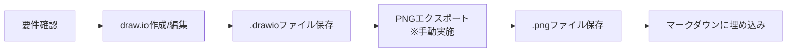

# 画面設計ルール（draw.io）

## 目次

- [概要](#概要)
- [ディレクトリ構造](#ディレクトリ構造)
- [図の種類と命名規則](#図の種類と命名規則)
- [draw.io図の作成手順](#drawio図の作成手順)
- [PNG変換とエクスポート](#png変換とエクスポート)
- [マークダウンへの埋め込み](#マークダウンへの埋め込み)
- [ワークフロー](#ワークフロー)
- [ベストプラクティス](#ベストプラクティス)
- [チェックリスト](#チェックリスト)
- [diagrams/README.mdテンプレート](#diagramsreadmemdテンプレート)
- [トラブルシューティング](#トラブルシューティング)
  - [よくある問題と解決方法](#よくある問題と解決方法)
  - [AI（Claude Code）で生成した図の問題](#aiclaude-codeで生成した図の問題)
- [関連ツール](#関連ツール)

## 概要

このドキュメントは、画面設計（ワイヤーフレーム、UIモックアップ）を**draw.io形式**で作成するための**必須ルール**を定めています。
画面設計以外の技術図表（フローチャート、ER図など）については、[mermaid-diagram-rules.md](./mermaid-diagram-rules.md)を参照してください。

### 基本方針

1. **編集可能性**: draw.ioファイル（`.drawio`）を元ファイルとして保持
2. **表示用**: PNG画像（`.png`）をマークダウンで表示
3. **配置場所**: `docs/03-ui-design/screens/`ディレクトリに格納
4. **バージョン管理**: 両形式（.drawioと.png）をGitで管理

## ディレクトリ構造

### 標準構造

```
docs/
├── 03-ui-design/
│   ├── screens/                # 画面設計ファイル格納場所
│   │   ├── wireframes/         # ワイヤーフレーム
│   │   │   ├── login.drawio
│   │   │   ├── login.png
│   │   │   ├── dashboard.drawio
│   │   │   ├── dashboard.png
│   │   │   └── README.md
│   │   ├── mockups/            # UIモックアップ
│   │   │   ├── asset-list.drawio
│   │   │   ├── asset-list.png
│   │   │   ├── asset-detail.drawio
│   │   │   ├── asset-detail.png
│   │   │   └── README.md
│   │   └── transitions/        # 画面遷移図
│   │       ├── screen-flow.drawio
│   │       ├── screen-flow.png
│   │       └── README.md
│   └── ...
```


## 画面設計の種類と命名規則

### 命名規則

**基本形式**: `{画面名}-{状態}.{拡張子}`

**規則**:
- すべて小文字（lowercase）
- 単語の区切りはハイフン（kebab-case）
- 状態やバリエーションがある場合は詳細を追加
- draw.ioとPNGは同じベース名

### 画面設計別命名例

#### wireframes/（ワイヤーフレーム）

| 画面種類 | ファイル名例 | 説明 |
|---------|------------|------|
| ログイン画面 | `login.{drawio,png}` | ログイン画面の基本レイアウト |
| ダッシュボード | `dashboard.{drawio,png}` | ホーム画面のレイアウト |
| 一覧画面 | `asset-list.{drawio,png}` | 資産一覧のレイアウト |
| 詳細画面 | `asset-detail.{drawio,png}` | 資産詳細のレイアウト |
| フォーム画面 | `asset-form-{new/edit}.{drawio,png}` | 登録・編集フォーム |
| モーダル | `modal-{function}.{drawio,png}` | モーダルダイアログ |

#### mockups/（UIモックアップ）

| 画面種類 | ファイル名例 | 説明 |
|---------|------------|------|
| デスクトップ版 | `{screen}-desktop.{drawio,png}` | PC画面デザイン |
| タブレット版 | `{screen}-tablet.{drawio,png}` | タブレットデザイン |
| モバイル版 | `{screen}-mobile.{drawio,png}` | スマートフォンデザイン |
| ダークモード | `{screen}-dark.{drawio,png}` | ダークモード版 |
| エラー状態 | `{screen}-error.{drawio,png}` | エラー時の表示 |
| 空状態 | `{screen}-empty.{drawio,png}` | データがない時の表示 |

#### transitions/（画面遷移図）

| 図の種類 | ファイル名例 | 説明 |
|---------|------------|------|
| 全体遷移図 | `screen-flow-overview.{drawio,png}` | システム全体の画面遷移 |
| 機能別遷移図 | `screen-flow-{feature}.{drawio,png}` | 機能ごとの画面遷移 |
| ユーザー別遷移図 | `screen-flow-{role}.{drawio,png}` | ロール別の画面遷移 |

## draw.io図の作成手順

### 1. 新規作成

```bash
# 該当ディレクトリに移動
cd docs/03-ui-design/screens/wireframes/  # または mockups/

# draw.ioで新規作成
# ブラウザで https://app.diagrams.net/ を開く
```

### 2. draw.io設定

**推奨設定**:

| 設定項目 | 推奨値 | 理由 |
|---------|-------|------|
| ページサイズ | A4横 または カスタム(1600x900) | 標準的な表示サイズ |
| グリッド | 10px | 整列しやすい |
| 背景色 | 白 | マークダウンで見やすい |
| フォントサイズ | タイトル: 20pt以上<br>本文: 12pt以上 | 可読性確保 |

### 3. UI要素スタイル標準

```xml
<!-- コンテナ/フレーム -->
style="rounded=0;whiteSpace=wrap;html=1;fillColor=#f5f5f5;strokeColor=#666666;dashed=1"

<!-- ボタン -->
style="rounded=1;whiteSpace=wrap;html=1;fontSize=12;fillColor=#dae8fc;strokeColor=#6c8ebf"

<!-- 入力フィールド -->
style="rounded=0;whiteSpace=wrap;html=1;fillColor=#ffffff;strokeColor=#333333"

<!-- ヘッダー/ナビゲーション -->
style="rounded=0;whiteSpace=wrap;html=1;fillColor=#333333;fontColor=#ffffff"

<!-- カード/パネル -->
style="rounded=1;whiteSpace=wrap;html=1;fillColor=#ffffff;strokeColor=#d6d6d6;shadow=1"
```

### 4. XMLファイル構造標準

**推奨XML構造**:

```xml
<mxfile host="65bd71144e">
    <diagram name="図の名前" id="diagram-id">
        <mxGraphModel dx="885" dy="672" grid="1" gridSize="10"
                      guides="1" tooltips="1" connect="1" arrows="1"
                      fold="1" page="1" pageScale="1"
                      pageWidth="1200" pageHeight="800"
                      background="#ffffff" math="0" shadow="0">
            <root>
                <mxCell id="0"/>
                <mxCell id="1" parent="0"/>
                <!-- 要素はparent="1" vertex="1"を使用 -->
                <mxCell id="element-id" value="テキスト"
                        style="..." parent="1" vertex="1">
                    <mxGeometry x="100" y="100" width="200" height="60"
                               as="geometry"/>
                </mxCell>
                <!-- 矢印はedge="1"を使用 -->
                <mxCell id="edge-id" style="..." parent="1"
                        source="source-id" target="target-id" edge="1">
                    <mxGeometry relative="1" as="geometry"/>
                </mxCell>
            </root>
        </mxGraphModel>
    </diagram>
</mxfile>
```

**重要な属性**:
- `background="#ffffff"`: 白背景を明示的に指定
- `parent="1" vertex="1"`: 通常の要素用
- `parent="1" edge="1"`: 矢印・接続線用
- `curved=1`: 矢印を曲線的にルーティング（重なり回避）

## PNG変換とエクスポート

### 重要な注意事項

⚠️ **PNGエクスポートは手動作業です**

draw.ioからPNGへのエクスポートは、**必ず人間が手動で実施する必要があります**。
- Claude Codeは`.drawio`ファイルの作成・編集は可能です
- しかし、PNGへのエクスポートは手動で行ってください
- Claude Codeが作成するPNGファイルは「プレースホルダー」として、実際のPNGエクスポート手順を記載したテキストファイルです

### エクスポート手順（手動実施）

#### 推奨：VS Code拡張機能を使用

1. **Draw.io Integration拡張機能をインストール**
   - VS Codeの拡張機能から「Draw.io Integration」を検索してインストール

2. **.drawioファイルを開く**
   - VS Codeで`.drawio`ファイルをダブルクリック（自動的にdraw.ioエディタが起動）

3. **PNG形式でエクスポート**
   - draw.ioエディタ内で「ファイル」メニュー → 「Export」 → 「PNG」を選択
   - ファイル名を確認して同じディレクトリに保存（拡張子は自動的に`.png`になる）

4. **エクスポート設定（必須）**

   | 設定項目 | 推奨値 | 必須 | 理由 |
   |---------|-------|------|------|
   | **ズーム** | 200% | ✓ | 高解像度で文字が読みやすい |
   | **境界線** | 20-30px | ✓ | 図の周囲に十分な余白を確保 |
   | **背景** | 白（不透明） | ✓ | マークダウンで見やすい |
   | **グリッド** | 表示しない | ✓ | クリーンな見た目 |
   | **選択範囲のみ** | オフ | ✓ | 図全体をエクスポート |
   | **透かし** | 削除 | ✓ | プロフェッショナルな仕上がり |

**余白が不足する場合の対処法**:

方法1: **エクスポート設定で調整**
- 境界線を20-30pxに設定（デフォルト10pxでは不足する場合）
- これが最も簡単で推奨される方法

方法2: **透明な要素を配置**
- 図の最外周に透明な矩形（fillColor=none, strokeColor=none）を配置
- 例: `<mxCell id="padding" value="" style="rounded=0;whiteSpace=wrap;html=1;fillColor=none;strokeColor=none;" vertex="1" parent="1">`
- これにより図のbounding boxを拡大

方法3: **キャンバスサイズ調整**
- pageWidthとpageHeightを図より大きく設定
- エクスポート時に「選択範囲のみ」をオフにする

#### 代替方法1：draw.io Desktop版

draw.io Desktopがインストールされている場合：

- GUIで`.drawio`ファイルを開く
- ファイル → 形式を指定してエクスポート → PNG

またはコマンドライン:

```bash
# drawio-cliを使用
drawio -x -f png \
  --scale 2 \
  --border 20 \
  --output business-flow.png \
  business-flow.drawio
```

#### 代替方法2：オンライン版

インターネット接続がある場合：
- https://app.diagrams.net/ にアクセス
- ファイル → 開く → デバイスから`.drawio`ファイルを選択
- ファイル → 形式を指定してエクスポート → PNG

## マークダウンへの埋め込み

### 基本形式

```markdown
### {図のタイトル}


<details>
<summary>📝 この図を編集</summary>

- [編集用ファイル](diagrams/{ファイル名}.drawio)
- [draw.ioで開く](https://app.diagrams.net/)

</details>
```

### 実装例

```markdown
### システム全体構成図


<details>
<summary>📝 この図を編集</summary>

- [編集用ファイル](diagrams/system-architecture.drawio)
- [draw.ioで開く](https://app.diagrams.net/)

</details>
```

### サイズ指定が必要な場合

```markdown
<!-- HTMLタグを使用 -->


<!-- または具体的なサイズ -->

```

## ワークフロー

### 図の作成・更新フロー



**Claude Code利用時の注意**:
- Claude Codeは`.drawio`ファイルの作成と編集を行います
- PNGエクスポート（手順D）は**必ず手動で実施**してください
- Claude Codeが作成する`.png`ファイルはプレースホルダーです

## ベストプラクティス

### ✅ DO（推奨事項）

1. **一貫性を保つ**
   - 同じカテゴリ内では統一されたスタイルを使用
   - 色使いやフォントサイズを統一
   - XMLファイル構造の標準に従う

2. **可読性を重視**
   - 十分な大きさのフォント（12pt以上）
   - コントラストの高い配色
   - 適切な余白（PNG出力時は境界線20-30px）

3. **シンプルに保つ**
   - 1つの図に詰め込みすぎない
   - 必要に応じて複数の図に分割

4. **メタ情報を含める**
   - 図のタイトル
   - 作成日/更新日（draw.io内）
   - 凡例（必要に応じて）

5. **矢印の配置**
   - `curved=1`を使用して重なりを回避
   - 必要に応じて中継点（Array points）を追加
   - ラベルは独立したテキスト要素として配置

6. **Claude Code使用時**
   - `.drawio`ファイルの作成・編集はClaude Codeに依頼可能
   - PNGエクスポートは必ず手動で実施
   - プレースホルダーPNGファイルの指示に従う

### ❌ DON'T（避けるべき事項）

1. **PNGのみの管理**
   - 必ずdraw.ioファイルも保持

2. **巨大な図の作成**
   - 1MB以上のPNGは避ける
   - 複雑すぎる図は分割

3. **斜め線の使用**
   - 矢印は直交線（縦横）のみ

4. **透明背景**
   - 白背景で統一

## チェックリスト

### 図作成時のチェックリスト

- [ ] draw.ioファイルを作成した
- [ ] ファイル名は命名規則に従っている
- [ ] グリッド（10px）に沿って配置した
- [ ] フォントサイズは12pt以上
- [ ] 矢印は直交線（orthogonalEdgeStyle）でcurved=1を使用
- [ ] XMLファイル構造の標準に従っている（parent/vertex/edge属性）
- [ ] **手動でPNGエクスポートを実施した**（Claude Codeではなく人間が実施）
- [ ] PNGを200%ズームでエクスポートした
- [ ] エクスポート設定（背景白、境界線20-30px）を確認した
- [ ] 図の周囲に十分な余白が確保されている
- [ ] PNGファイルサイズは1MB以下
- [ ] マークダウンに正しく埋め込んだ
- [ ] 編集リンクを含めた

### レビュー時のチェックリスト

- [ ] 図の内容が要件/仕様と一致している
- [ ] テキストが読みやすい
- [ ] 配色が適切
- [ ] 図の構造が理解しやすい
- [ ] ファイル名が適切
- [ ] マークダウンで正しく表示される

## screens/README.mdテンプレート

各画面設計ディレクトリ（`wireframes/`, `mockups/`, `transitions/`）には、以下のテンプレートに従ってREADME.mdを配置してください。

### 必須セクション

1. **タイトル**: `{画面設計タイプ}一覧`
2. **概要**: ディレクトリの目的と準拠ルールへの参照
3. **ファイル一覧**: 画面設計ファイルの一覧（表形式）

### 標準テンプレート

```markdown
# {画面設計タイプ}一覧

## 概要

このディレクトリには、{説明}に関する画面設計ファイルを格納します。
すべての画面設計は[画面設計ルール](../../00-rules/screen-design-rules.md)に準拠して作成してください。

## ファイル一覧

| ファイル名 | 画面名 | 説明 | 関連機能 |
|-----------|--------|------|----------|
| login | ログイン画面 | SSO認証画面のレイアウト | FR-002 |
| dashboard | ダッシュボード | ホーム画面のレイアウト | FR-040 |
| asset-list | 資産一覧 | 資産検索・一覧表示 | FR-010 |
```

### 重要事項

- **簡潔性を保つ**: README.mdは画面設計ファイルの管理と索引のみ
- **技術的詳細は記載しない**: draw.ioの使い方、命名規則、エクスポート設定は本ファイルを参照
- **準拠ルールを明記**: すべての詳細は本ファイル（screen-design-rules.md）に従う

## トラブルシューティング

### よくある問題と解決方法

| 問題 | 原因 | 解決方法 |
|-----|------|---------|
| PNGがテキストファイル | Claude Codeのプレースホルダー | 手動でdraw.ioからPNGエクスポート |
| PNGが粗い | エクスポート解像度が低い | ズーム200%以上で再エクスポート |
| 文字が小さい | フォントサイズ不足 | draw.ioで12pt以上に変更 |
| ファイルサイズが大きい | 解像度が高すぎる/図が複雑 | 150%に下げる or 図を分割 |
| GitHubで表示されない | パスが間違っている | 相対パスを確認（大文字小文字も） |
| 図が切れている | エクスポート範囲が狭い | 「選択範囲のみ」をオフに |
| プレースホルダーが表示 | PNGが未エクスポート | draw.ioで手動エクスポート実施 |
| **左右の余白が不足** | 境界線設定が小さい | 境界線を20-30pxに設定して再エクスポート |
| **矢印がオブジェクトに重なる** | 直線的なルーティング | curved=1を追加、中継点を調整 |

### AI（Claude Code）で生成した図の問題

| 問題 | 原因 | 解決方法 |
|-----|------|---------|
| XMLがdraw.ioで開けない | 生成されたXMLの構文エラー | XMLバリデーターで検証、UTF-8で保存し直す、`<?xml version="1.0"?>` タグを確認 |
| 図の要素が重なっている | AI生成時の配置が不適切 | Claude Codeに「要素の間隔を広く取って」と再依頼、draw.ioの自動レイアウト機能を使用 |
| スイムレーンが表示されない | プロンプトでの指定不足 | プロンプトに「必ず以下のスイムレーンを含めること」と明示的に列挙 |
| 矢印が斜めになっている | AI生成時のスタイル設定ミス | プロンプトに「edgeStyle=orthogonalEdgeStyle、斜め線は絶対に使用しない」と明記 |
| フォントサイズが小さすぎる | AI生成時のデフォルト値が不適切 | プロンプトで「タイトル20pt、本文14pt、注釈12pt」と具体的に指定 |
| 分岐条件が不明確 | 判断基準の指定不足 | プロンプトで分岐条件を「判断（条件: 〇〇か？）YES/NO」形式で明示 |

## 関連ツール

### draw.io編集ツール（推奨順）

1. [VS Code Draw.io Integration](https://marketplace.visualstudio.com/items?itemName=hediet.vscode-drawio) - **推奨**
2. [draw.io Desktop](https://github.com/jgraph/drawio-desktop/releases) - スタンドアロン版
3. [draw.io（オンライン版）](https://app.diagrams.net/) - ブラウザ版

### 画像最適化ツール

- [TinyPNG](https://tinypng.com/) - PNG圧縮
- [ImageOptim](https://imageoptim.com/) - 画像最適化

---

**ルール制定日**: 2025-01-01
**適用範囲**: プロジェクト内のすべての画面設計（ワイヤーフレーム、UIモックアップ）
**関連ルール**: [mermaid-diagram-rules.md](./mermaid-diagram-rules.md) - 技術図表の記述ルール