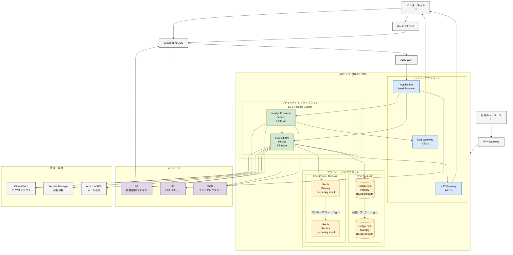

# インフラ構成

## 目次

- [概要](#概要)
- [インフラ全体構成図](#インフラ全体構成図)
- [ネットワーク構成](#ネットワーク構成)
  - [VPC設計](#vpc設計)
  - [サブネット構成](#サブネット構成)
  - [セキュリティグループ](#セキュリティグループ)
  - [ルーティング](#ルーティング)
- [コンピューティング](#コンピューティング)
  - [ECS Fargate構成](#ecs-fargate構成)
  - [タスク定義](#タスク定義)
  - [サービス構成](#サービス構成)
  - [オートスケーリング](#オートスケーリング)
- [データベース](#データベース)
  - [RDS PostgreSQL構成](#rds-postgresql構成)
  - [バックアップ戦略](#バックアップ戦略)
  - [レプリケーション](#レプリケーション)
- [キャッシュ](#キャッシュ)
  - [ElastiCache Redis構成](#elasticache-redis構成)
- [ストレージ](#ストレージ)
  - [S3バケット構成](#s3バケット構成)
  - [ライフサイクルポリシー](#ライフサイクルポリシー)
- [ロードバランシング](#ロードバランシング)
  - [ALB構成](#alb構成)
  - [ターゲットグループ](#ターゲットグループ)
  - [ヘルスチェック](#ヘルスチェック)
- [CDN](#cdn)
  - [CloudFront構成](#cloudfront構成)
- [DNS](#dns)
  - [Route 53構成](#route-53構成)
- [メール送信](#メール送信)
  - [SES構成](#ses構成)
- [監視・ログ](#監視ログ)
  - [CloudWatch](#cloudwatch)
  - [ログ管理](#ログ管理)
  - [アラート設定](#アラート設定)
- [セキュリティ](#セキュリティ)
  - [IAM](#iam)
  - [Secrets Manager](#secrets-manager)
  - [WAF](#waf)
- [社内ネットワーク接続](#社内ネットワーク接続)
  - [VPN接続](#vpn接続)
  - [PrivateLink](#privatelink)
- [災害復旧](#災害復旧)
  - [バックアップ戦略](#バックアップ戦略-1)
  - [復旧手順](#復旧手順)
  - [RTO/RPO](#rtorpo)
- [環境構成](#環境構成)
  - [開発環境](#開発環境)
  - [ステージング環境](#ステージング環境)
  - [本番環境](#本番環境)
- [コスト見積もり](#コスト見積もり)
- [デプロイメント](#デプロイメント)
  - [CI/CDパイプライン](#cicdパイプライン)
  - [Blue/Greenデプロイ](#bluegreen デプロイ)
- [関連ドキュメント](#関連ドキュメント)

## 概要

このドキュメントでは、社内資産・備品管理システムのインフラストラクチャ構成を定義します。
AWSのマネージドサービスを活用し、高可用性・拡張性・セキュリティを確保した構成とします。

## インフラ全体構成図

以下のインフラ構成図はMermaid形式で記述されています（[Mermaid図表記述ルール](../00-rules/mermaid-diagram-rules.md)参照）：



**外部サービス**:
- Amazon SES (メール送信)
- CloudWatch (監視・ログ)
- AWS Secrets Manager (認証情報管理)
- AWS WAF (セキュリティ)

## ネットワーク構成

### VPC設計

**VPC仕様**:

| 項目 | 値 |
|-----|-----|
| VPC CIDR | `10.0.0.0/16` |
| リージョン | `ap-northeast-1` (東京) |
| Availability Zone | `ap-northeast-1a`, `ap-northeast-1c` |
| DNS解決 | 有効 |
| DNSホスト名 | 有効 |

**設計方針**:
- Multi-AZ構成で高可用性を確保
- プライベートサブネットで重要リソースを保護
- パブリックサブネットはALBのみ配置

### サブネット構成

| サブネット名 | タイプ | CIDR | AZ | 用途 |
|------------|------|------|-----|------|
| public-subnet-1a | Public | `10.0.1.0/24` | 1a | ALB |
| public-subnet-1c | Public | `10.0.2.0/24` | 1c | ALB |
| private-app-subnet-1a | Private | `10.0.10.0/24` | 1a | ECS Fargate (App) |
| private-app-subnet-1c | Private | `10.0.11.0/24` | 1c | ECS Fargate (App) |
| private-db-subnet-1a | Private | `10.0.20.0/24` | 1a | RDS, ElastiCache |
| private-db-subnet-1c | Private | `10.0.21.0/24` | 1c | RDS, ElastiCache |

**サブネット設計の理由**:
- **Public Subnet**: インターネットゲートウェイへのルートあり（ALBのみ配置）
- **Private App Subnet**: NATゲートウェイ経由でインターネットアクセス（アプリケーション配置）
- **Private DB Subnet**: インターネットアクセス不可（データベース配置）

### セキュリティグループ

#### ALBセキュリティグループ

| タイプ | プロトコル | ポート | ソース | 説明 |
|-------|---------|-------|--------|------|
| Inbound | HTTPS | 443 | 0.0.0.0/0 | インターネットからHTTPS |
| Inbound | HTTP | 80 | 0.0.0.0/0 | HTTPからHTTPSへリダイレクト |
| Outbound | すべて | すべて | 0.0.0.0/0 | 全トラフィック許可 |

#### ECS Fargateセキュリティグループ (Laravel)

| タイプ | プロトコル | ポート | ソース | 説明 |
|-------|---------|-------|--------|------|
| Inbound | HTTP | 8000 | ALB SG | ALBからのトラフィック |
| Outbound | PostgreSQL | 5432 | RDS SG | データベースアクセス |
| Outbound | Redis | 6379 | ElastiCache SG | キャッシュアクセス |
| Outbound | HTTPS | 443 | 0.0.0.0/0 | 外部APIアクセス |

#### ECS Fargateセキュリティグループ (Next.js)

| タイプ | プロトコル | ポート | ソース | 説明 |
|-------|---------|-------|--------|------|
| Inbound | HTTP | 3000 | ALB SG | ALBからのトラフィック |
| Outbound | HTTP | 8000 | Laravel SG | Laravel APIアクセス |
| Outbound | HTTPS | 443 | 0.0.0.0/0 | 外部リソースアクセス |

#### RDSセキュリティグループ

| タイプ | プロトコル | ポート | ソース | 説明 |
|-------|---------|-------|--------|------|
| Inbound | PostgreSQL | 5432 | ECS SG (Laravel) | Laravelからのアクセス |
| Inbound | PostgreSQL | 5432 | 社内VPN | 運用・メンテナンス用 |

#### ElastiCacheセキュリティグループ

| タイプ | プロトコル | ポート | ソース | 説明 |
|-------|---------|-------|--------|------|
| Inbound | Redis | 6379 | ECS SG (Laravel) | Laravelからのアクセス |

### ルーティング

#### パブリックサブネットルートテーブル

| 宛先 | ターゲット |
|-----|----------|
| 10.0.0.0/16 | local |
| 0.0.0.0/0 | Internet Gateway |

#### プライベートアプリサブネットルートテーブル

| 宛先 | ターゲット |
|-----|----------|
| 10.0.0.0/16 | local |
| 0.0.0.0/0 | NAT Gateway |

#### プライベートDBサブネットルートテーブル

| 宛先 | ターゲット |
|-----|----------|
| 10.0.0.0/16 | local |

**NAT Gateway**:
- 各AZに1つずつ配置（高可用性）
- Elastic IP割り当て
- プライベートサブネットからのインターネットアクセスを提供

## コンピューティング

### ECS Fargate構成

**クラスター仕様**:

| 項目 | 値 |
|-----|-----|
| クラスター名 | `asset-management-cluster` |
| 起動タイプ | Fargate |
| ネットワークモード | awsvpc |

**Fargateの利点**:
- サーバー管理不要
- オートスケーリングが容易
- コンテナ単位で課金
- セキュリティパッチ自動適用

### タスク定義

#### Laravelタスク定義

```json
{
  "family": "asset-management-laravel",
  "networkMode": "awsvpc",
  "requiresCompatibilities": ["FARGATE"],
  "cpu": "1024",
  "memory": "2048",
  "containerDefinitions": [
    {
      "name": "laravel-app",
      "image": "<ECR_REPOSITORY_URL>:latest",
      "portMappings": [
        {
          "containerPort": 8000,
          "protocol": "tcp"
        }
      ],
      "environment": [
        {
          "name": "APP_ENV",
          "value": "production"
        }
      ],
      "secrets": [
        {
          "name": "DB_PASSWORD",
          "valueFrom": "arn:aws:secretsmanager:ap-northeast-1:xxxx:secret:db-password"
        }
      ],
      "logConfiguration": {
        "logDriver": "awslogs",
        "options": {
          "awslogs-group": "/ecs/asset-management-laravel",
          "awslogs-region": "ap-northeast-1",
          "awslogs-stream-prefix": "ecs"
        }
      }
    }
  ]
}
```

**リソース仕様**:

| 項目 | 開発 | ステージング | 本番 |
|-----|------|------------|------|
| CPU | 512 | 1024 | 1024 |
| メモリ | 1024 MB | 2048 MB | 2048 MB |
| タスク数（最小） | 1 | 2 | 2 |
| タスク数（最大） | 2 | 4 | 8 |

#### Next.jsタスク定義

```json
{
  "family": "asset-management-nextjs",
  "networkMode": "awsvpc",
  "requiresCompatibilities": ["FARGATE"],
  "cpu": "512",
  "memory": "1024",
  "containerDefinitions": [
    {
      "name": "nextjs-app",
      "image": "<ECR_REPOSITORY_URL>:latest",
      "portMappings": [
        {
          "containerPort": 3000,
          "protocol": "tcp"
        }
      ],
      "environment": [
        {
          "name": "NEXT_PUBLIC_API_URL",
          "value": "https://api.asset-management.example.com"
        }
      ],
      "logConfiguration": {
        "logDriver": "awslogs",
        "options": {
          "awslogs-group": "/ecs/asset-management-nextjs",
          "awslogs-region": "ap-northeast-1",
          "awslogs-stream-prefix": "ecs"
        }
      }
    }
  ]
}
```

**リソース仕様**:

| 項目 | 開発 | ステージング | 本番 |
|-----|------|------------|------|
| CPU | 256 | 512 | 512 |
| メモリ | 512 MB | 1024 MB | 1024 MB |
| タスク数（最小） | 1 | 2 | 2 |
| タスク数（最大） | 2 | 4 | 8 |

### サービス構成

**ECSサービス仕様**:

| 項目 | Laravel | Next.js |
|-----|---------|---------|
| サービス名 | `laravel-service` | `nextjs-service` |
| 起動タイプ | Fargate | Fargate |
| デプロイタイプ | Rolling Update | Rolling Update |
| 最小ヘルシー割合 | 100% | 100% |
| 最大割合 | 200% | 200% |
| ヘルスチェック猶予期間 | 300秒 | 180秒 |

### オートスケーリング

**ターゲット追跡スケーリングポリシー**:

| メトリクス | ターゲット値 | スケールアウト | スケールイン |
|----------|-----------|------------|------------|
| CPU使用率 | 70% | タスク数+1 | タスク数-1 |
| メモリ使用率 | 80% | タスク数+1 | タスク数-1 |
| ALBリクエスト数 | 1000/タスク | タスク数+1 | タスク数-1 |

**スケーリング設定**:
- クールダウン期間: 300秒
- スケールアウト: 即座に実行
- スケールイン: 5分間メトリクス監視後

## データベース

### RDS PostgreSQL構成

**RDSインスタンス仕様**:

| 項目 | 値 |
|-----|-----|
| エンジン | PostgreSQL 14.x |
| インスタンスクラス | db.t4g.medium (本番), db.t4g.small (ステージング) |
| ストレージタイプ | gp3 |
| ストレージ容量 | 100 GB（初期）、最大500 GB（自動拡張） |
| IOPS | 3000 |
| スループット | 125 MB/s |
| Multi-AZ | 有効 |
| 暗号化 | 有効 (AWS KMS) |

**パラメータグループ設定**:

```
max_connections = 200
shared_buffers = 256MB
effective_cache_size = 1GB
work_mem = 8MB
maintenance_work_mem = 128MB
wal_buffers = 8MB
checkpoint_completion_target = 0.9
random_page_cost = 1.1
effective_io_concurrency = 200
```

### バックアップ戦略

**自動バックアップ**:
- バックアップ保持期間: 7日間
- バックアップウィンドウ: 03:00-04:00 JST（深夜）
- メンテナンスウィンドウ: 土曜日 04:00-05:00 JST
- スナップショット: 毎日自動取得

**手動スナップショット**:
- 本番リリース前: 必須
- 大規模データ変更前: 必須
- 保持期間: 30日間

### レプリケーション

**Multi-AZ構成**:
- プライマリ: ap-northeast-1a
- スタンバイ: ap-northeast-1c
- 同期レプリケーション
- 自動フェイルオーバー（60-120秒）

**リードレプリカ（将来検討）**:
- 読み取り負荷が高い場合に検討
- レポート生成専用
- 非同期レプリケーション

## キャッシュ

### ElastiCache Redis構成

**クラスター仕様**:

| 項目 | 値 |
|-----|-----|
| エンジン | Redis 7.x |
| ノードタイプ | cache.t4g.small (本番), cache.t4g.micro (ステージング) |
| レプリケーショングループ | 有効 |
| レプリカ数 | 1 |
| Multi-AZ | 有効 |
| 自動フェイルオーバー | 有効 |
| 暗号化 | 転送中・保管中とも有効 |

**用途別キャッシュ設計**:

| 用途 | キー形式 | TTL | 説明 |
|-----|---------|-----|------|
| セッション | `session:{session_id}` | 2時間 | ユーザーセッション |
| APIレスポンス | `api:{endpoint}:{params}` | 5分 | APIレスポンスキャッシュ |
| 資産検索 | `search:{query_hash}` | 10分 | 検索結果キャッシュ |
| ユーザー情報 | `user:{user_id}` | 1時間 | ユーザー基本情報 |
| 貸出申請数 | `lending_count:{location}` | 1分 | リアルタイム集計 |

**パラメータグループ設定**:

```
maxmemory-policy: allkeys-lru
timeout: 300
tcp-keepalive: 300
```

## ストレージ

### S3バケット構成

#### 資産画像・ファイルバケット

**バケット仕様**:

| 項目 | 値 |
|-----|-----|
| バケット名 | `asset-management-files-prod` |
| リージョン | ap-northeast-1 |
| バージョニング | 有効 |
| 暗号化 | SSE-S3 |
| パブリックアクセス | ブロック（署名付きURL使用） |

**ディレクトリ構造**:

```
asset-management-files-prod/
├── assets/
│   ├── images/
│   │   ├── {asset_id}/
│   │   │   ├── main.jpg
│   │   │   ├── sub1.jpg
│   │   │   └── sub2.jpg
│   ├── qr-codes/
│   │   └── {asset_id}.png
│   └── manuals/
│       └── {asset_id}/
│           └── manual.pdf
├── exports/
│   └── inventory/
│       └── {year}/{month}/
│           └── inventory-{date}.csv
└── backups/
    └── {year}/{month}/{day}/
```

#### ログバケット

**バケット仕様**:

| 項目 | 値 |
|-----|-----|
| バケット名 | `asset-management-logs-prod` |
| リージョン | ap-northeast-1 |
| バージョニング | 無効 |
| 暗号化 | SSE-S3 |
| パブリックアクセス | ブロック |

**用途**:
- ALBアクセスログ
- CloudFrontログ
- S3アクセスログ

### ライフサイクルポリシー

**資産画像バケット**:

| ストレージクラス | 期間 |
|--------------|------|
| Standard | 30日間 |
| Standard-IA | 30-90日 |
| Glacier | 90日以降 |
| 削除 | 7年後（法的要件） |

**ログバケット**:

| ストレージクラス | 期間 |
|--------------|------|
| Standard | 7日間 |
| Standard-IA | 7-30日 |
| Glacier | 30-365日 |
| 削除 | 1年後 |

## ロードバランシング

### ALB構成

**Application Load Balancer仕様**:

| 項目 | 値 |
|-----|-----|
| 名前 | `asset-management-alb` |
| スキーム | internet-facing |
| IPアドレスタイプ | IPv4 |
| サブネット | public-subnet-1a, public-subnet-1c |
| セキュリティグループ | alb-sg |
| アクセスログ | 有効（S3バケットに保存） |

**リスナー設定**:

| プロトコル | ポート | デフォルトアクション |
|----------|-------|-----------------|
| HTTP | 80 | HTTPSへリダイレクト |
| HTTPS | 443 | パスベースルーティング |

**HTTPSリスナールール**:

| 優先度 | 条件 | アクション |
|-------|------|----------|
| 1 | パス `/api/*` | Laravel ターゲットグループへ転送 |
| 2 | パス `/*` | Next.js ターゲットグループへ転送 |

**SSL/TLS証明書**:
- AWS Certificate Manager (ACM)で管理
- ワイルドカード証明書: `*.asset-management.example.com`
- 自動更新

### ターゲットグループ

#### Laravelターゲットグループ

| 項目 | 値 |
|-----|-----|
| 名前 | `laravel-tg` |
| プロトコル | HTTP |
| ポート | 8000 |
| ターゲットタイプ | IP |
| VPC | asset-management-vpc |
| ヘルスチェックパス | `/health` |
| 正常判定しきい値 | 2 |
| 異常判定しきい値 | 3 |
| タイムアウト | 5秒 |
| 間隔 | 30秒 |
| 成功コード | 200 |

#### Next.jsターゲットグループ

| 項目 | 値 |
|-----|-----|
| 名前 | `nextjs-tg` |
| プロトコル | HTTP |
| ポート | 3000 |
| ターゲットタイプ | IP |
| VPC | asset-management-vpc |
| ヘルスチェックパス | `/api/health` |
| 正常判定しきい値 | 2 |
| 異常判定しきい値 | 3 |
| タイムアウト | 5秒 |
| 間隔 | 30秒 |
| 成功コード | 200 |

### ヘルスチェック

**Laravelヘルスチェックエンドポイント** (`/health`):

```php
// routes/web.php
Route::get('/health', function () {
    // データベース接続チェック
    DB::connection()->getPdo();

    // Redisチェック
    Redis::ping();

    return response()->json(['status' => 'healthy'], 200);
});
```

**Next.jsヘルスチェックエンドポイント** (`/api/health`):

```typescript
// pages/api/health.ts
export default function handler(req, res) {
  res.status(200).json({ status: 'healthy' });
}
```

## CDN

### CloudFront構成

**ディストリビューション仕様**:

| 項目 | 値 |
|-----|-----|
| オリジン | ALB, S3バケット |
| 価格クラス | All Edge Locations |
| HTTP/HTTPS | HTTPSのみ |
| SSL証明書 | ACM証明書 |
| WAF | 有効 |
| ログ | 有効（S3バケット） |

**オリジン設定**:

| オリジン名 | タイプ | 用途 |
|----------|------|------|
| ALB | Custom Origin | 動的コンテンツ |
| S3 | S3 Origin | 静的ファイル（画像等） |

**キャッシュビヘイビア**:

| パスパターン | オリジン | TTL | キャッシュポリシー |
|-----------|---------|-----|---------------|
| `/assets/*` | S3 | 1年 | CachingOptimized |
| `/api/*` | ALB | キャッシュなし | - |
| `/*` | ALB | 1時間 | CachingOptimizedForUncompressedObjects |

**地理的制限**: なし（日本国内利用が主だが、海外出張者も考慮）

## DNS

### Route 53構成

**ホストゾーン**:

| ドメイン | タイプ | 説明 |
|---------|------|------|
| `asset-management.example.com` | Public | 本番環境 |
| `staging.asset-management.example.com` | Public | ステージング環境 |

**レコード設定**:

| 名前 | タイプ | 値 | ルーティングポリシー |
|-----|------|-----|-----------------|
| `asset-management.example.com` | A | ALB (Alias) | Simple |
| `www.asset-management.example.com` | CNAME | `asset-management.example.com` | Simple |
| `api.asset-management.example.com` | A | ALB (Alias) | Simple |

**ヘルスチェック**:
- エンドポイント: `https://asset-management.example.com/api/health`
- 間隔: 30秒
- 失敗しきい値: 3
- CloudWatch Alarmsと連携

## メール送信

### SES構成

**Amazon SES仕様**:

| 項目 | 値 |
|-----|-----|
| リージョン | ap-northeast-1 |
| 送信モード | 本番モード |
| 送信制限 | 50,000件/日（初期） |
| DKIM | 有効 |
| SPF | 設定済み |

**送信元アドレス**:
- システム通知: `noreply@asset-management.example.com`
- 貸出通知: `lending@asset-management.example.com`
- 棚卸通知: `inventory@asset-management.example.com`

**メールテンプレート**:

| テンプレート名 | 用途 |
|-------------|------|
| `lending-request` | 貸出申請通知 |
| `lending-approval` | 貸出承認通知 |
| `lending-rejection` | 貸出却下通知 |
| `return-reminder` | 返却リマインダー |
| `inventory-start` | 棚卸開始通知 |

**バウンス・苦情処理**:
- SNSトピックと連携
- バウンス率監視（5%超でアラート）
- 苦情率監視（0.1%超でアラート）

## 監視・ログ

### CloudWatch

**メトリクス監視**:

| サービス | メトリクス | しきい値 | アクション |
|---------|----------|---------|----------|
| ALB | TargetResponseTime | 1秒以上 | SNS通知 |
| ALB | HTTPCode_Target_5XX_Count | 10件/5分 | SNS通知 |
| ECS | CPUUtilization | 80%以上 | オートスケール |
| ECS | MemoryUtilization | 80%以上 | オートスケール |
| RDS | CPUUtilization | 80%以上 | SNS通知 |
| RDS | FreeableMemory | 256MB以下 | SNS通知 |
| RDS | DatabaseConnections | 180以上 | SNS通知 |
| ElastiCache | CPUUtilization | 75%以上 | SNS通知 |
| ElastiCache | DatabaseMemoryUsagePercentage | 90%以上 | SNS通知 |

**カスタムメトリクス**:

| メトリクス名 | 説明 | 収集間隔 |
|-----------|------|---------|
| `LendingRequestCount` | 貸出申請数 | 1分 |
| `ActiveUsersCount` | アクティブユーザー数 | 5分 |
| `AssetSearchLatency` | 資産検索レイテンシ | 1分 |
| `APIErrorRate` | APIエラー率 | 1分 |

### ログ管理

**CloudWatch Logs ロググループ**:

| ロググループ | 保持期間 | 説明 |
|-----------|---------|------|
| `/ecs/asset-management-laravel` | 30日 | Laravelアプリケーションログ |
| `/ecs/asset-management-nextjs` | 30日 | Next.jsアプリケーションログ |
| `/aws/rds/instance/asset-db/postgresql` | 14日 | PostgreSQLログ |
| `/aws/elasticache/asset-redis` | 7日 | Redisログ |
| `/aws/lambda/asset-batch-jobs` | 30日 | バッチ処理ログ |

**ログフィルタリング**:

```
エラーログ抽出フィルタ: [level = "error" || level = "critical"]
API遅延フィルタ: [response_time > 1000]
認証失敗フィルタ: [event = "login_failed"]
```

### アラート設定

**CloudWatch Alarms → SNS → Slack/Email**:

| アラート名 | 条件 | 重大度 | 通知先 |
|----------|------|-------|-------|
| `HighCPUUsage` | ECS CPU > 80% (5分間) | Warning | Slack + Email |
| `DatabaseConnectionFull` | RDS接続数 > 180 | Critical | Slack + Email + 電話 |
| `APIErrorRateHigh` | 5XX エラー > 10件/5分 | Critical | Slack + Email |
| `DiskSpaceLow` | RDS空き容量 < 10GB | Warning | Slack + Email |
| `HealthCheckFailed` | ヘルスチェック失敗 | Critical | Slack + Email + 電話 |

**ダッシュボード**:
- リアルタイム監視ダッシュボード
- 週次/月次レポート自動生成
- SLO/SLI追跡

## セキュリティ

### IAM

**IAMロール**:

| ロール名 | サービス | ポリシー |
|---------|---------|---------|
| `ECSTaskExecutionRole` | ECS | ECR, CloudWatch Logs, Secrets Manager |
| `ECSTaskRole` | ECS | S3, RDS, SES, Secrets Manager |
| `LambdaExecutionRole` | Lambda | CloudWatch Logs, S3, RDS |
| `EC2InstanceRole` | EC2 (バッチ処理用) | S3, RDS, CloudWatch |

**最小権限の原則**:
- 各ロールに必要最小限の権限のみ付与
- リソースベースのポリシーで制限
- タグベースのアクセス制御

**MFA**:
- AWSコンソールアクセスは全員MFA必須
- ルートアカウントアクセス禁止

### Secrets Manager

**管理するシークレット**:

| シークレット名 | 内容 | ローテーション |
|-------------|------|------------|
| `prod/db/master-password` | RDSマスターパスワード | 90日 |
| `prod/redis/auth-token` | Redis認証トークン | 90日 |
| `prod/jwt/secret-key` | JWT署名鍵 | 180日 |
| `prod/ses/smtp-credentials` | SES SMTP認証情報 | なし |
| `prod/external/ad-credentials` | Active Directory認証情報 | 90日 |

**シークレットアクセス制御**:
- ECSタスクロールのみアクセス可能
- 取得ログをCloudWatch Logsに記録
- バージョン管理で過去のシークレット追跡

### WAF

**AWS WAF設定**:

| ルール名 | タイプ | アクション | 説明 |
|---------|------|----------|------|
| `RateLimit` | Rate-based | Block | 5分間に1000リクエスト超 |
| `SQLiProtection` | Managed | Block | SQLインジェクション対策 |
| `XSSProtection` | Managed | Block | XSS対策 |
| `IPReputationList` | Managed | Block | 悪意あるIPブロック |
| `KnownBadInputs` | Managed | Block | 既知の攻撃パターン |

**地理的ブロック**: なし（海外出張者を考慮）

**カスタムルール**:
- 管理画面へのアクセスは社内IP+VPNのみ許可
- API呼び出しレート制限（ユーザーごと）

## 社内ネットワーク接続

### VPN接続

**AWS Site-to-Site VPN**:

| 項目 | 値 |
|-----|-----|
| カスタマーゲートウェイ | 社内ファイアウォール |
| 仮想プライベートゲートウェイ | VPC接続 |
| ルーティング | 静的ルーティング |
| トンネル | 冗長構成（2本） |
| 暗号化 | IPsec |

**社内からのアクセス**:
- RDSへの直接アクセス（運用・メンテナンス）
- ElastiCacheへの直接アクセス（デバッグ）
- ECS Execによるコンテナアクセス

### PrivateLink

**AWS PrivateLink構成**:

| サービス | エンドポイント | 用途 |
|---------|------------|------|
| S3 | Gateway Endpoint | VPC内部からS3アクセス |
| ECR | Interface Endpoint | コンテナイメージ取得 |
| Secrets Manager | Interface Endpoint | シークレット取得 |
| CloudWatch Logs | Interface Endpoint | ログ送信 |

**利点**:
- インターネットゲートウェイ不要
- データ転送コスト削減
- セキュリティ向上

## 災害復旧

### バックアップ戦略

**RDS自動バックアップ**:
- スナップショット: 毎日03:00 JST
- 保持期間: 7日間
- リージョン間コピー: 週次（大阪リージョンへ）

**S3バックアップ**:
- バージョニング有効
- クロスリージョンレプリケーション: 大阪リージョン（重要ファイルのみ）
- ライフサイクルポリシーで自動アーカイブ

**設定ファイルバックアップ**:
- Terraformコード: GitHubリポジトリ
- ECSタスク定義: バージョン管理
- ALB設定: AWS Config記録

### 復旧手順

**RDS復旧手順**:

1. スナップショットから新規RDSインスタンス作成
2. セキュリティグループ設定
3. エンドポイントをECSタスク定義に反映
4. ECSサービス更新
5. 動作確認

**推定復旧時間**: 30分

**ECS復旧手順**:

1. 過去のタスク定義リビジョンを確認
2. ECSサービス更新で前バージョンにロールバック
3. ヘルスチェック確認

**推定復旧時間**: 5分

### RTO/RPO

| コンポーネント | RPO（データ損失許容時間） | RTO（復旧目標時間） |
|-------------|----------------------|-----------------|
| RDS | 5分（自動バックアップ） | 30分 |
| ElastiCache | 1時間（キャッシュのため） | 10分 |
| S3 | 0分（自動レプリケーション） | 即座 |
| ECSアプリケーション | 0分（イメージベース） | 5分 |

## 環境構成

### 開発環境

| 項目 | 構成 |
|-----|------|
| ホスティング | ローカルDocker Compose |
| データベース | PostgreSQL (Docker) |
| キャッシュ | Redis (Docker) |
| ストレージ | ローカルファイルシステム |
| ドメイン | `localhost:3000` |

### ステージング環境

| 項目 | 構成 |
|-----|------|
| VPC | `10.1.0.0/16` |
| ECS | 最小2タスク |
| RDS | db.t4g.small |
| ElastiCache | cache.t4g.micro |
| ドメイン | `staging.asset-management.example.com` |
| データ | 本番データのマスク版 |

### 本番環境

| 項目 | 構成 |
|-----|------|
| VPC | `10.0.0.0/16` |
| ECS | 最小2タスク、最大8タスク |
| RDS | db.t4g.medium (Multi-AZ) |
| ElastiCache | cache.t4g.small (Multi-AZ) |
| ドメイン | `asset-management.example.com` |

## コスト見積もり

**月額コスト見積もり（本番環境）**:

| サービス | インスタンス/仕様 | 月額（USD） | 月額（JPY） |
|---------|--------------|-----------|-----------|
| **コンピューティング** |
| ECS Fargate (Laravel) | 2タスク（1vCPU, 2GB） | $60 | ¥9,000 |
| ECS Fargate (Next.js) | 2タスク（0.5vCPU, 1GB） | $30 | ¥4,500 |
| **データベース** |
| RDS PostgreSQL | db.t4g.medium (Multi-AZ) | $130 | ¥19,500 |
| ElastiCache Redis | cache.t4g.small (Multi-AZ) | $50 | ¥7,500 |
| **ストレージ** |
| S3 | 100GB + リクエスト | $10 | ¥1,500 |
| RDS ストレージ | 100GB gp3 | $15 | ¥2,250 |
| **ネットワーク** |
| ALB | 1台 + データ転送 | $25 | ¥3,750 |
| NAT Gateway | 2台（Multi-AZ） | $65 | ¥9,750 |
| データ転送 | 500GB/月 | $45 | ¥6,750 |
| **その他** |
| CloudWatch | ログ + メトリクス | $20 | ¥3,000 |
| Route 53 | ホストゾーン + クエリ | $5 | ¥750 |
| Secrets Manager | 5シークレット | $2 | ¥300 |
| SES | 10,000通/月 | $1 | ¥150 |
| **合計** | | **$458** | **¥68,700** |

**コスト最適化策**:
- Savings Plans（1年コミット）で20-30%削減
- RDS Reserved Instancesで40%削減
- S3 Intelligent-Tieringで自動最適化
- CloudWatch Logsの保持期間最適化

## デプロイメント

### CI/CDパイプライン

**GitHub Actions ワークフロー**:

```yaml
name: Deploy to Production

on:
  push:
    branches:
      - main

jobs:
  deploy:
    runs-on: ubuntu-latest
    steps:
      - name: Checkout code
        uses: actions/checkout@v3

      - name: Configure AWS credentials
        uses: aws-actions/configure-aws-credentials@v2
        with:
          role-to-assume: arn:aws:iam::xxxx:role/GitHubActionsRole
          aws-region: ap-northeast-1

      - name: Login to Amazon ECR
        id: login-ecr
        uses: aws-actions/amazon-ecr-login@v1

      - name: Build, tag, and push image to Amazon ECR
        env:
          ECR_REGISTRY: ${{ steps.login-ecr.outputs.registry }}
          ECR_REPOSITORY: asset-management-laravel
          IMAGE_TAG: ${{ github.sha }}
        run: |
          docker build -t $ECR_REGISTRY/$ECR_REPOSITORY:$IMAGE_TAG .
          docker push $ECR_REGISTRY/$ECR_REPOSITORY:$IMAGE_TAG

      - name: Deploy to ECS
        run: |
          aws ecs update-service \
            --cluster asset-management-cluster \
            --service laravel-service \
            --force-new-deployment
```

### Blue/Greenデプロイ

**ECS Blue/Greenデプロイ手順**:

1. **新バージョンタスク起動**（Green）
2. **ヘルスチェック実施**（Green）
3. **ALBターゲットグループ切り替え**（Blue → Green）
4. **トラフィック監視**（10分間）
5. **旧バージョンタスク停止**（Blue）

**ロールバック**:
- 異常検知時は即座にBlueに切り戻し
- 5分以内に完了

## 関連ドキュメント

- [システムアーキテクチャ](system-architecture.md) - アプリケーションアーキテクチャ
- [技術スタック](technology-stack.md) - 使用技術の詳細
- [データベース設計](database-design.md) - データベーススキーマ
- [セキュリティアーキテクチャ](security-architecture.md) - セキュリティ設計
- [パフォーマンス設計](performance-design.md) - パフォーマンス最適化
- [../01-requirements/non-functional-requirements.md](../01-requirements/non-functional-requirements.md) - 非機能要件