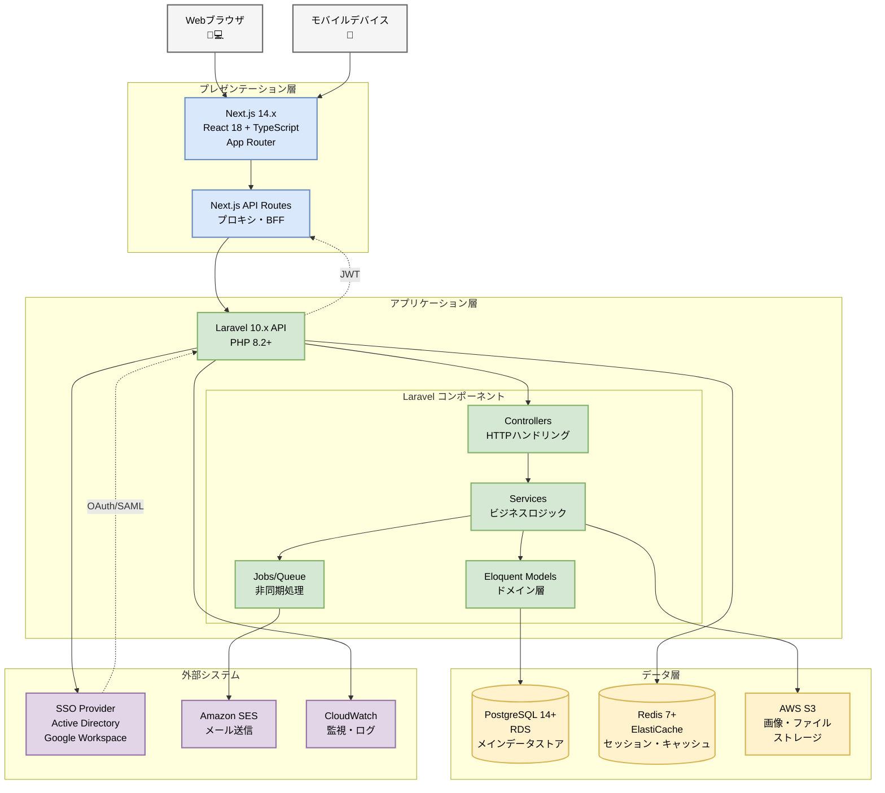

# システムアーキテクチャ

## 目次

- [概要](#概要)
- [アーキテクチャ概要](#アーキテクチャ概要)
  - [システム全体構成図](#システム全体構成図)
  - [アーキテクチャスタイル](#アーキテクチャスタイル)
- [レイヤー構成](#レイヤー構成)
  - [プレゼンテーション層](#プレゼンテーション層)
  - [アプリケーション層](#アプリケーション層)
  - [ドメイン層](#ドメイン層)
  - [インフラストラクチャ層](#インフラストラクチャ層)
- [コンポーネント構成](#コンポーネント構成)
  - [フロントエンド](#フロントエンド)
  - [バックエンド](#バックエンド)
  - [データベース](#データベース)
  - [キャッシュ](#キャッシュ)
  - [外部システム](#外部システム)
- [データフロー](#データフロー)
  - [基本的なリクエストフロー](#基本的なリクエストフロー)
  - [認証フロー](#認証フロー)
  - [貸出申請フロー](#貸出申請フロー)
  - [棚卸しフロー](#棚卸しフロー)
- [ディレクトリ構成](#ディレクトリ構成)
  - [バックエンド（Laravel）](#バックエンドlaravel)
  - [フロントエンド（Next.js）](#フロントエンドnextjs)
- [アーキテクチャ決定記録（ADR）](#アーキテクチャ決定記録adr)
- [関連ドキュメント](#関連ドキュメント)

## 概要

社内資産・備品管理システムは、従業員500名、5拠点、4,000点以上の資産を管理するWebアプリケーションです。
バックエンドにLaravel、フロントエンドにNext.jsを採用した、モダンなSPA（Single Page Application）アーキテクチャを採用します。

## アーキテクチャ概要

### システム全体構成図



### アーキテクチャスタイル

**採用スタイル**: モノリシックバックエンド + SPA フロントエンド

**理由**:
- チーム規模（6名）に適したシンプルな構成
- 開発・デプロイの複雑性を抑える
- 将来的なマイクロサービス化への移行も可能

**代替案検討**:
- マイクロサービス: 初期フェーズでは過剰（チーム規模、複雑性）
- モノリシックフルスタック: フロントエンドの独立性が低い

## レイヤー構成

### プレゼンテーション層

**責務**: ユーザーインターフェースの提供、ユーザー操作の受付

**技術**: Next.js (React + TypeScript)

**コンポーネント**:
- Pages (App Router)
- UI Components (React Components)
- State Management (React Context / Zustand)
- API Client (Axios / Fetch)

### アプリケーション層

**責務**: ビジネスロジックの調整、ユースケースの実装

**技術**: Laravel (PHP)

**コンポーネント**:
- Controllers (HTTP Request Handler)
- Services (Business Logic)
- Jobs (非同期処理)
- Events & Listeners

### ドメイン層

**責務**: ビジネスルールの実装、ドメインモデルの管理

**技術**: Laravel (Eloquent Models)

**コンポーネント**:
- Models (Eloquent ORM)
- Domain Services
- Value Objects
- Domain Events

### インフラストラクチャ層

**責務**: 外部システム連携、永続化、技術的基盤

**技術**: Laravel + AWS Services

**コンポーネント**:
- Repositories
- External API Clients (SSO, Email)
- File Storage (S3)
- Cache (Redis)
- Database Access (Eloquent)

## コンポーネント構成

### フロントエンド

**Next.js Application**

```
app/
├── (auth)/              # 認証関連ページ
│   └── login/
├── (dashboard)/         # ダッシュボード
│   ├── assets/          # 資産管理
│   ├── lending/         # 貸出管理
│   ├── inventory/       # 棚卸し
│   └── reports/         # レポート
├── api/                 # API Routes (プロキシ)
├── components/          # 共通コンポーネント
│   ├── ui/              # UIコンポーネント
│   ├── forms/           # フォーム
│   └── layouts/         # レイアウト
├── lib/                 # ユーティリティ
│   ├── api-client.ts    # API Client
│   ├── auth.ts          # 認証ヘルパー
│   └── validators.ts    # バリデーション
└── types/               # TypeScript型定義
```

**主要機能**:
- SSR (Server-Side Rendering) でSEO対応
- Client-side Navigation
- API通信（Laravel APIへ）
- 認証状態管理
- フォームバリデーション

### バックエンド

**Laravel API Application**

```
app/
├── Http/
│   ├── Controllers/     # コントローラー
│   │   ├── Auth/
│   │   ├── Asset/
│   │   ├── Lending/
│   │   └── Inventory/
│   ├── Middleware/      # ミドルウェア
│   ├── Requests/        # Form Request (バリデーション)
│   └── Resources/       # API Resource (レスポンス整形)
├── Models/              # Eloquent Models
│   ├── User.php
│   ├── Asset.php
│   ├── LendingRequest.php
│   └── Inventory.php
├── Services/            # ビジネスロジック
│   ├── AssetService.php
│   ├── LendingService.php
│   └── InventoryService.php
├── Repositories/        # データアクセス
├── Jobs/                # 非同期ジョブ
│   ├── SendReminderEmail.php
│   └── GenerateReportJob.php
├── Events/              # イベント
└── Listeners/           # リスナー
```

**主要機能**:
- RESTful API提供
- SSO認証（Laravel Socialite）
- ビジネスロジック実装
- データベースアクセス
- ジョブキュー（メール送信、レポート生成）

### データベース

**PostgreSQL RDS**

主要テーブル:
- users (ユーザー)
- assets (資産)
- asset_categories (資産カテゴリ)
- lending_requests (貸出申請)
- lending_histories (貸出履歴)
- inventories (棚卸し)
- inventory_items (棚卸し項目)
- approvers (承認者)

### キャッシュ

**Redis ElastiCache**

用途:
- セッション管理
- API レスポンスキャッシュ
- ジョブキュー
- レート制限

### 外部システム

**社内認証システム (SSO)**
- Active Directory (SAML 2.0)
- Google Workspace (OAuth 2.0)
- 実装: Laravel Socialite

**メール配信**
- Amazon SES
- 実装: Laravel Mail

**ファイルストレージ**
- Amazon S3
- 用途: 資産画像、QRコード、レポートPDF

## データフロー

### 基本的なリクエストフロー

```
1. ユーザー操作
   ↓
2. Next.js (Client-side)
   - イベントハンドリング
   - バリデーション (クライアント側)
   ↓
3. API Request (HTTP)
   - Authorization Header (Bearer Token)
   ↓
4. ALB (Load Balancer)
   ↓
5. Laravel API
   - Middleware (認証・認可)
   - Controller (リクエスト処理)
   - Service (ビジネスロジック)
   - Repository (データアクセス)
   ↓
6. PostgreSQL / Redis
   - データ取得・更新
   ↓
7. API Response (JSON)
   ↓
8. Next.js (Client-side)
   - レスポンス処理
   - UI更新
```

### 認証フロー

```
1. ユーザーがログインボタンクリック
   ↓
2. Next.js → Laravel API (/api/auth/redirect)
   ↓
3. Laravel → SSO Provider (AD/Google)
   - SAML/OAuth認証リダイレクト
   ↓
4. ユーザーがSSO認証
   ↓
5. SSO Provider → Laravel (/api/auth/callback)
   - 認証トークン受信
   ↓
6. Laravel
   - ユーザー情報取得
   - ユーザーレコード作成/更新
   - JWTトークン発行
   ↓
7. Laravel → Next.js
   - JWTトークン返却
   ↓
8. Next.js
   - トークン保存 (HttpOnly Cookie)
   - ダッシュボードへリダイレクト
```

### 貸出申請フロー

```
1. 従業員が貸出申請
   ↓
2. Next.js → Laravel API (POST /api/lending-requests)
   - 資産ID、期間、理由
   ↓
3. Laravel (LendingService)
   - バリデーション
   - 資産の利用可能性チェック
   - 申請レコード作成 (status: pending)
   ↓
4. Laravel Event Dispatch
   - LendingRequestCreated イベント
   ↓
5. Event Listener
   - SendApprovalEmailJob をキューに追加
   ↓
6. Job Worker
   - 承認者にメール送信 (SES)
   ↓
7. API Response → Next.js
   - 申請完了メッセージ表示
```

### 棚卸しフロー

```
1. 管理者が棚卸し開始
   ↓
2. Next.js → Laravel API (POST /api/inventories)
   - 対象拠点、担当者
   ↓
3. Laravel (InventoryService)
   - 棚卸しレコード作成
   - 対象資産リスト生成
   - QRコード一括生成 (Job)
   ↓
4. QR Code Generation Job
   - 各資産のQRコード生成
   - S3へアップロード
   ↓
5. スマートフォンでQRコード読取
   ↓
6. Next.js (Mobile) → Laravel API (POST /api/inventories/{id}/items/{assetId}/confirm)
   ↓
7. Laravel
   - 実在確認記録
   - 進捗率更新
   ↓
8. WebSocket / Polling
   - リアルタイム進捗表示
```

## ディレクトリ構成

### バックエンド（Laravel）

```
laravel-api/
├── app/
│   ├── Console/
│   ├── Exceptions/
│   ├── Http/
│   │   ├── Controllers/
│   │   ├── Middleware/
│   │   ├── Requests/
│   │   └── Resources/
│   ├── Models/
│   ├── Services/
│   ├── Repositories/
│   ├── Jobs/
│   ├── Events/
│   └── Listeners/
├── bootstrap/
├── config/
├── database/
│   ├── factories/
│   ├── migrations/
│   └── seeders/
├── routes/
│   ├── api.php
│   └── web.php
├── storage/
├── tests/
│   ├── Feature/
│   └── Unit/
└── vendor/
```

### フロントエンド（Next.js）

```
nextjs-frontend/
├── app/
│   ├── (auth)/
│   ├── (dashboard)/
│   ├── api/
│   ├── components/
│   ├── lib/
│   └── types/
├── public/
│   ├── images/
│   └── icons/
├── styles/
├── .next/
└── node_modules/
```

## アーキテクチャ決定記録（ADR）

### ADR-001: モノリシックバックエンドの採用

**決定日**: 2025-01-15

**状態**: 承認済み

**コンテキスト**:
チーム規模6名、開発期間9ヶ月という制約の中で、効率的な開発を実現する必要がある。

**決定**:
マイクロサービスではなく、モノリシックなLaravel APIを採用する。

**理由**:
- チーム規模に対してマイクロサービスは過剰
- 開発・デプロイの複雑性を抑える
- 社内システムのためトラフィックは限定的
- 将来的なマイクロサービス化への移行パスは確保

**結果**:
- 開発速度の向上
- 運用コストの削減
- シンプルなデプロイフロー

### ADR-002: Next.js App Routerの採用

**決定日**: 2025-01-18

**状態**: 承認済み

**コンテキスト**:
Next.js 13以降でApp Routerが推奨されており、Pages Routerとの選択が必要。

**決定**:
App Routerを採用する。

**理由**:
- Next.jsの最新機能（Server Components等）が利用可能
- より優れたレイアウトシステム
- 将来性（Next.jsの推奨方向）
- TypeScript統合の向上

**結果**:
- モダンな開発体験
- パフォーマンス向上
- 学習コストは許容範囲内

### ADR-003: JWT認証の採用

**決定日**: 2025-01-20

**状態**: 承認済み

**コンテキスト**:
SPA + API構成において、認証方式を決定する必要がある。

**決定**:
JWT (JSON Web Token) を使用したステートレス認証を採用する。

**理由**:
- SPAに適した認証方式
- スケーラビリティ（サーバー側でセッション管理不要）
- Laravel Sanctum / Passport のサポート
- モバイルアプリへの将来的な対応が容易

**結果**:
- ステートレスな認証
- スケーラブルな構成
- セキュアなトークン管理（HttpOnly Cookie）

## 関連ドキュメント

- [技術スタック](technology-stack.md) - 採用技術の詳細
- [データベース設計](database-design.md) - テーブル定義とER図
- [インフラ構成](infrastructure.md) - AWS構成の詳細
- [セキュリティアーキテクチャ](security-architecture.md) - セキュリティ設計
- [パフォーマンス設計](performance-design.md) - パフォーマンス最適化
- [../01-requirements/](../01-requirements/) - 満たすべき要件定義
