# Mermaid図表記述ルール

## 目次

- [概要](#概要)
- [基本方針](#基本方針)
- [図表の種類と使用場面](#図表の種類と使用場面)
  - [フローチャート（flowchart/graph）](#フローチャートflowchartgraph)
  - [シーケンス図（sequence）](#シーケンス図sequence)
  - [クラス図（classDiagram）](#クラス図classdiagram)
  - [ER図（erDiagram）](#er図erdiagram)
  - [ガントチャート（gantt）](#ガントチャートgantt)
  - [状態遷移図（stateDiagram）](#状態遷移図statediagram)
- [記述ルール](#記述ルール)
  - [共通ルール](#共通ルール)
  - [命名規則](#命名規則)
  - [スタイル定義](#スタイル定義)
  - [色の使い分け](#色の使い分け)
- [実装例](#実装例)
  - [機能依存関係図](#機能依存関係図)
  - [ユースケース図](#ユースケース図)
  - [システム構成図](#システム構成図)
  - [API シーケンス図](#api-シーケンス図)
  - [データベース設計（ER図）](#データベース設計er図)
- [ベストプラクティス](#ベストプラクティス)
- [チェックリスト](#チェックリスト)
- [関連ツール](#関連ツール)

## 概要

このドキュメントは、プロジェクト内の技術文書で使用する図表を**Mermaid形式**で記述するためのルールを定めています。Mermaidを使用することで、図表をMarkdown内に直接記述でき、バージョン管理が容易になります。

**重要**: 画面設計（ワイヤーフレーム、UIモックアップ）については、[screen-design-rules.md](./screen-design-rules.md)を参照してください。

## 基本方針

1. **テキストベース管理**: すべての図表をMermaid記法で記述し、Gitでバージョン管理
2. **Markdownへの直接埋め込み**: 図表は該当するMarkdownファイル内に直接記述
3. **一貫性の確保**: プロジェクト全体で統一された記法とスタイルを使用
4. **可読性の重視**: 図表コードも読みやすく、メンテナンスしやすい形式で記述

## 図表の種類と使用場面

### フローチャート（flowchart/graph）

**用途**:
- 処理フロー、業務フロー
- 機能の依存関係
- システム構成図

**基本構文**:
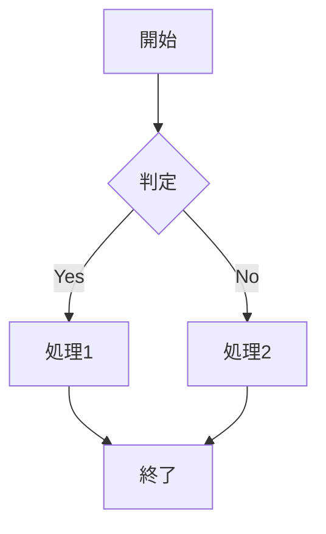

### シーケンス図（sequence）

**用途**:
- API通信フロー
- ユーザーインタラクション
- システム間連携

**基本構文**:
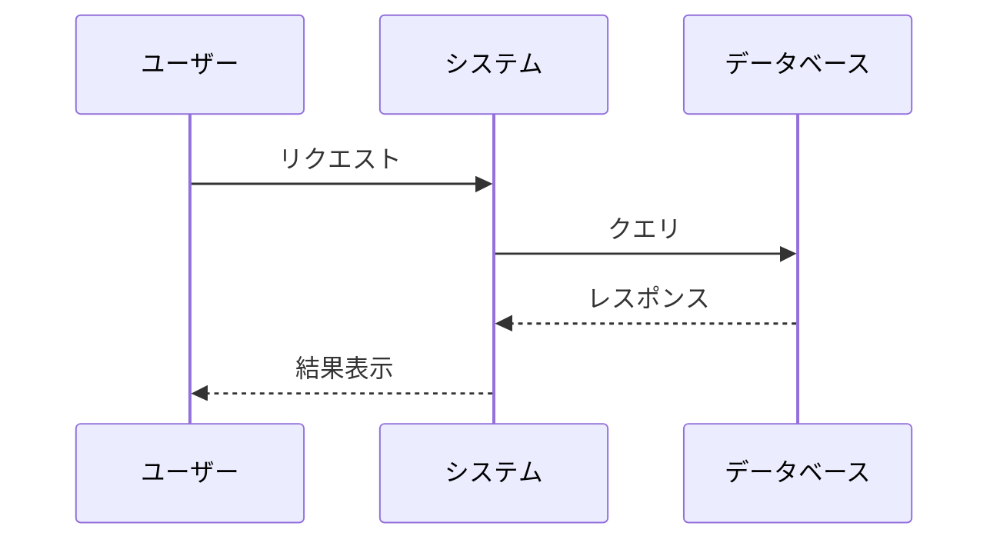

### クラス図（classDiagram）

**用途**:
- オブジェクト指向設計
- データモデル
- モジュール構成

**基本構文**:
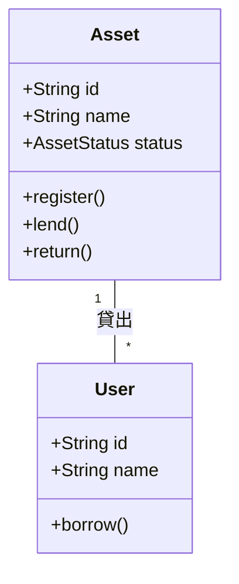

### ER図（erDiagram）

**用途**:
- データベース設計
- エンティティ関係

**基本構文**:
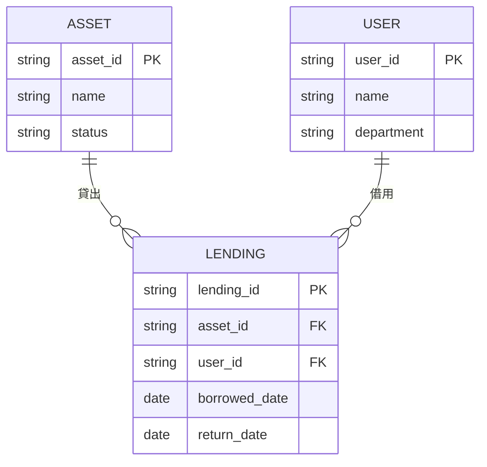

### ガントチャート（gantt）

**用途**:
- プロジェクトスケジュール
- 開発タイムライン

**基本構文**:
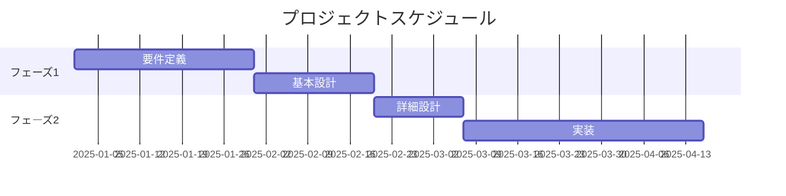

### 状態遷移図（stateDiagram）

**用途**:
- 資産のライフサイクル
- 承認フロー
- システム状態管理

**基本構文**:
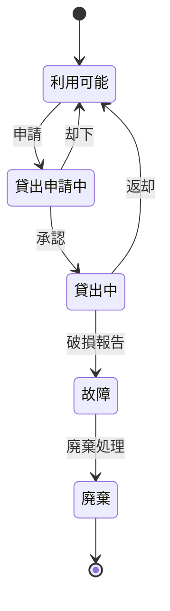

## 記述ルール

### 共通ルール

1. **Mermaidブロックの記述**
```markdown
```mermaid
[図表の記述]
```
```

2. **図表の前後に説明を追加**
```markdown
### 機能依存関係図

以下の図は、システムの主要機能間の依存関係を示しています。

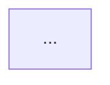

**凡例**:
- 青: 必須機能（Must Have）
- 黄: 重要機能（Should Have）
- 紫: 推奨機能（Could Have）
```

3. **1つの図表は100行以内**
   - 大きすぎる図表は複数に分割
   - 必要に応じてサブグラフを活用

### 命名規則

| 要素 | 命名規則 | 例 |
|------|---------|-----|
| ノードID | 英数字とアンダースコア | `FR_001`, `UC_Login` |
| ラベル | 日本語可（改行は`<br/>`） | `ログイン<br/>処理` |
| クラス名 | キャメルケース | `mustHave`, `primaryUseCase` |
| スタイル定義 | ケバブケース | `fill-color`, `stroke-width` |

### スタイル定義

**優先度・重要度による色分け**:
```mermaid
%%{init: {'theme':'base', 'themeVariables': {'primaryColor':'#dae8fc'}}}%%
graph LR
    classDef mustHave fill:#dae8fc,stroke:#6c8ebf,stroke-width:2px,color:#000000
    classDef shouldHave fill:#fff2cc,stroke:#d6b656,stroke-width:2px,color:#000000
    classDef couldHave fill:#e1d5e7,stroke:#9673a6,stroke-width:2px,color:#000000
    classDef wontHave fill:#f8cecc,stroke:#b85450,stroke-width:2px,color:#000000
```

### 色の使い分け

| 色 | HEX | 用途 |
|----|-----|------|
| 青 | `#dae8fc` / `#6c8ebf` | 必須・主要・正常系 |
| 黄 | `#fff2cc` / `#d6b656` | 重要・警告・注意 |
| 紫 | `#e1d5e7` / `#9673a6` | 推奨・副次的 |
| 赤 | `#f8cecc` / `#b85450` | エラー・削除・廃止 |
| 緑 | `#d5e8d4` / `#82b366` | 成功・完了・承認 |
| グレー | `#f5f5f5` / `#666666` | システム境界・無効 |

## 実装例

### 機能依存関係図

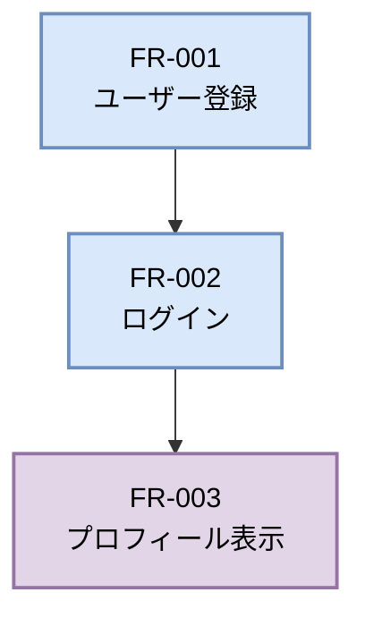

### ユースケース図

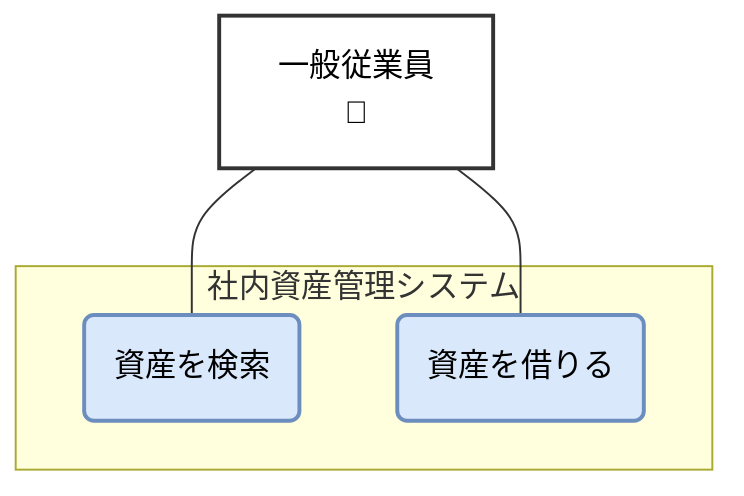

### システム構成図

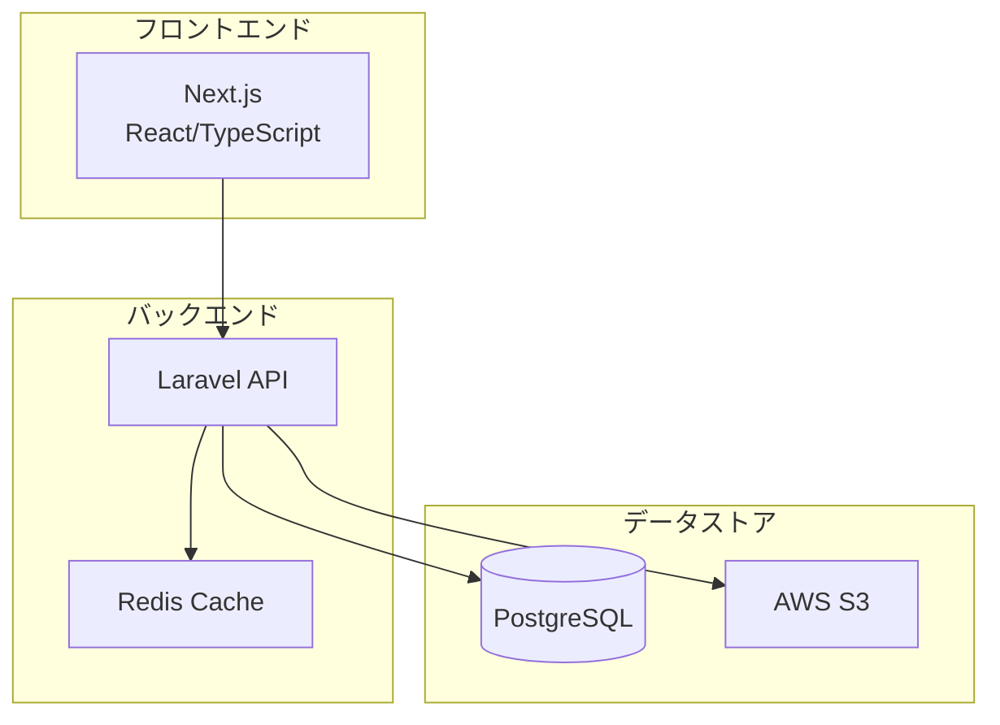

### API シーケンス図

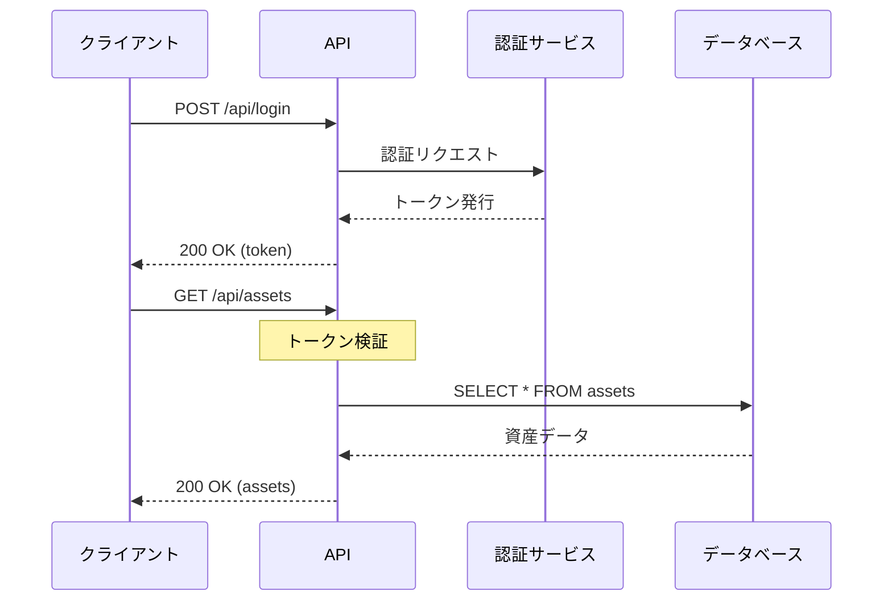

### データベース設計（ER図）

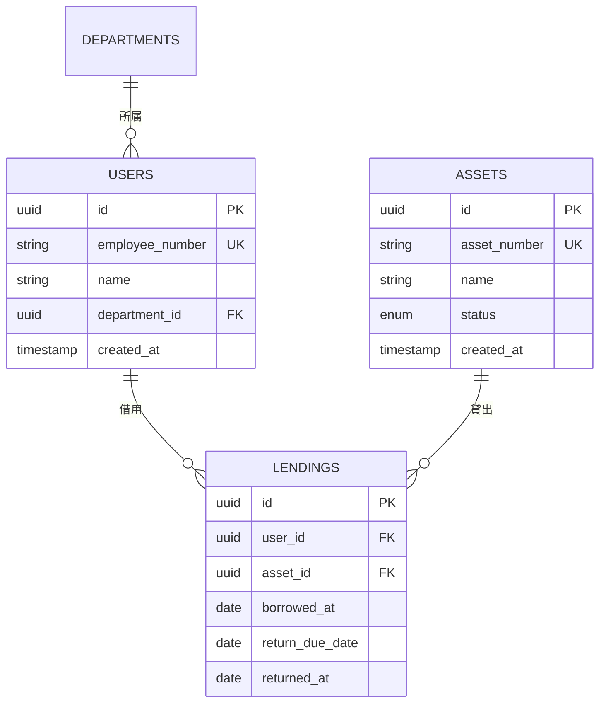

## ベストプラクティス

### ✅ DO（推奨事項）

1. **説明を充実させる**
   - 図表の前に概要説明を記載
   - 図表の後に凡例や補足を追加

2. **適切な図表タイプを選択**
   - フロー → flowchart/graph
   - 時系列の相互作用 → sequenceDiagram
   - データ構造 → erDiagram/classDiagram

3. **サブグラフで整理**
   - 関連する要素をグループ化
   - システム境界を明確化

4. **一貫性のあるスタイル**
   - プロジェクト全体で同じ色定義を使用
   - 命名規則を統一

### ❌ DON'T（避けるべき事項）

1. **過度に複雑な図表**
   - 1つの図に詰め込みすぎない
   - 必要に応じて分割

2. **説明なしの図表**
   - 図表だけでは意図が伝わらない
   - 必ず文脈を提供

3. **不適切な図表タイプ**
   - UIレイアウトにMermaidを使わない（→ draw.ioを使用）
   - 複雑な図形表現を無理に実装しない

## チェックリスト

### 図表作成時

- [ ] 適切な図表タイプを選択した
- [ ] 命名規則に従っている
- [ ] スタイル定義を追加した
- [ ] 図表の前に概要説明を記載した
- [ ] 凡例・補足説明を追加した
- [ ] 100行以内に収まっている

### レビュー時

- [ ] 図表の意図が明確である
- [ ] ラベルが適切で分かりやすい
- [ ] 色使いが統一されている
- [ ] Mermaid記法が正しい
- [ ] GitHubやVS Codeで正しくレンダリングされる

## 関連ツール

### プレビューツール

1. **VS Code拡張機能**
   - [Markdown Preview Mermaid Support](https://marketplace.visualstudio.com/items?itemName=bierner.markdown-mermaid)
   - リアルタイムプレビュー対応

2. **オンラインエディタ**
   - [Mermaid Live Editor](https://mermaid.live/)
   - ブラウザで即座に確認

3. **統合ツール**
   - GitHub: Markdown内のMermaidを自動レンダリング
   - GitLab: 同様に対応
   - Notion: Mermaidブロック対応

### リファレンス

- [Mermaid公式ドキュメント](https://mermaid.js.org/intro/)
- [Mermaid構文リファレンス](https://mermaid.js.org/syntax/syntax.html)
