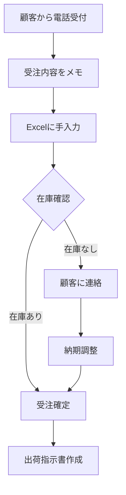
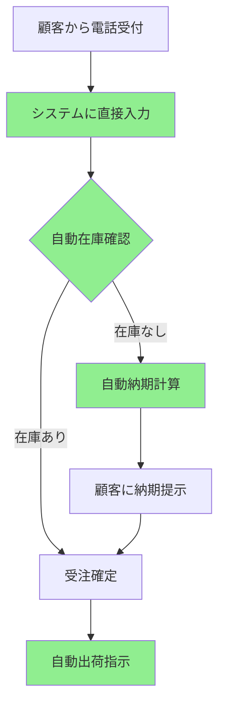
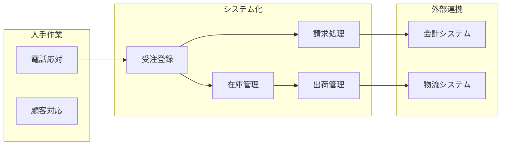

# 業務フロー図 テンプレート

> **使い方**:このテンプレートは `business-flow.md` の記述ルールを定義します。
> - 各セクションの「記述ルール」と「記述例」を参考にして内容を記述してください。
> - **出力形式**: 実際に作成するファイルには「記述ルール」と「記述例」は含めず、内容のみを記述してください。
> - **セクションの統一**: 該当しないセクションも削除せず「該当なし」と記載してください。

## 目次

- [現行業務フロー（As-Is）](#現行業務フローas-is)
  - [業務フロー](#業務フロー)
  - [課題](#課題)
- [新業務フロー（To-Be）](#新業務フローto-be)
  - [業務フロー](#業務フロー-1)
  - [改善ポイント](#改善ポイント)
- [業務とシステムの関係](#業務とシステムの関係)
  - [業務・システム対応表](#業務システム対応表)
  - [システム境界図](#システム境界図)

---

## 現行業務フロー（As-Is）

### 記述ルール

- 現在の業務プロセスをMermaid形式のフローチャートで記述する
- 主要なアクター（担当者・システム）を明確にする
- 問題点や課題がある箇所にコメントを付ける

### 業務フロー

#### 記述例

### 課題

#### 記述例

- 手入力による転記ミスが発生している
- 在庫確認に時間がかかる（別システムを参照）
- 受注から出荷指示まで平均30分かかる

---

## 新業務フロー（To-Be）

### 記述ルール

- 新しい業務プロセスをMermaid形式のフローチャートで記述する
- As-Isと比較して改善されるポイントを明示する
- システム化される部分を明確に区別する

### 業務フロー

#### 記述例

### 改善ポイント

#### 記述例

| 項目 | As-Is | To-Be | 効果 |
|-----|-------|-------|-----|
| 受注入力 | Excel手入力 | システム直接入力 | 転記ミス削減 |
| 在庫確認 | 別システム参照 | 自動確認 | 時間短縮 |
| 出荷指示 | 手作業 | 自動生成 | 工数削減 |

---

## 業務とシステムの関係

### 記述ルール

- 業務プロセスとシステム機能の対応を明確にする
- どの業務がシステム化されるかを示す
- 人手で行う作業とシステムで自動化する作業を区別する

### 業務・システム対応表

#### 記述例

| 業務 | 担当 | システム機能 | 自動化 |
|-----|-----|------------|-------|
| 受注受付 | 営業担当 | 受注入力画面 | 一部 |
| 在庫確認 | - | 在庫照会機能 | 完全 |
| 納期回答 | - | 納期計算機能 | 完全 |
| 出荷指示 | 物流担当 | 出荷指示機能 | 一部 |
| 請求処理 | 経理担当 | 請求書発行機能 | 一部 |

### システム境界図

#### 記述例

