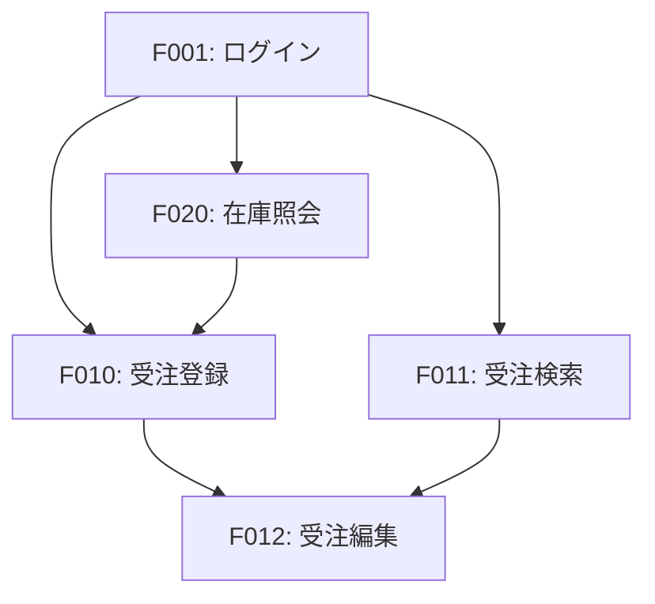

# 機能要件 テンプレート

> **使い方**:このテンプレートは `functional-requirements.md` の記述ルールを定義します。
> - 各セクションの「記述ルール」と「記述例」を参考にして内容を記述してください。
> - **出力形式**: 実際に作成するファイルには「記述ルール」と「記述例」は含めず、内容のみを記述してください。
> - **セクションの統一**: 該当しないセクションも削除せず「該当なし」と記載してください。

## 目次

- [機能一覧表](#機能一覧表)
  - [一覧](#一覧)
- [各機能の概要説明](#各機能の概要説明)
  - [機能詳細](#機能詳細)
- [機能間の依存関係](#機能間の依存関係)
  - [依存関係図](#依存関係図)
  - [依存関係一覧](#依存関係一覧)
- [優先度](#優先度)
  - [優先度の定義](#優先度の定義)
  - [機能別優先度](#機能別優先度)

---

## 機能一覧表

### 記述ルール

- 機能IDを付与し、一意に識別できるようにする
- 機能カテゴリで分類する
- 各機能の概要を簡潔に記述する

### 一覧

#### 記述例

| 機能ID | カテゴリ | 機能名 | 概要 |
|-------|---------|-------|------|
| F001 | 認証 | ログイン | ユーザー認証を行う |
| F002 | 認証 | ログアウト | セッションを終了する |
| F003 | 認証 | パスワードリセット | パスワードを再設定する |
| F010 | 受注管理 | 受注登録 | 新規受注を登録する |
| F011 | 受注管理 | 受注検索 | 受注情報を検索する |
| F012 | 受注管理 | 受注編集 | 受注内容を修正する |
| F020 | 在庫管理 | 在庫照会 | 在庫状況を確認する |
| F021 | 在庫管理 | 在庫調整 | 在庫数を調整する |

---

## 各機能の概要説明

### 記述ルール

- 機能IDごとに詳細を記述する
- 入力・処理・出力を明確にする
- 関連する画面やAPIがあれば参照を記載する

### 機能詳細

#### 記述例

**F010: 受注登録**

**概要**

顧客からの注文情報を登録し、受注番号を発行する。

**入力**

- 顧客情報（顧客ID または 新規顧客情報）
- 商品情報（商品ID、数量）
- 納品希望日
- 備考

**処理**

1. 入力内容のバリデーション
2. 在庫の引当確認
3. 受注番号の自動採番
4. 受注データの登録

**出力**

- 受注番号
- 受注確認画面の表示
- 受注確認メールの送信

**関連**

- 画面: S010-受注登録画面
- API: POST /api/orders

---

## 機能間の依存関係

### 記述ルール

- 機能間の依存関係をMermaid形式で図示する
- 前提となる機能を明確にする
- 依存の種類（必須/任意）を区別する

### 依存関係図

#### 記述例

### 依存関係一覧

#### 記述例

| 機能ID | 依存先 | 依存種類 | 説明 |
|-------|-------|---------|------|
| F010 | F001 | 必須 | 認証が必要 |
| F010 | F020 | 必須 | 在庫確認が必要 |
| F012 | F010 | 必須 | 受注が存在する必要がある |
| F012 | F011 | 任意 | 検索から遷移可能 |

---

## 優先度

### 記述ルール

- 優先度の定義を明確にする
- 各機能に優先度を割り当てる
- 優先度の理由を記載する

### 優先度の定義

#### 記述例

| 優先度 | 説明 | リリース目標 |
|-------|------|------------|
| 必須 | リリースに必須の機能 | Phase 1 |
| 高 | 業務に重要な機能 | Phase 1 |
| 中 | あると便利な機能 | Phase 2 |
| 低 | 将来的に実装する機能 | 未定 |

### 機能別優先度

#### 記述例

| 機能ID | 機能名 | 優先度 | 理由 |
|-------|-------|-------|------|
| F001 | ログイン | 必須 | セキュリティ要件 |
| F010 | 受注登録 | 必須 | コア業務機能 |
| F011 | 受注検索 | 必須 | コア業務機能 |
| F012 | 受注編集 | 高 | 運用上必要 |
| F020 | 在庫照会 | 必須 | 受注登録の前提 |
| F021 | 在庫調整 | 中 | 棚卸時に使用 |
