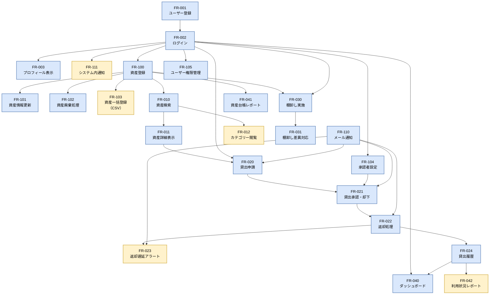

# 機能要件

## 目次

- [概要](#概要)
- [機能要件の分類](#機能要件の分類)
  - [必須機能（Must Have）](#必須機能must-have)
  - [重要機能（Should Have）](#重要機能should-have)
  - [推奨機能（Could Have）](#推奨機能could-have)
  - [将来機能（Won't Have - This Time）](#将来機能wont-have---this-time)
- [機能一覧](#機能一覧)
  - [ユーザー管理機能](#ユーザー管理機能)
  - [資産管理機能](#資産管理機能)
  - [貸出・返却機能](#貸出返却機能)
  - [棚卸し機能](#棚卸し機能)
  - [レポート・分析機能](#レポート分析機能)
  - [管理機能（管理者向け）](#管理機能管理者向け)
  - [通知機能](#通知機能)
- [機能の優先順位マトリクス](#機能の優先順位マトリクス)
- [機能の依存関係図](#機能の依存関係図)
- [スコープ外機能](#スコープ外機能)
- [関連ドキュメント](#関連ドキュメント)

## 概要

このドキュメントでは、システムが提供すべき具体的な機能を定義します。
各機能には一意のIDを付与し、優先順位と依存関係を明記します。

---

## 機能要件の分類

### 必須機能（Must Have）
最初のリリースで必ず実装が必要な機能

### 重要機能（Should Have）
ビジネス価値は高いが、代替手段があれば後回し可能な機能

### 推奨機能（Could Have）
あると望ましいが、なくても運用可能な機能

### 将来機能（Won't Have - This Time）
今回のスコープ外だが、将来実装を検討する機能

---

## 機能一覧

### ユーザー管理機能

#### FR-001: ユーザー登録（社内認証連携）
**優先度**: Must Have
**依存機能**: なし

**説明**:
Active DirectoryまたはGoogle Workspaceと連携して自動的にユーザーアカウントを作成

**詳細要件**:
- 社内認証システム（AD/Google Workspace）とのSSO連携
- 初回ログイン時に自動的にアカウント作成
- 所属部署、役職、社員番号を自動取得
- ユーザー属性に基づく権限自動付与

**出力**:
- アカウント作成完了
- ダッシュボード画面への遷移

---

#### FR-002: ログイン/ログアウト
**優先度**: Must Have
**依存機能**: FR-001

**説明**:
社内認証システムを使用してシステムにログイン・ログアウト

**詳細要件**:
- SSO（シングルサインオン）によるログイン
- セッションタイムアウト（1時間）
- ログアウト機能
- ログイン履歴の記録

---

#### FR-003: プロフィール表示
**優先度**: Must Have
**依存機能**: FR-002

**説明**:
自分のプロフィール情報を確認する

**詳細要件**:
- 氏名、社員番号、所属部署、メールアドレスの表示
- 現在借りている資産一覧の表示
- 貸出履歴の表示（直近10件）

---

### 資産管理機能

#### FR-010: 資産検索
**優先度**: Must Have
**依存機能**: なし

**説明**:
資産をキーワードで検索する機能

**詳細要件**:
- キーワード検索（資産名、型番、資産番号、メーカー）
- カテゴリー検索（PC、モニター、家具、備品等）
- 詳細検索（貸出状況、保管場所、取得日範囲）
- 検索結果のソート（資産名順、取得日順、貸出状況）
- ページネーション（1ページ20件）

**入力項目**:
- 検索キーワード
- カテゴリー（任意）
- 貸出状況フィルタ（任意）
- 保管場所フィルタ（任意）

**出力**:
- 検索結果一覧（資産画像、名称、型番、貸出状況、保管場所）
- ヒット件数

**パフォーマンス要件**:
- 検索結果表示まで1秒以内

---

#### FR-011: 資産詳細表示
**優先度**: Must Have
**依存機能**: FR-010

**説明**:
資産の詳細情報を表示する機能

**詳細要件**:
- 資産の基本情報（名称、型番、メーカー、資産番号、シリアル番号）
- 取得情報（取得日、取得価格、耐用年数、残存価値）
- 保管情報（保管場所、管理部署、管理責任者）
- 貸出状況（貸出中/利用可能、貸出者、返却予定日）
- 資産画像
- 貸出履歴（過去の貸出記録）
- 「貸出申請」ボタン（利用可能な場合のみ）

---

#### FR-012: 資産カテゴリー閲覧
**優先度**: Should Have
**依存機能**: FR-010

**説明**:
カテゴリーごとに資産を閲覧する機能

**詳細要件**:
- カテゴリー一覧の表示（PC、モニター、キーボード、マウス、家具、備品等）
- 各カテゴリーの在庫数表示
- カテゴリー選択による絞り込み
- サブカテゴリー対応（例：PC→ノートPC、デスクトップPC）

---

### 貸出・返却機能

#### FR-020: 貸出申請
**優先度**: Must Have
**依存機能**: FR-011, FR-002

**説明**:
資産の貸出を申請する機能

**詳細要件**:
- 資産詳細ページから貸出申請
- 貸出期間の指定（開始日、返却予定日）
- 利用目的の入力（任意、200文字以内）
- 申請理由の入力（必須、500文字以内）
- 申請確認画面の表示
- 申請完了時にメール通知（申請者、承認者）

**入力項目**:
- 貸出開始日（必須）
- 返却予定日（必須）
- 利用目的（任意）
- 申請理由（必須）

**バリデーション**:
- 既に貸出中の資産は申請不可
- 返却予定日は開始日より後
- 最大貸出期間: 180日

---

#### FR-021: 貸出承認/却下
**優先度**: Must Have
**依存機能**: FR-020

**説明**:
承認者が貸出申請を承認または却下する機能

**詳細要件**:
- 承認待ち申請一覧の表示
- 申請詳細の確認（申請者、資産、期間、理由）
- 承認/却下の選択
- 却下時は却下理由の入力（必須）
- 承認/却下後にメール通知（申請者）
- 承認後、貸出ステータスが「貸出中」に更新

**承認権限**:
- 資産管理部門（総務部）: 全申請を承認可能
- 部門長: 自部門メンバーの申請を承認可能（設定により）

---

#### FR-022: 返却処理
**優先度**: Must Have
**依存機能**: FR-021

**説明**:
貸出中の資産を返却する機能

**詳細要件**:
- 自分が借りている資産一覧の表示
- 「返却する」ボタンによる返却処理
- 返却確認ダイアログ
- 返却時の状態入力（正常/破損/紛失）
- 破損・紛失時はコメント入力（必須）
- 返却完了メール通知（本人、管理者）

**バリデーション**:
- 破損・紛失選択時は必ずコメント入力

---

#### FR-023: 返却遅延アラート
**優先度**: Should Have
**依存機能**: FR-022

**説明**:
返却予定日を過ぎた資産について自動的にアラートを送信

**詳細要件**:
- 返却予定日の3日前にリマインダーメール送信
- 返却予定日当日にアラートメール送信
- 返却予定日超過後、1日ごとにアラートメール送信
- 管理者ダッシュボードに遅延一覧を表示

---

#### FR-024: 貸出履歴
**優先度**: Must Have
**依存機能**: FR-022

**説明**:
自分の過去の貸出履歴を確認する機能

**詳細要件**:
- 貸出履歴一覧の表示（貸出日、返却日、資産名、状態）
- 期間指定での絞り込み
- CSV エクスポート
- 現在貸出中の資産はハイライト表示

---

### 棚卸し機能

#### FR-030: 棚卸し実施
**優先度**: Must Have
**依存機能**: なし

**説明**:
定期的な棚卸しを実施し、実在庫と帳簿在庫を照合する機能

**詳細要件**:
- 棚卸し開始（対象期間、対象拠点、担当者を指定）
- 棚卸し用QRコードの一括生成
- 資産ごとの実在確認（QRコード読み取りまたは手動入力）
- 確認状況のリアルタイム表示
- 未確認資産一覧の表示
- 差異一覧の自動生成
- 棚卸し結果レポートの出力

---

#### FR-031: 棚卸し差異対応
**優先度**: Must Have
**依存機能**: FR-030

**説明**:
棚卸しで発見された差異に対応する機能

**詳細要件**:
- 差異資産一覧の表示（所在不明、未登録発見）
- 差異理由の入力
- 所在不明資産の調査依頼
- 資産ステータスの更新（所在不明、廃棄済み等）
- 差異対応履歴の記録

---

### レポート・分析機能

#### FR-040: ダッシュボード
**優先度**: Must Have
**依存機能**: FR-002

**説明**:
資産管理の概要を可視化するダッシュボード

**詳細要件**:
- 総資産数、貸出中数、利用可能数の表示
- カテゴリー別資産分布（円グラフ）
- 拠点別資産分布（棒グラフ）
- 貸出中資産一覧（トップ10）
- 返却遅延資産アラート
- 承認待ち申請数（管理者・承認者のみ）

---

#### FR-041: 資産台帳レポート
**優先度**: Must Have
**依存機能**: なし

**説明**:
資産台帳を出力する機能

**詳細要件**:
- 全資産の一覧出力（Excel/CSV/PDF）
- フィルタ条件指定（カテゴリー、拠点、貸出状況）
- 出力項目の選択
- スケジュール出力（月次自動生成）

---

#### FR-042: 利用状況レポート
**優先度**: Should Have
**依存機能**: FR-024

**説明**:
資産の利用状況を分析するレポート

**詳細要件**:
- 期間指定（月次、四半期、年次）
- カテゴリー別利用率
- 資産別利用率（稼働率）
- 部署別利用状況
- 低稼働資産の抽出
- グラフ表示（棒グラフ、折れ線グラフ）

---

### 管理機能（管理者向け）

#### FR-100: 資産登録
**優先度**: Must Have
**依存機能**: なし

**説明**:
管理者が新しい資産を登録する機能

**詳細要件**:
- 資産情報の入力
  - 基本情報（名称、型番、メーカー、資産番号、シリアル番号）
  - 取得情報（取得日、取得価格、耐用年数）
  - 保管情報（保管場所、管理部署、管理責任者）
  - カテゴリー、サブカテゴリー
- 資産画像のアップロード（最大5枚）
- QRコードの自動生成
- 登録確認画面
- バーコードスキャナー対応

---

#### FR-101: 資産情報更新
**優先度**: Must Have
**依存機能**: FR-100

**説明**:
既存資産の情報を更新する機能

**詳細要件**:
- 資産検索・選択
- 各項目の編集
- 更新履歴の記録（誰が、いつ、何を変更したか）
- 更新理由の入力（任意）

---

#### FR-102: 資産廃棄処理
**優先度**: Must Have
**依存機能**: FR-100

**説明**:
不要になった資産を廃棄する機能

**詳細要件**:
- 廃棄対象資産の選択
- 廃棄理由の入力（故障、老朽化、不要等）
- 廃棄承認ワークフロー（高額資産のみ）
- 廃棄日の記録
- 資産ステータスを「廃棄済み」に更新
- 廃棄証明書の発行（PDF）

---

#### FR-103: 資産一括登録（CSV）
**優先度**: Should Have
**依存機能**: FR-100

**説明**:
CSVファイルで資産を一括登録する機能

**詳細要件**:
- CSVテンプレートのダウンロード
- CSVファイルのアップロード
- アップロード前のバリデーション
- エラー行のハイライト表示
- プレビュー表示
- 一括登録の実行
- 登録結果レポート（成功X件、失敗Y件）

---

#### FR-104: 承認者設定
**優先度**: Must Have
**依存機能**: FR-001

**説明**:
貸出申請の承認者を設定する機能

**詳細要件**:
- 部署ごとの承認者設定
- 承認フローの設定（1段階/2段階承認）
- 代理承認者の設定
- 承認権限の有効期限設定

---

#### FR-105: ユーザー権限管理
**優先度**: Must Have
**依存機能**: FR-001

**説明**:
ユーザーの権限を管理する機能

**詳細要件**:
- ユーザー一覧の表示・検索
- 権限レベルの設定（一般ユーザー、承認者、管理者）
- 権限の有効化・無効化
- 特定資産への アクセス制限設定

---

### 通知機能

#### FR-110: メール通知
**優先度**: Must Have
**依存機能**: なし

**説明**:
各種イベント発生時にメール通知を送信する機能

**通知タイミング**:
- 貸出申請時（申請者、承認者）
- 貸出承認/却下時（申請者）
- 返却予定日リマインダー（貸出者）
- 返却遅延アラート（貸出者、管理者）
- 返却処理時（管理者）
- 棚卸し開始時（担当者）

---

#### FR-111: システム内通知
**優先度**: Should Have
**依存機能**: FR-002

**説明**:
システム内で通知を表示する機能

**詳細要件**:
- 通知アイコンへの未読数表示
- 通知一覧の表示
- 通知の既読/未読管理
- 通知のフィルタリング（種類別）
- 通知の削除

---

## 機能の優先順位マトリクス

| 機能ID | 機能名 | 優先度 | ビジネス価値 | 実装難易度 | 優先順位 |
|--------|--------|--------|--------------|-----------|----------|
| FR-001 | ユーザー登録 | Must | 高 | 中 | 1 |
| FR-010 | 資産検索 | Must | 高 | 低 | 1 |
| FR-020 | 貸出申請 | Must | 高 | 中 | 2 |
| FR-021 | 貸出承認 | Must | 高 | 中 | 2 |
| FR-022 | 返却処理 | Must | 高 | 低 | 3 |
| FR-030 | 棚卸し実施 | Must | 高 | 高 | 4 |
| FR-040 | ダッシュボード | Must | 中 | 中 | 5 |
| FR-100 | 資産登録 | Must | 高 | 低 | 1 |
| FR-042 | 利用状況レポート | Should | 中 | 中 | 6 |
| FR-023 | 返却遅延アラート | Should | 中 | 低 | 7 |

---

## 機能の依存関係図

機能間の純粋な依存関係を以下に示します。矢印は「→」の先の機能が「←」の元の機能に依存することを示します（AがBに依存する場合：B→A）。
青色は必須機能（Must Have）、黄色は重要機能（Should Have）、紫色は推奨機能（Could Have）を表しています。

### 基盤機能と業務機能の依存関係

---

## スコープ外機能

以下の機能は今回のリリーススコープ外とします：

### FR-200: IoT連携（RFID/BLE）
IoTタグによる自動位置追跡・棚卸し機能
- 理由: 投資対効果が不明確、まずは手動運用で検証

### FR-201: モバイルアプリ
ネイティブモバイルアプリ
- 理由: レスポンシブWebで対応、フェーズ2で検討

### FR-202: 予約機能
将来の貸出予約機能
- 理由: 運用フローが未確定、ニーズ検証後に実装

### FR-203: 外部システム連携（会計システム）
会計システムとの自動連携
- 理由: 会計システム側のAPI提供が不確定

---

## 関連ドキュメント

- [ビジネス要件](business-requirements.md) - 機能の背景となるビジネス目的
- [ユースケース](use-cases.md) - 各機能の具体的な利用シナリオ
- [ユーザーストーリー](user-stories.md) - ユーザー視点での機能要求
- [非機能要件](non-functional-requirements.md) - 機能の品質要件
- [../03-features/](../03-features/) - 各機能の詳細仕様
- [../04-api/](../04-api/) - 機能を実現するAPI仕様

