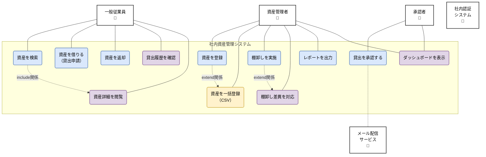

# ユースケース

## 目次

- [概要](#概要)
- [アクター定義](#アクター定義)
  - [主要アクター](#主要アクター)
  - [副次的アクター](#副次的アクター)
- [ユースケース図](#ユースケース図)
- [ユースケース詳細](#ユースケース詳細)
  - [UC-001: ログイン](#uc-001-ログイン)
  - [UC-002: 資産を検索する](#uc-002-資産を検索する)
  - [UC-003: 資産詳細を閲覧する](#uc-003-資産詳細を閲覧する)
  - [UC-004: 資産を借りる（貸出申請）](#uc-004-資産を借りる貸出申請)
  - [UC-005: 貸出を承認する](#uc-005-貸出を承認する)
  - [UC-006: 資産を返却する](#uc-006-資産を返却する)
  - [UC-007: 貸出履歴を確認する](#uc-007-貸出履歴を確認する)
  - [UC-101: 資産を登録する（管理者）](#uc-101-資産を登録する管理者)
  - [UC-102: 資産を一括登録する（管理者）](#uc-102-資産を一括登録する管理者)
  - [UC-103: 棚卸しを実施する（管理者）](#uc-103-棚卸しを実施する管理者)
  - [UC-104: 棚卸し差異を対応する（管理者）](#uc-104-棚卸し差異を対応する管理者)
  - [UC-105: レポートを出力する（管理者）](#uc-105-レポートを出力する管理者)
- [ユースケースの優先順位](#ユースケースの優先順位)
- [関連ドキュメント](#関連ドキュメント)

## 概要

このドキュメントでは、システムの利用シナリオを具体的に記述します。
ユースケースは、アクター（利用者）がシステムを使って何を達成するかを示します。

---

## アクター定義

### 主要アクター

| アクター | 説明 | 権限レベル |
|---------|------|----------|
| 一般従業員 | 資産を借りる社員 | 低 |
| 承認者 | 貸出申請を承認する部門長・管理者 | 中 |
| 資産管理者 | 資産の登録・管理を行う総務部担当者 | 高 |
| システム管理者 | システム設定・ユーザー管理を行う | 最高 |

### 副次的アクター

| アクター | 説明 |
|---------|------|
| システム | 自動処理を行うシステム自身（アラート送信等） |
| 社内認証システム | Active DirectoryまたはGoogle Workspace |
| メール配信サービス | メール送信を行う外部サービス |

---

## ユースケース図

システム全体のユースケースと、アクター（利用者）の関係を示します。

### ユースケースの分類

- **青色（主要ユースケース）**: 資産管理の中核となる必須機能
- **紫色（副次的ユースケース）**: 基本機能を補完する重要機能
- **黄色（オプション機能）**: あると便利な追加機能

### 外部システム連携

- **社内認証システム**: Active DirectoryまたはGoogle WorkspaceによるSSO認証
- **メール配信サービス**: 承認・却下通知、リマインダーなどのメール送信

---

## ユースケース詳細

### UC-001: ログイン

**概要**: 従業員が社内認証システムを使ってログインする

**アクター**: 一般従業員、承認者、資産管理者、システム管理者

**事前条件**:
- 社内アカウントが存在する
- ネットワークに接続している

**事後条件**: ログイン状態になり、各機能が利用可能になる

**基本フロー**:
1. ユーザーがシステムのURLにアクセス
2. システムが社内SSOログイン画面へリダイレクト
3. ユーザーが社内アカウントで認証
4. 社内認証システムが認証情報を返却
5. システムがユーザー情報を取得（氏名、部署、役職等）
6. 初回ログインの場合、システムがアカウントを自動作成
7. システムがダッシュボードへリダイレクト

**代替フロー**:

**5a. ユーザー権限の自動付与**
1. システムが役職情報から権限を判定
2. 部門長の場合、承認者権限を付与
3. 総務部の場合、資産管理者権限を付与

**例外フロー**:

**E1. 認証失敗**
1. システムが「認証に失敗しました」と表示
2. ログイン画面へ戻る

**関連機能要件**: FR-001, FR-002

---

### UC-002: 資産を検索する

**概要**: 従業員が必要な資産を検索する

**アクター**: 一般従業員、承認者、資産管理者

**事前条件**: ログイン済み

**事後条件**: 検索結果が表示される

**基本フロー**:
1. ユーザーが検索ボックスにキーワードを入力
2. ユーザーがEnterキーを押すか、検索ボタンをクリック
3. システムが資産データベースを検索
4. システムが検索結果を表示（資産画像、名称、型番、貸出状況、保管場所）
5. システムが検索結果件数を表示

**代替フロー**:

**1a. カテゴリーから検索**
1. ユーザーがカテゴリーメニューから選択（PC、モニター、家具等）
2. 基本フローの3へ

**1b. 詳細検索**
1. ユーザーが「詳細検索」をクリック
2. システムが詳細検索フォームを表示
3. ユーザーが条件を指定（カテゴリー、貸出状況、保管場所、取得日範囲）
4. 基本フローの3へ

**4a. 検索結果なし**
1. システムが「該当する資産が見つかりませんでした」と表示
2. 検索条件の見直しを促す

**5a. 検索結果のソート**
1. ユーザーがソート条件を選択（資産名順、取得日順、貸出状況順）
2. システムが選択条件でソートした結果を表示

**関連機能要件**: FR-010

**関連ユースケース**: UC-003 (資産詳細を閲覧する)

---

### UC-003: 資産詳細を閲覧する

**概要**: ユーザーが資産の詳細情報を確認する

**アクター**: 一般従業員、承認者、資産管理者

**事前条件**: ログイン済み

**事後条件**: 資産詳細が表示される

**基本フロー**:
1. ユーザーが検索結果または資産一覧から資産をクリック
2. システムが資産詳細ページを表示
   - 資産画像
   - 基本情報（名称、型番、メーカー、資産番号、シリアル番号）
   - 取得情報（取得日、取得価格、耐用年数）
   - 保管情報（保管場所、管理部署、管理責任者）
   - 貸出状況（貸出中/利用可能）
   - 貸出履歴
3. 資産が利用可能な場合、システムが「貸出申請」ボタンを表示

**代替フロー**:

**2a. 貸出中の場合**
1. システムが貸出者と返却予定日を表示
2. 「貸出申請」ボタンは表示しない

**関連機能要件**: FR-011

**関連ユースケース**: UC-004 (資産を借りる)

---

### UC-004: 資産を借りる（貸出申請）

**概要**: 従業員が資産の貸出を申請する

**アクター**: 一般従業員

**事前条件**:
- ログイン済み
- 対象資産が利用可能

**事後条件**: 貸出申請が登録され、承認者に通知される

**基本フロー**:
1. ユーザーが資産詳細ページの「貸出申請」ボタンをクリック
2. システムが貸出申請フォームを表示
3. ユーザーが以下を入力
   - 貸出開始日
   - 返却予定日
   - 利用目的（任意）
   - 申請理由
4. ユーザーが「申請」ボタンをクリック
5. システムが入力内容をバリデーション
6. システムが申請を登録
7. システムが承認者に通知メール送信
8. システムが「申請しました」と表示
9. システムがマイページへリダイレクト

**代替フロー**:

**5a. バリデーションエラー**
1. システムがエラーメッセージを表示
2. 基本フローの3へ戻る

**例外フロー**:

**E1. 既に貸出中**
1. システムが「この資産は既に貸出中です」と表示
2. ユースケース終了

**E2. 最大貸出期間超過**
1. システムが「貸出期間は最大180日までです」と表示
2. 基本フローの3へ戻る

**関連機能要件**: FR-020

**関連ユースケース**: UC-005 (貸出を承認する)

---

### UC-005: 貸出を承認する

**概要**: 承認者が貸出申請を承認または却下する

**アクター**: 承認者、資産管理者

**事前条件**:
- ログイン済み
- 承認権限を持つ
- 未承認の申請が存在する

**事後条件**: 申請が承認または却下され、申請者に通知される

**基本フロー**:
1. 承認者がダッシュボードの「承認待ち」をクリック
2. システムが承認待ち申請一覧を表示
3. 承認者が特定の申請を選択
4. システムが申請詳細を表示（申請者、資産、期間、理由）
5. 承認者が「承認」ボタンをクリック
6. システムが確認ダイアログを表示
7. 承認者が「はい」をクリック
8. システムが申請を承認
9. システムが資産ステータスを「貸出中」に更新
10. システムが申請者に承認メール送信
11. システムが「承認しました」と表示

**代替フロー**:

**5a. 却下の場合**
1. 承認者が「却下」ボタンをクリック
2. システムが却下理由入力ダイアログを表示
3. 承認者が却下理由を入力
4. システムが申請を却下
5. システムが申請者に却下メール送信（理由含む）
6. システムが「却下しました」と表示

**関連機能要件**: FR-021

**関連ユースケース**: UC-006 (資産を返却する)

---

### UC-006: 資産を返却する

**概要**: 借りている資産を返却する

**アクター**: 一般従業員

**事前条件**:
- ログイン済み
- 貸出中の資産がある

**事後条件**: 資産が返却され、資産ステータスが「利用可能」に更新される

**基本フロー**:
1. ユーザーがマイページの「借りている資産」を表示
2. システムが貸出中資産一覧を表示
3. ユーザーが返却する資産の「返却する」ボタンをクリック
4. システムが返却確認ダイアログを表示
5. システムが資産状態選択を表示（正常/破損/紛失）
6. ユーザーが「正常」を選択
7. ユーザーが「返却」ボタンをクリック
8. システムが返却処理を実行
9. システムが資産ステータスを「利用可能」に更新
10. システムが管理者に返却完了メール送信
11. システムが「返却しました」と表示

**代替フロー**:

**6a. 破損・紛失の場合**
1. ユーザーが「破損」または「紛失」を選択
2. システムがコメント入力欄を必須表示
3. ユーザーが状況を詳しく入力
4. 基本フローの7へ
5. システムが管理者に緊急通知メール送信

**関連機能要件**: FR-022

**関連ユースケース**: UC-004 (資産を借りる)

---

### UC-007: 貸出履歴を確認する

**概要**: 自分の過去の貸出履歴を確認する

**アクター**: 一般従業員、承認者

**事前条件**: ログイン済み

**事後条件**: 貸出履歴が表示される

**基本フロー**:
1. ユーザーがマイページから「貸出履歴」をクリック
2. システムが貸出履歴一覧を表示（貸出日、返却日、資産名、状態）
3. ユーザーが履歴を閲覧

**代替フロー**:

**3a. 期間指定で絞り込み**
1. ユーザーが期間を指定（過去1ヶ月、3ヶ月、1年、全期間）
2. システムが指定期間の履歴を表示

**3b. CSVエクスポート**
1. ユーザーが「CSVダウンロード」ボタンをクリック
2. システムがCSVファイルを生成
3. ユーザーがファイルをダウンロード

**関連機能要件**: FR-024

---

### UC-101: 資産を登録する（管理者）

**概要**: 資産管理者が新しい資産を登録する

**アクター**: 資産管理者

**事前条件**:
- ログイン済み
- 資産管理者権限を持つ

**事後条件**: 新しい資産が登録される

**基本フロー**:
1. 資産管理者が管理画面から「資産管理」を選択
2. 資産管理者が「新規資産登録」ボタンをクリック
3. システムが資産登録フォームを表示
4. 資産管理者が以下の情報を入力
   - 基本情報（名称、型番、メーカー、資産番号、シリアル番号）
   - 取得情報（取得日、取得価格、耐用年数）
   - 保管情報（保管場所、管理部署、管理責任者）
   - カテゴリー
5. 資産管理者が資産画像をアップロード（任意）
6. 資産管理者が「登録」ボタンをクリック
7. システムが入力内容をバリデーション
8. システムが資産を登録
9. システムがQRコードを自動生成
10. システムが「登録しました」と表示
11. システムが資産詳細ページへリダイレクト

**代替フロー**:

**4a. バーコードスキャナー使用**
1. 資産管理者がバーコードスキャナーで型番・シリアル番号を読み取り
2. システムが自動入力
3. 基本フローの5へ

**7a. バリデーションエラー**
1. システムがエラーメッセージを表示
2. 基本フローの4へ戻る

**例外フロー**:

**E1. 資産番号重複**
1. システムが「この資産番号は既に登録されています」と表示
2. 基本フローの4へ戻る

**関連機能要件**: FR-100

**関連ユースケース**: UC-102 (資産を一括登録する)

---

### UC-102: 資産を一括登録する（管理者）

**概要**: 資産管理者がCSVファイルで資産を一括登録する

**アクター**: 資産管理者

**事前条件**:
- ログイン済み
- 資産管理者権限を持つ
- 登録データをCSV形式で準備済み

**事後条件**: 複数の資産が一括登録される

**基本フロー**:
1. 資産管理者が管理画面から「資産管理」を選択
2. 資産管理者が「CSV一括登録」ボタンをクリック
3. システムがCSV一括登録画面を表示
4. 資産管理者が「テンプレートダウンロード」をクリック（任意）
5. 資産管理者がCSVファイルを選択
6. 資産管理者が「アップロード」ボタンをクリック
7. システムがCSVファイルをバリデーション
8. システムがプレビューを表示（登録予定件数、エラー件数）
9. 資産管理者が内容を確認
10. 資産管理者が「登録」ボタンをクリック
11. システムが一括登録を実行
12. システムが登録結果を表示（成功X件、失敗Y件）
13. システムがエラー詳細CSVをダウンロード可能にする（エラーがある場合）

**代替フロー**:

**7a. バリデーションエラー**
1. システムがエラー行を赤くハイライト表示
2. エラー内容を具体的に表示
3. 資産管理者がCSVを修正して再アップロード

**関連機能要件**: FR-103

**関連ユースケース**: UC-101 (資産を登録する)

---

### UC-103: 棚卸しを実施する（管理者）

**概要**: 資産管理者が定期棚卸しを実施する

**アクター**: 資産管理者

**事前条件**:
- ログイン済み
- 資産管理者権限を持つ

**事後条件**: 棚卸しが完了し、差異が記録される

**基本フロー**:
1. 資産管理者が管理画面から「棚卸し管理」を選択
2. 資産管理者が「新規棚卸し開始」ボタンをクリック
3. システムが棚卸し設定画面を表示
4. 資産管理者が以下を設定
   - 対象拠点
   - 対象カテゴリー（全て/一部）
   - 担当者（複数選択可）
5. 資産管理者が「開始」ボタンをクリック
6. システムが棚卸しを開始
7. システムが棚卸し用QRコード一覧を生成
8. 資産管理者が資産の実在確認（QRコード読み取りまたは手動入力）
9. システムが確認状況をリアルタイム表示（確認済み/未確認）
10. 全資産の確認が完了
11. システムが差異一覧を自動生成（所在不明、帳簿外発見）
12. 資産管理者が「棚卸し完了」ボタンをクリック
13. システムが棚卸し結果レポートを生成

**代替フロー**:

**11a. 差異がある場合**
1. システムが差異資産一覧を表示
2. 資産管理者が UC-104 (差異を対応する) へ進む

**関連機能要件**: FR-030

**関連ユースケース**: UC-104 (棚卸し差異を対応する)

---

### UC-104: 棚卸し差異を対応する（管理者）

**概要**: 資産管理者が棚卸しで発見された差異に対応する

**アクター**: 資産管理者

**事前条件**:
- 棚卸しが完了している
- 差異が存在する

**事後条件**: 差異が解消または記録される

**基本フロー**:
1. 資産管理者が棚卸し結果から差異一覧を表示
2. システムが差異資産を表示（所在不明、未登録発見）
3. 資産管理者が所在不明資産を選択
4. 資産管理者が対応を選択
   - 調査継続
   - 所在不明として確定
   - 廃棄済みとして処理
5. 資産管理者が理由・コメントを入力
6. 資産管理者が「確定」ボタンをクリック
7. システムが資産ステータスを更新
8. システムが対応履歴を記録

**代替フロー**:

**3a. 未登録資産の発見**
1. 資産管理者が未登録発見資産を選択
2. システムが簡易登録フォームを表示
3. 資産管理者が必要情報を入力
4. システムが新規資産として登録

**関連機能要件**: FR-031

**関連ユースケース**: UC-103 (棚卸しを実施する)

---

### UC-105: レポートを出力する（管理者）

**概要**: 資産管理者が各種レポートを出力する

**アクター**: 資産管理者、承認者

**事前条件**: ログイン済み

**事後条件**: レポートがダウンロードされる

**基本フロー**:
1. ユーザーが管理画面から「レポート」を選択
2. システムがレポート種類一覧を表示
   - 資産台帳
   - 利用状況レポート
   - 貸出履歴レポート
   - 棚卸し結果レポート
3. ユーザーがレポート種類を選択
4. システムが出力条件設定画面を表示
5. ユーザーが条件を設定（期間、拠点、カテゴリー等）
6. ユーザーが出力形式を選択（Excel/CSV/PDF）
7. ユーザーが「出力」ボタンをクリック
8. システムがレポートを生成
9. システムがダウンロードリンクを表示
10. ユーザーがレポートをダウンロード

**代替フロー**:

**8a. スケジュール出力設定**
1. ユーザーが「スケジュール出力」タブを選択
2. ユーザーが出力スケジュールを設定（毎月1日、毎週月曜等）
3. システムが自動出力設定を保存
4. 指定日時に自動的にレポート生成・メール送信

**関連機能要件**: FR-041, FR-042

---

## ユースケースの優先順位

| 優先度 | ユースケースID | ユースケース名 | 理由 |
|-------|---------------|--------------|------|
| 1 | UC-001 | ログイン | 全機能の前提 |
| 1 | UC-002 | 資産を検索する | コア機能 |
| 1 | UC-004 | 資産を借りる | コア機能 |
| 2 | UC-005 | 貸出を承認する | 承認フロー必須 |
| 2 | UC-006 | 資産を返却する | コア機能 |
| 2 | UC-101 | 資産を登録する | マスタ管理必須 |
| 3 | UC-103 | 棚卸しを実施する | 定期業務 |
| 3 | UC-007 | 貸出履歴を確認する | 履歴参照 |
| 4 | UC-102 | 資産を一括登録する | 効率化 |
| 4 | UC-105 | レポートを出力する | 分析・報告 |

---

## 関連ドキュメント

- [機能要件](functional-requirements.md) - ユースケースを実現する機能
- [ユーザーストーリー](user-stories.md) - より細分化されたユーザー視点の要求
- [../03-features/](../03-features/) - ユースケースを実現する詳細仕様
- [../05-tests/](../05-tests/) - ユースケースを検証するテストシナリオ

