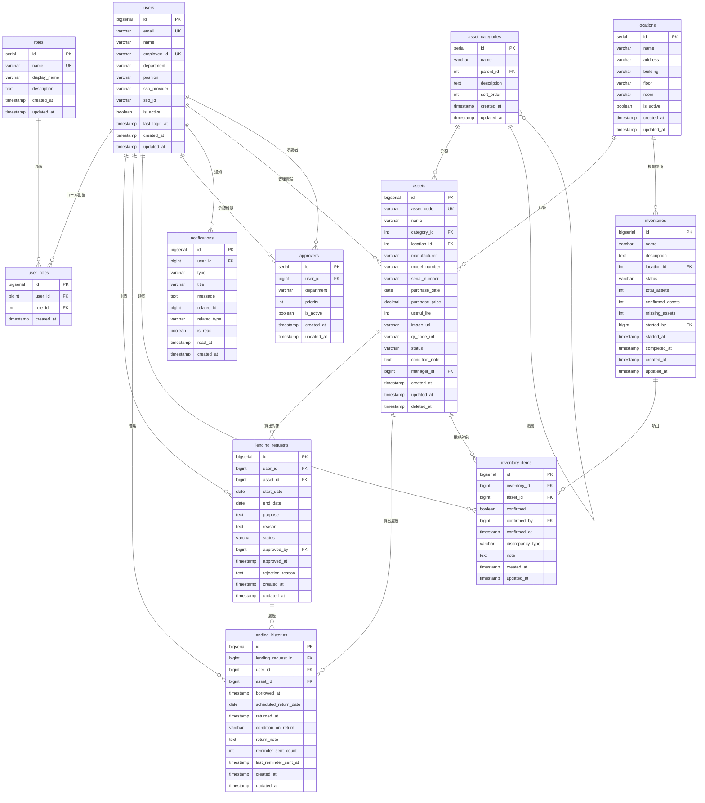

# データベース設計

## 目次

- [概要](#概要)
- [ER図](#er図)
- [テーブル定義](#テーブル定義)
  - [users](#users)
  - [roles](#roles)
  - [user_roles](#user_roles)
  - [asset_categories](#asset_categories)
  - [locations](#locations)
  - [assets](#assets)
  - [lending_requests](#lending_requests)
  - [lending_histories](#lending_histories)
  - [inventories](#inventories)
  - [inventory_items](#inventory_items)
  - [approvers](#approvers)
  - [notifications](#notifications)
- [インデックス設計](#インデックス設計)
- [制約とルール](#制約とルール)
- [マイグレーション戦略](#マイグレーション戦略)
- [データ保持ポリシー](#データ保持ポリシー)
- [関連ドキュメント](#関連ドキュメント)

## 概要

このドキュメントでは、社内資産・備品管理システムのデータベース設計を定義します。
PostgreSQL 14+を使用し、正規化とパフォーマンスのバランスを考慮した設計とします。

**データベース名**: `asset_management`

**文字コード**: UTF-8

**タイムゾーン**: Asia/Tokyo (JST)

## ER図




## テーブル定義

### users

ユーザー情報を管理するテーブル。SSO連携で自動作成されます。

| カラム名 | 型 | 制約 | 説明 |
|---------|-----|------|------|
| id | BIGSERIAL | PK | ユーザーID |
| email | VARCHAR(255) | NOT NULL, UNIQUE | メールアドレス |
| name | VARCHAR(255) | NOT NULL | 氏名 |
| employee_id | VARCHAR(50) | UNIQUE | 社員番号 |
| department | VARCHAR(255) | | 所属部署 |
| position | VARCHAR(255) | | 役職 |
| sso_provider | VARCHAR(50) | | SSO提供者 (google, microsoft) |
| sso_id | VARCHAR(255) | | SSO ID |
| is_active | BOOLEAN | DEFAULT TRUE | アクティブ状態 |
| last_login_at | TIMESTAMP | | 最終ログイン日時 |
| created_at | TIMESTAMP | NOT NULL | 作成日時 |
| updated_at | TIMESTAMP | NOT NULL | 更新日時 |

**インデックス**:
- `idx_users_email` ON email
- `idx_users_employee_id` ON employee_id
- `idx_users_sso` ON (sso_provider, sso_id)

### roles

ロール（権限）を定義するテーブル。

| カラム名 | 型 | 制約 | 説明 |
|---------|-----|------|------|
| id | SERIAL | PK | ロールID |
| name | VARCHAR(50) | NOT NULL, UNIQUE | ロール名 (admin, manager, user) |
| display_name | VARCHAR(255) | NOT NULL | 表示名 |
| description | TEXT | | 説明 |
| created_at | TIMESTAMP | NOT NULL | 作成日時 |
| updated_at | TIMESTAMP | NOT NULL | 更新日時 |

**デフォルトロール**:
- `admin`: システム管理者
- `asset_manager`: 資産管理者
- `approver`: 承認者
- `user`: 一般ユーザー

### user_roles

ユーザーとロールの中間テーブル（多対多）。

| カラム名 | 型 | 制約 | 説明 |
|---------|-----|------|------|
| id | BIGSERIAL | PK | ID |
| user_id | BIGINT | FK (users), NOT NULL | ユーザーID |
| role_id | INT | FK (roles), NOT NULL | ロールID |
| created_at | TIMESTAMP | NOT NULL | 作成日時 |

**複合ユニーク制約**: (user_id, role_id)

### asset_categories

資産カテゴリを管理するテーブル。階層構造をサポート。

| カラム名 | 型 | 制約 | 説明 |
|---------|-----|------|------|
| id | SERIAL | PK | カテゴリID |
| name | VARCHAR(255) | NOT NULL | カテゴリ名 |
| parent_id | INT | FK (asset_categories) | 親カテゴリID (NULL=ルート) |
| description | TEXT | | 説明 |
| sort_order | INT | DEFAULT 0 | 表示順序 |
| created_at | TIMESTAMP | NOT NULL | 作成日時 |
| updated_at | TIMESTAMP | NOT NULL | 更新日時 |

**インデックス**:
- `idx_categories_parent` ON parent_id

**例**:
- PC (parent_id=NULL)
  - ノートPC (parent_id=1)
  - デスクトップPC (parent_id=1)
- モニター (parent_id=NULL)

### locations

保管場所を管理するテーブル。

| カラム名 | 型 | 制約 | 説明 |
|---------|-----|------|------|
| id | SERIAL | PK | 保管場所ID |
| name | VARCHAR(255) | NOT NULL | 保管場所名 |
| address | VARCHAR(500) | | 住所 |
| building | VARCHAR(255) | | 建物名 |
| floor | VARCHAR(50) | | フロア |
| room | VARCHAR(50) | | 部屋番号 |
| is_active | BOOLEAN | DEFAULT TRUE | アクティブ状態 |
| created_at | TIMESTAMP | NOT NULL | 作成日時 |
| updated_at | TIMESTAMP | NOT NULL | 更新日時 |

**例**:
- 東京本社
- 大阪支店
- 名古屋支店

### assets

資産情報を管理するメインテーブル。

| カラム名 | 型 | 制約 | 説明 |
|---------|-----|------|------|
| id | BIGSERIAL | PK | 資産ID |
| asset_code | VARCHAR(50) | NOT NULL, UNIQUE | 資産コード |
| name | VARCHAR(255) | NOT NULL | 資産名 |
| category_id | INT | FK (asset_categories), NOT NULL | カテゴリID |
| location_id | INT | FK (locations), NOT NULL | 保管場所ID |
| manufacturer | VARCHAR(255) | | メーカー |
| model_number | VARCHAR(255) | | 型番 |
| serial_number | VARCHAR(255) | | シリアル番号 |
| purchase_date | DATE | | 取得日 |
| purchase_price | DECIMAL(12,2) | | 取得価格 |
| useful_life | INT | | 耐用年数（年） |
| image_url | VARCHAR(500) | | 画像URL (S3) |
| qr_code_url | VARCHAR(500) | | QRコードURL (S3) |
| status | VARCHAR(50) | NOT NULL | ステータス (available, in_use, maintenance, disposed) |
| condition_note | TEXT | | 状態備考 |
| manager_id | BIGINT | FK (users) | 管理責任者ID |
| created_at | TIMESTAMP | NOT NULL | 作成日時 |
| updated_at | TIMESTAMP | NOT NULL | 更新日時 |
| deleted_at | TIMESTAMP | | 削除日時（ソフトデリート） |

**インデックス**:
- `idx_assets_code` ON asset_code
- `idx_assets_category` ON category_id
- `idx_assets_location` ON location_id
- `idx_assets_status` ON status
- `idx_assets_serial` ON serial_number

**ステータス**:
- `available`: 利用可能
- `in_use`: 貸出中
- `maintenance`: メンテナンス中
- `disposed`: 廃棄済み

### lending_requests

貸出申請を管理するテーブル。

| カラム名 | 型 | 制約 | 説明 |
|---------|-----|------|------|
| id | BIGSERIAL | PK | 申請ID |
| user_id | BIGINT | FK (users), NOT NULL | 申請者ID |
| asset_id | BIGINT | FK (assets), NOT NULL | 資産ID |
| start_date | DATE | NOT NULL | 貸出開始日 |
| end_date | DATE | NOT NULL | 返却予定日 |
| purpose | TEXT | | 利用目的 |
| reason | TEXT | NOT NULL | 申請理由 |
| status | VARCHAR(50) | NOT NULL | ステータス (pending, approved, rejected, cancelled) |
| approved_by | BIGINT | FK (users) | 承認者ID |
| approved_at | TIMESTAMP | | 承認日時 |
| rejection_reason | TEXT | | 却下理由 |
| created_at | TIMESTAMP | NOT NULL | 申請日時 |
| updated_at | TIMESTAMP | NOT NULL | 更新日時 |

**インデックス**:
- `idx_lending_requests_user` ON user_id
- `idx_lending_requests_asset` ON asset_id
- `idx_lending_requests_status` ON status
- `idx_lending_requests_dates` ON (start_date, end_date)

**ステータス**:
- `pending`: 承認待ち
- `approved`: 承認済み
- `rejected`: 却下
- `cancelled`: キャンセル

### lending_histories

貸出履歴を記録するテーブル。

| カラム名 | 型 | 制約 | 説明 |
|---------|-----|------|------|
| id | BIGSERIAL | PK | 履歴ID |
| lending_request_id | BIGINT | FK (lending_requests), NOT NULL | 貸出申請ID |
| user_id | BIGINT | FK (users), NOT NULL | ユーザーID |
| asset_id | BIGINT | FK (assets), NOT NULL | 資産ID |
| borrowed_at | TIMESTAMP | NOT NULL | 貸出日時 |
| scheduled_return_date | DATE | NOT NULL | 返却予定日 |
| returned_at | TIMESTAMP | | 実際の返却日時 |
| condition_on_return | VARCHAR(50) | | 返却時の状態 (normal, damaged, lost) |
| return_note | TEXT | | 返却時備考 |
| reminder_sent_count | INT | DEFAULT 0 | リマインダー送信回数 |
| last_reminder_sent_at | TIMESTAMP | | 最終リマインダー送信日時 |
| created_at | TIMESTAMP | NOT NULL | 作成日時 |
| updated_at | TIMESTAMP | NOT NULL | 更新日時 |

**インデックス**:
- `idx_lending_histories_user` ON user_id
- `idx_lending_histories_asset` ON asset_id
- `idx_lending_histories_return` ON returned_at
- `idx_lending_histories_scheduled` ON scheduled_return_date

### inventories

棚卸しを管理するテーブル。

| カラム名 | 型 | 制約 | 説明 |
|---------|-----|------|------|
| id | BIGSERIAL | PK | 棚卸しID |
| name | VARCHAR(255) | NOT NULL | 棚卸し名 |
| description | TEXT | | 説明 |
| location_id | INT | FK (locations) | 対象保管場所ID (NULL=全拠点) |
| status | VARCHAR(50) | NOT NULL | ステータス (planning, in_progress, completed) |
| total_assets | INT | DEFAULT 0 | 対象資産数 |
| confirmed_assets | INT | DEFAULT 0 | 確認済み資産数 |
| missing_assets | INT | DEFAULT 0 | 所在不明資産数 |
| started_by | BIGINT | FK (users), NOT NULL | 開始者ID |
| started_at | TIMESTAMP | | 開始日時 |
| completed_at | TIMESTAMP | | 完了日時 |
| created_at | TIMESTAMP | NOT NULL | 作成日時 |
| updated_at | TIMESTAMP | NOT NULL | 更新日時 |

**インデックス**:
- `idx_inventories_location` ON location_id
- `idx_inventories_status` ON status
- `idx_inventories_started` ON started_at

**ステータス**:
- `planning`: 計画中
- `in_progress`: 実施中
- `completed`: 完了

### inventory_items

棚卸し項目（個別資産の確認状況）を管理するテーブル。

| カラム名 | 型 | 制約 | 説明 |
|---------|-----|------|------|
| id | BIGSERIAL | PK | 項目ID |
| inventory_id | BIGINT | FK (inventories), NOT NULL | 棚卸しID |
| asset_id | BIGINT | FK (assets), NOT NULL | 資産ID |
| confirmed | BOOLEAN | DEFAULT FALSE | 確認済み |
| confirmed_by | BIGINT | FK (users) | 確認者ID |
| confirmed_at | TIMESTAMP | | 確認日時 |
| discrepancy_type | VARCHAR(50) | | 差異種別 (missing, found, damaged) |
| note | TEXT | | 備考 |
| created_at | TIMESTAMP | NOT NULL | 作成日時 |
| updated_at | TIMESTAMP | NOT NULL | 更新日時 |

**複合ユニーク制約**: (inventory_id, asset_id)

**インデックス**:
- `idx_inventory_items_inventory` ON inventory_id
- `idx_inventory_items_asset` ON asset_id
- `idx_inventory_items_confirmed` ON confirmed

**差異種別**:
- `missing`: 所在不明
- `found`: 帳簿外発見
- `damaged`: 破損

### approvers

承認者を管理するテーブル。

| カラム名 | 型 | 制約 | 説明 |
|---------|-----|------|------|
| id | SERIAL | PK | 承認者ID |
| user_id | BIGINT | FK (users), NOT NULL | ユーザーID |
| department | VARCHAR(255) | | 対象部署 (NULL=全部署) |
| priority | INT | DEFAULT 1 | 優先順位 (1=第一承認者) |
| is_active | BOOLEAN | DEFAULT TRUE | アクティブ状態 |
| created_at | TIMESTAMP | NOT NULL | 作成日時 |
| updated_at | TIMESTAMP | NOT NULL | 更新日時 |

**インデックス**:
- `idx_approvers_user` ON user_id
- `idx_approvers_department` ON department

### notifications

通知を管理するテーブル。

| カラム名 | 型 | 制約 | 説明 |
|---------|-----|------|------|
| id | BIGSERIAL | PK | 通知ID |
| user_id | BIGINT | FK (users), NOT NULL | 受信者ID |
| type | VARCHAR(50) | NOT NULL | 通知種別 |
| title | VARCHAR(255) | NOT NULL | タイトル |
| message | TEXT | NOT NULL | メッセージ |
| related_id | BIGINT | | 関連レコードID |
| related_type | VARCHAR(50) | | 関連レコード種別 |
| is_read | BOOLEAN | DEFAULT FALSE | 既読フラグ |
| read_at | TIMESTAMP | | 既読日時 |
| created_at | TIMESTAMP | NOT NULL | 作成日時 |

**インデックス**:
- `idx_notifications_user` ON user_id
- `idx_notifications_is_read` ON (user_id, is_read)
- `idx_notifications_created` ON created_at

**通知種別**:
- `lending_approved`: 貸出承認
- `lending_rejected`: 貸出却下
- `return_reminder`: 返却リマインダー
- `return_overdue`: 返却期限超過
- `inventory_assigned`: 棚卸し担当割当

## インデックス設計

### 検索クエリ最適化

頻繁に実行される検索クエリに対してインデックスを設定：

1. **資産検索**: `idx_assets_status`, `idx_assets_category`, `idx_assets_location`
2. **貸出履歴検索**: `idx_lending_histories_user`, `idx_lending_histories_asset`
3. **未返却資産検索**: `idx_lending_histories_return`, `idx_lending_histories_scheduled`
4. **棚卸し進捗**: `idx_inventory_items_inventory`, `idx_inventory_items_confirmed`

### 複合インデックス

複数カラムでの検索が多い場合：

```sql
-- 貸出期間での検索
CREATE INDEX idx_lending_histories_dates
ON lending_histories(start_date, end_date);

-- 未読通知検索
CREATE INDEX idx_notifications_unread
ON notifications(user_id, is_read)
WHERE is_read = FALSE;
```

## 制約とルール

### 外部キー制約

すべての外部キーに `ON DELETE` 動作を定義：

```sql
-- ユーザー削除時は履歴を保持（NULL許可）
ALTER TABLE lending_histories
ADD CONSTRAINT fk_lending_histories_user
FOREIGN KEY (user_id) REFERENCES users(id)
ON DELETE SET NULL;

-- 資産削除はソフトデリートで対応（物理削除しない）
ALTER TABLE assets
ADD COLUMN deleted_at TIMESTAMP;

-- カテゴリ削除時は子カテゴリも削除
ALTER TABLE asset_categories
ADD CONSTRAINT fk_categories_parent
FOREIGN KEY (parent_id) REFERENCES asset_categories(id)
ON DELETE CASCADE;
```

### CHECK制約

データ整合性を保証：

```sql
-- 貸出期間の妥当性
ALTER TABLE lending_requests
ADD CONSTRAINT chk_lending_dates
CHECK (end_date >= start_date);

-- 貸出期間の上限（180日）
ALTER TABLE lending_requests
ADD CONSTRAINT chk_lending_duration
CHECK (end_date <= start_date + INTERVAL '180 days');

-- 優先順位は正の整数
ALTER TABLE approvers
ADD CONSTRAINT chk_priority
CHECK (priority > 0);
```

### トリガー

自動処理をトリガーで実装：

```sql
-- 資産ステータス自動更新
CREATE OR REPLACE FUNCTION update_asset_status()
RETURNS TRIGGER AS $$
BEGIN
  IF TG_OP = 'INSERT' AND NEW.status = 'approved' THEN
    UPDATE assets SET status = 'in_use'
    WHERE id = NEW.asset_id;
  ELSIF TG_OP = 'UPDATE' AND NEW.returned_at IS NOT NULL THEN
    UPDATE assets SET status = 'available'
    WHERE id = NEW.asset_id;
  END IF;
  RETURN NEW;
END;
$$ LANGUAGE plpgsql;

CREATE TRIGGER trg_update_asset_status
AFTER INSERT OR UPDATE ON lending_histories
FOR EACH ROW
EXECUTE FUNCTION update_asset_status();
```

## マイグレーション戦略

### 初期マイグレーション

Laravelマイグレーションで管理：

```
database/migrations/
├── 2025_01_01_000001_create_users_table.php
├── 2025_01_01_000002_create_roles_table.php
├── 2025_01_01_000003_create_user_roles_table.php
├── 2025_01_01_000004_create_asset_categories_table.php
├── 2025_01_01_000005_create_locations_table.php
├── 2025_01_01_000006_create_assets_table.php
├── 2025_01_01_000007_create_lending_requests_table.php
├── 2025_01_01_000008_create_lending_histories_table.php
├── 2025_01_01_000009_create_inventories_table.php
├── 2025_01_01_000010_create_inventory_items_table.php
├── 2025_01_01_000011_create_approvers_table.php
└── 2025_01_01_000012_create_notifications_table.php
```

### データ移行

既存Excelデータ（4,000件）の移行：

1. **クレンジング**: 重複・不整合データの修正
2. **カテゴリマッピング**: 既存分類を新カテゴリに変換
3. **一括インポート**: `assets` テーブルへ投入
4. **QRコード生成**: バッチ処理で生成
5. **検証**: データ整合性チェック

## データ保持ポリシー

### アーカイブ戦略

古いデータのアーカイブ：

| テーブル | 保持期間 | アーカイブ方針 |
|---------|---------|--------------|
| lending_histories | 3年 | 3年以上経過したレコードをアーカイブテーブルへ |
| notifications | 1年 | 1年以上経過した既読通知を削除 |
| inventory_items | 無期限 | アーカイブしない（監査要件） |

### バックアップ

- **フルバックアップ**: 毎日深夜2時
- **差分バックアップ**: 1時間ごと
- **保持期間**: 30日間
- **暗号化**: AES-256

## 関連ドキュメント

- [システムアーキテクチャ](system-architecture.md) - データフロー
- [技術スタック](technology-stack.md) - PostgreSQL詳細
- [インフラ構成](infrastructure.md) - RDS構成
- [../01-requirements/functional-requirements.md](../01-requirements/functional-requirements.md) - 機能要件
