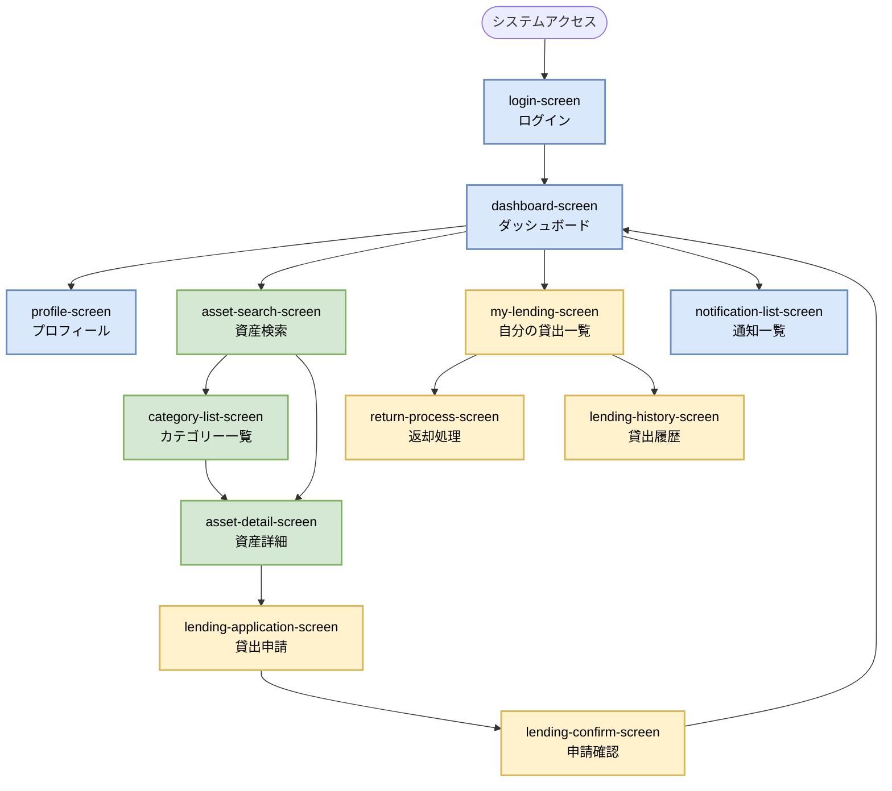
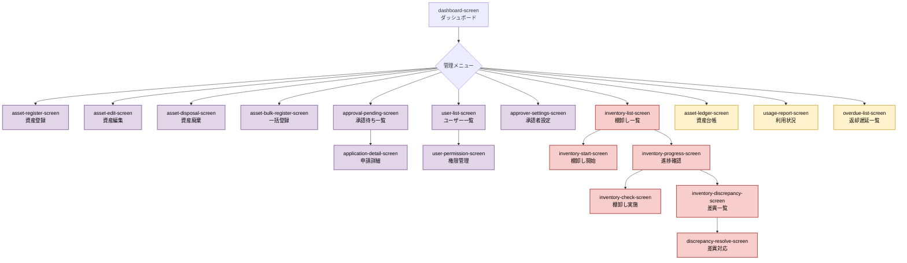

# 画面設計

## 目次

- [概要](#概要)
- [機能別画面一覧](#機能別画面一覧)
- [画面遷移図](#画面遷移図)
- [命名規則](#命名規則)
- [関連ドキュメント](#関連ドキュメント)

---

## 概要

このドキュメントでは、社内資産管理システムの画面一覧と画面遷移を定義します。
各画面の詳細仕様は `docs/03-ui-design/` ディレクトリ配下で管理します。

**画面名の英語表記（xxx-screen）** は、`03-ui-design` のディレクトリ構成に使用します。

機能要件の詳細は [機能要件書](../01-requirements/functional-requirements.md) を参照してください。

---

## 機能別画面一覧

| 機能名 | 機能名（英語） | 機能ID | 画面名 | 画面名（英語） | 画面ID | 概要 | アクセス権限 |
|--------|----------------|--------|--------|----------------|--------|------|--------------|
| ユーザー管理機能 | user-management | FR-001, FR-002 | ログイン画面 | login-screen | SCR-001 | SSO連携によるログイン | 全ユーザー |
|                  |                 | FR-003 | プロフィール画面 | profile-screen | SCR-003 | 自分の情報、貸出中資産、履歴表示 | 全ユーザー（ログイン済） |
| 資産管理機能 | asset-management | FR-010 | 資産検索画面 | asset-search-screen | SCR-010 | キーワード・カテゴリ・詳細条件で検索 | 全ユーザー |
|              |                  | FR-011 | 資産詳細画面 | asset-detail-screen | SCR-011 | 資産の詳細情報、貸出履歴表示 | 全ユーザー |
|              |                  | FR-012 | カテゴリー一覧画面 | category-list-screen | SCR-012 | カテゴリー別資産閲覧 | 全ユーザー |
| 貸出・返却機能 | lending-management | FR-020 | 貸出申請画面 | lending-application-screen | SCR-020 | 資産の貸出を申請 | 全ユーザー |
|                |                    | FR-020 | 貸出申請確認画面 | lending-confirm-screen | SCR-021 | 申請内容の確認 | 全ユーザー |
|                |                    | FR-021 | 承認待ち一覧画面 | approval-pending-screen | SCR-022 | 承認待ちの申請一覧 | 承認者・管理者 |
|                |                    | FR-021 | 申請詳細画面 | application-detail-screen | SCR-023 | 申請内容の詳細・承認/却下 | 承認者・管理者 |
|                |                    | FR-022 | 返却処理画面 | return-process-screen | SCR-024 | 貸出中資産の返却処理 | 全ユーザー |
|                |                    | FR-024 | 貸出履歴画面 | lending-history-screen | SCR-025 | 自分の貸出履歴一覧 | 全ユーザー |
|                |                    | FR-022 | 自分の貸出一覧画面 | my-lending-screen | SCR-026 | 現在借りている資産一覧 | 全ユーザー |
| 棚卸し機能 | inventory | FR-030 | 棚卸し一覧画面 | inventory-list-screen | SCR-030 | 棚卸し実施状況一覧 | 管理者・棚卸し担当者 |
|            |           | FR-030 | 棚卸し開始画面 | inventory-start-screen | SCR-031 | 新規棚卸しの開始設定 | 管理者 |
|            |           | FR-030 | 棚卸し実施画面 | inventory-check-screen | SCR-032 | QRコード読み取り・実在確認 | 棚卸し担当者 |
|            |           | FR-030 | 棚卸し進捗画面 | inventory-progress-screen | SCR-033 | 棚卸し進捗のリアルタイム表示 | 管理者・棚卸し担当者 |
|            |           | FR-031 | 棚卸し差異一覧画面 | inventory-discrepancy-screen | SCR-034 | 棚卸し結果の差異表示 | 管理者 |
|            |           | FR-031 | 差異対応画面 | discrepancy-resolve-screen | SCR-035 | 差異の原因入力・対応記録 | 管理者 |
| レポート・分析機能 | reports | FR-040 | ダッシュボード画面 | dashboard-screen | SCR-002 | 資産管理概要、通知、クイックアクセス | 全ユーザー（ログイン済） |
|                    |         | FR-041 | 資産台帳レポート画面 | asset-ledger-screen | SCR-040 | 資産台帳の出力（Excel/CSV/PDF） | 管理者 |
|                    |         | FR-042 | 利用状況レポート画面 | usage-report-screen | SCR-041 | 資産利用状況の分析・グラフ表示 | 管理者 |
|                    |         | FR-023 | 返却遅延一覧画面 | overdue-list-screen | SCR-042 | 返却遅延資産の一覧表示 | 管理者・承認者 |
| 管理機能（資産） | admin | FR-100 | 資産登録画面 | asset-register-screen | SCR-100 | 新規資産の登録 | 管理者 |
|                  |       | FR-101 | 資産編集画面 | asset-edit-screen | SCR-101 | 既存資産の情報更新 | 管理者 |
|                  |       | FR-102 | 資産廃棄画面 | asset-disposal-screen | SCR-102 | 資産の廃棄処理 | 管理者 |
|                  |       | FR-103 | 資産一括登録画面 | asset-bulk-register-screen | SCR-103 | CSVによる一括登録 | 管理者 |
| 管理機能（ユーザー） | admin | FR-104 | 承認者設定画面 | approver-settings-screen | SCR-104 | 部署別承認者の設定 | 管理者 |
|                      |       | FR-105 | ユーザー権限管理画面 | user-permission-screen | SCR-105 | ユーザー権限の管理 | 管理者 |
|                      |       | FR-105 | ユーザー一覧画面 | user-list-screen | SCR-106 | ユーザー一覧・検索 | 管理者 |
|                      |       | - | システム設定画面 | system-settings-screen | SCR-107 | システム全体の設定 | 管理者 |
| 通知機能 | notifications | FR-111 | 通知一覧画面 | notification-list-screen | SCR-110 | システム内通知の一覧表示 | 全ユーザー |
|          |               | FR-111 | 通知設定画面 | notification-settings-screen | SCR-111 | 通知の受信設定 | 全ユーザー |
| 共通画面 | common | - | エラー画面 | error-screen | SCR-004 | システムエラー表示 | 全ユーザー |
|          |        | - | 404エラー画面 | not-found-screen | SCR-005 | ページが見つからない | 全ユーザー |

---

## 画面遷移図

### 全体遷移図

以下の図は、システム全体の主要な画面遷移を示しています。



### 管理者向け画面遷移図



---

## 命名規則

### 画面ID

- **形式**: `SCR-XXX`
- **採番ルール**:
  - 001-009: 共通画面
  - 010-019: 資産管理機能
  - 020-029: 貸出・返却機能
  - 030-039: 棚卸し機能
  - 040-049: レポート・分析機能
  - 100-109: 管理機能（管理者向け）
  - 110-119: 通知機能

### 英語画面名

- **形式**: `{機能}-{動作/対象}-screen`
- **単語区切り**: ハイフン（`-`）
- **例**:
  - `asset-search-screen` - 資産検索画面
  - `lending-application-screen` - 貸出申請画面
  - `inventory-check-screen` - 棚卸し実施画面

### ディレクトリ構成への適用

`docs/03-ui-design/` のディレクトリ構成は、機能名（英語）と画面名（英語）を使用します：

```
03-ui-design/
├── user-management/          # ユーザー管理機能
│   ├── login-screen/
│   └── profile-screen/
├── asset-management/         # 資産管理機能
│   ├── asset-search-screen/
│   ├── asset-detail-screen/
│   └── category-list-screen/
├── lending-management/       # 貸出・返却機能
│   ├── lending-application-screen/
│   ├── lending-confirm-screen/
│   ├── approval-pending-screen/
│   ├── application-detail-screen/
│   ├── return-process-screen/
│   ├── lending-history-screen/
│   └── my-lending-screen/
├── inventory/                # 棚卸し機能
│   ├── inventory-list-screen/
│   ├── inventory-start-screen/
│   ├── inventory-check-screen/
│   ├── inventory-progress-screen/
│   ├── inventory-discrepancy-screen/
│   └── discrepancy-resolve-screen/
├── reports/                  # レポート・分析機能
│   ├── dashboard-screen/
│   ├── asset-ledger-screen/
│   ├── usage-report-screen/
│   └── overdue-list-screen/
├── admin/                    # 管理機能
│   ├── asset-register-screen/
│   ├── asset-edit-screen/
│   ├── asset-disposal-screen/
│   ├── asset-bulk-register-screen/
│   ├── approver-settings-screen/
│   ├── user-permission-screen/
│   ├── user-list-screen/
│   └── system-settings-screen/
├── notifications/            # 通知機能
│   ├── notification-list-screen/
│   └── notification-settings-screen/
└── common/                   # 共通画面
    ├── error-screen/
    └── not-found-screen/
```

---

## 関連ドキュメント

- [機能要件](../01-requirements/functional-requirements.md) - 画面の根拠となる機能要件
- [ユースケース](../01-requirements/use-cases.md) - 画面を使用するユースケース
- [UI仕様書](../03-ui-design/) - 各画面の詳細仕様
- [システムアーキテクチャ](./system-architecture.md) - 画面を構成する技術基盤

---

**この画面一覧は、UI仕様書作成の基盤となります。新規画面追加時は必ずこのドキュメントを更新してください。**
