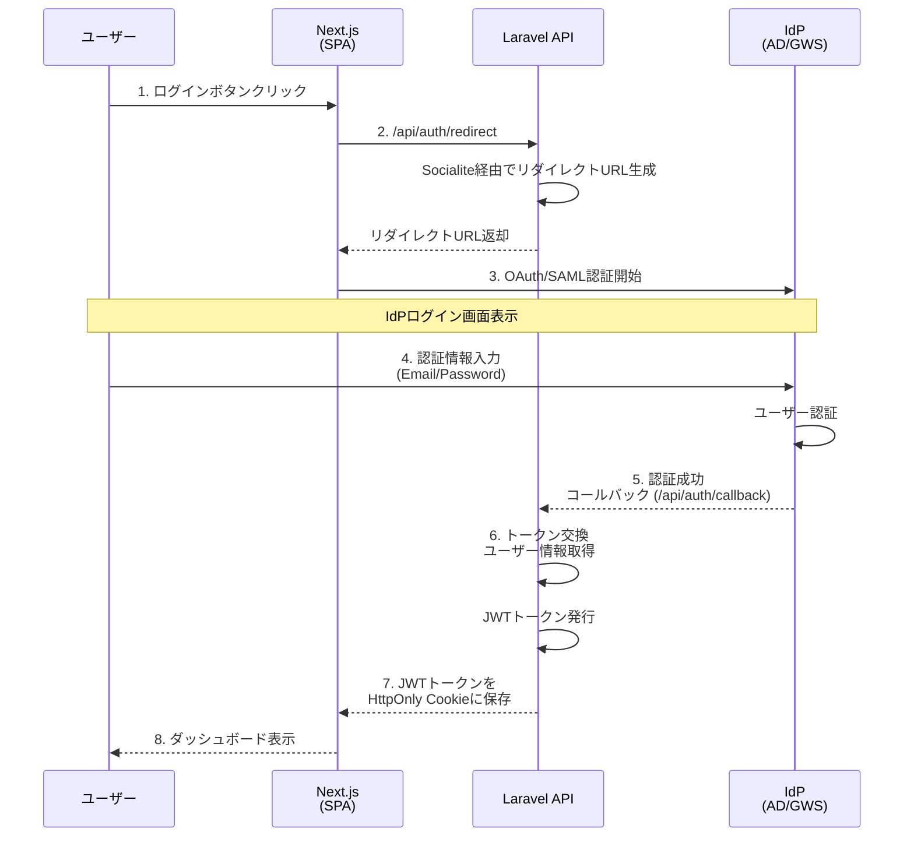
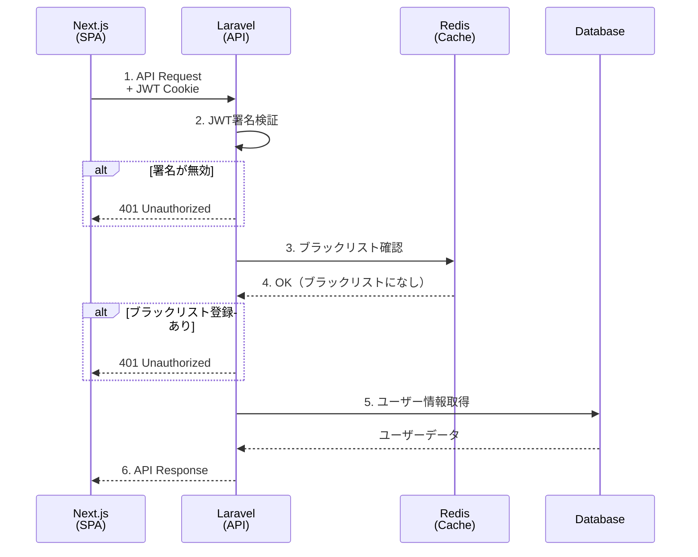
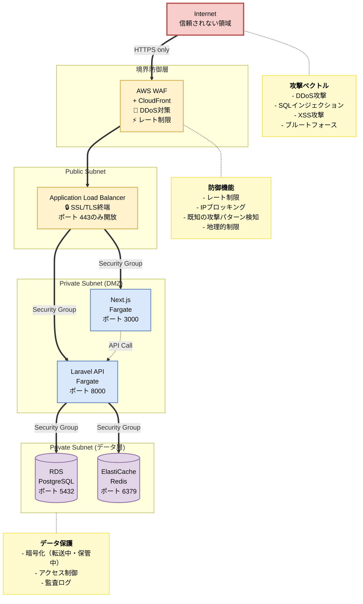

# セキュリティアーキテクチャ

## 目次

- [概要](#概要)
- [セキュリティ原則](#セキュリティ原則)
- [認証アーキテクチャ](#認証アーキテクチャ)
  - [SSO認証フロー](#sso認証フロー)
  - [API認証](#api認証)
  - [セッション管理](#セッション管理)
  - [パスワードポリシー](#パスワードポリシー)
- [認可アーキテクチャ](#認可アーキテクチャ)
  - [ロールベースアクセス制御](#ロールベースアクセス制御)
  - [権限マトリクス](#権限マトリクス)
  - [リソースレベル制御](#リソースレベル制御)
- [データ暗号化](#データ暗号化)
  - [転送中の暗号化](#転送中の暗号化)
  - [保管時の暗号化](#保管時の暗号化)
  - [鍵管理](#鍵管理)
- [ネットワークセキュリティ](#ネットワークセキュリティ)
  - [セキュリティ境界](#セキュリティ境界)
  - [ファイアウォール設定](#ファイアウォール設定)
  - [DDoS対策](#ddos対策)
- [アプリケーションセキュリティ](#アプリケーションセキュリティ)
  - [OWASP Top 10対策](#owasp-top-10対策)
  - [入力検証](#入力検証)
  - [出力エスケープ](#出力エスケープ)
  - [CSRF対策](#csrf対策)
- [インフラセキュリティ](#インフラセキュリティ)
  - [IAMポリシー](#iamポリシー)
  - [シークレット管理](#シークレット管理)
  - [コンテナセキュリティ](#コンテナセキュリティ)
- [セキュリティ監視](#セキュリティ監視)
  - [ログ収集](#ログ収集)
  - [異常検知](#異常検知)
  - [インシデント対応](#インシデント対応)
- [脆弱性管理](#脆弱性管理)
  - [脆弱性スキャン](#脆弱性スキャン)
  - [パッチ管理](#パッチ管理)
  - [ペネトレーションテスト](#ペネトレーションテスト)
- [データ保護](#データ保護)
  - [個人情報保護](#個人情報保護)
  - [データ分類](#データ分類)
  - [データ保持ポリシー](#データ保持ポリシー)
- [セキュリティ監査](#セキュリティ監査)
  - [監査ログ](#監査ログ)
  - [コンプライアンス](#コンプライアンス)
- [セキュリティテスト](#セキュリティテスト)
- [関連ドキュメント](#関連ドキュメント)

## 概要

このドキュメントでは、社内資産・備品管理システムのセキュリティアーキテクチャを定義します。
認証・認可、データ暗号化、ネットワークセキュリティ、アプリケーションセキュリティなど、
システム全体のセキュリティ設計を包括的にカバーします。

## セキュリティ原則

本システムでは以下のセキュリティ原則を採用します：

### 1. 多層防御（Defense in Depth）

複数のセキュリティ層を設け、単一障害点を排除します。

以下の多層防御構造はMermaid形式で記述されています：

```mermaid
graph TD
    %% スタイル定義
    classDef appLayer fill:#dae8fc,stroke:#6c8ebf,stroke-width:2px,color:#000000
    classDef authLayer fill:#d5e8d4,stroke:#82b366,stroke-width:2px,color:#000000
    classDef apiLayer fill:#fff2cc,stroke:#d6b656,stroke-width:2px,color:#000000
    classDef netLayer fill:#f8cecc,stroke:#b85450,stroke-width:2px,color:#000000
    classDef dataLayer fill:#e1d5e7,stroke:#9673a6,stroke-width:2px,color:#000000
    classDef infraLayer fill:#f5f5f5,stroke:#666666,stroke-width:2px,color:#000000

    subgraph SecurityLayers["多層防御アーキテクチャ"]
        L7[Layer 7: アプリケーション層<br/>✓ 入力検証<br/>✓ CSRF対策<br/>✓ 出力エスケープ]:::appLayer
        L6[Layer 6: 認証・認可層<br/>✓ SSO統合<br/>✓ RBAC（ロールベースアクセス制御）<br/>✓ セッション管理]:::authLayer
        L5[Layer 5: API層<br/>✓ JWT検証<br/>✓ レート制限<br/>✓ APIキー管理]:::apiLayer
        L4[Layer 4: ネットワーク層<br/>✓ WAF（Web Application Firewall）<br/>✓ セキュリティグループ<br/>✓ DDoS対策]:::netLayer
        L3[Layer 3: データ層<br/>✓ 暗号化（転送中・保管中）<br/>✓ アクセス制御<br/>✓ 監査ログ]:::dataLayer
        L2[Layer 2: インフラ層<br/>✓ IAMポリシー<br/>✓ VPC分離<br/>✓ PrivateLink]:::infraLayer
        L1[Layer 1: 物理層<br/>✓ AWS データセンター<br/>✓ 物理的セキュリティ<br/>✓ コンプライアンス認証]:::infraLayer

        L7 --> L6
        L6 --> L5
        L5 --> L4
        L4 --> L3
        L3 --> L2
        L2 --> L1
    end
```



### 2. 最小権限の原則（Principle of Least Privilege）

- ユーザーは必要最小限の権限のみを持つ
- IAMロールは必要なリソースのみアクセス可能
- データベースユーザーは必要なテーブルのみ操作可能

### 3. ゼロトラストアーキテクチャ

- 社内ネットワークからのアクセスも検証
- すべてのリクエストを認証・認可
- セッションごとに検証

### 4. セキュアバイデフォルト

- すべての通信をHTTPS
- デフォルトで最も安全な設定
- オプトインでのみ緩和

### 5. 暗号化の徹底

- 転送中: TLS 1.3
- 保管時: AES-256
- バックアップ: 暗号化必須

## 認証アーキテクチャ

### SSO認証フロー

**Active Directory / Google Workspace連携**:

以下のSSO認証フローはMermaid形式で記述されています：



**認証フロー詳細**:

1. ユーザーがログインボタンをクリック
2. Next.jsがLaravel API (`/api/auth/redirect`) を呼び出し
3. LaravelがSocialite経由でIdPリダイレクトURLを返却
4. ユーザーがIdP（AD/Google Workspace）でログイン
5. IdPがコールバックURL (`/api/auth/callback`) にリダイレクト
6. Laravelがユーザー情報を取得し、JWTトークンを発行
7. JWTをHttpOnly Cookieとして設定
8. Next.jsがダッシュボードを表示

**使用技術**:

| コンポーネント | 技術 | 用途 |
|-------------|------|------|
| IdP | Active Directory / Google Workspace | ユーザー認証 |
| プロトコル | OAuth 2.0 / SAML 2.0 | 認証プロトコル |
| Laravel | Socialite | SSO連携ライブラリ |
| トークン | JWT (RS256) | アクセストークン |

### API認証

**JWT (JSON Web Token) 認証**:

**JWTペイロード**:

```json
{
  "sub": "user123",
  "name": "山田太郎",
  "email": "yamada@example.com",
  "roles": ["general_user"],
  "location_id": 1,
  "iat": 1704067200,
  "exp": 1704153600
}
```

**JWT検証フロー**:

以下のJWT検証フローはMermaid形式で記述されています：



**Laravel Sanctum設定**:

```php
// config/sanctum.php
return [
    'expiration' => 1440, // 24時間
    'token_prefix' => env('SANCTUM_TOKEN_PREFIX', ''),

    'middleware' => [
        'verify_csrf_token' => App\Http\Middleware\VerifyCsrfToken::class,
        'encrypt_cookies' => App\Http\Middleware\EncryptCookies::class,
    ],
];
```

**トークン更新戦略**:
- Access Token有効期限: 24時間
- Refresh Token有効期限: 30日
- トークン更新エンドポイント: `/api/auth/refresh`
- 自動更新: Next.jsミドルウェアで実装

### セッション管理

**セッションストレージ**: Redis

**セッション仕様**:

| 項目 | 値 |
|-----|-----|
| セッションID生成 | Laravel標準（暗号学的に安全な乱数） |
| セッション有効期限 | 2時間（アイドルタイムアウト） |
| セッション延長 | リクエストごとに自動延長 |
| Cookie属性 | HttpOnly, Secure, SameSite=Lax |
| セッション固定化対策 | ログイン後にセッションIDを再生成 |

**Redisセッションキー**:

```
laravel_session:{session_id}
```

**セッションデータ構造**:

```json
{
  "user_id": 123,
  "email": "yamada@example.com",
  "roles": ["general_user"],
  "location_id": 1,
  "last_activity": 1704067200,
  "ip_address": "10.0.1.50",
  "user_agent": "Mozilla/5.0..."
}
```

### パスワードポリシー

**SSO利用のためパスワード管理は不要**ですが、システム管理者アカウント（緊急用）には以下を適用：

| 項目 | ポリシー |
|-----|---------|
| 最小文字数 | 12文字以上 |
| 文字種 | 大文字・小文字・数字・記号を含む |
| パスワード履歴 | 過去5世代は再利用不可 |
| 有効期限 | 90日 |
| アカウントロック | 5回連続失敗で30分ロック |
| ハッシュアルゴリズム | bcrypt (cost=12) |

## 認可アーキテクチャ

### ロールベースアクセス制御

**ロール定義**:

| ロール名 | 説明 | 対象ユーザー |
|---------|------|------------|
| `admin` | システム管理者 | 情報システム部 |
| `asset_manager` | 資産管理者 | 総務部資産管理担当 |
| `location_manager` | 拠点管理者 | 各拠点の総務担当 |
| `approver` | 承認者 | 部門長、課長 |
| `general_user` | 一般ユーザー | 全社員 |

**権限定義**:

```php
// database/seeders/PermissionSeeder.php
$permissions = [
    // 資産管理
    'assets.view',          // 資産閲覧
    'assets.create',        // 資産登録
    'assets.update',        // 資産更新
    'assets.delete',        // 資産削除
    'assets.export',        // 資産エクスポート

    // 貸出管理
    'lending.request',      // 貸出申請
    'lending.approve',      // 貸出承認
    'lending.view_all',     // 全貸出閲覧

    // 棚卸管理
    'inventory.create',     // 棚卸開始
    'inventory.execute',    // 棚卸実施
    'inventory.report',     // 棚卸レポート

    // ユーザー管理
    'users.view',           // ユーザー閲覧
    'users.create',         // ユーザー登録
    'users.update',         // ユーザー更新
    'users.delete',         // ユーザー削除

    // システム管理
    'system.settings',      // システム設定
    'system.logs',          // ログ閲覧
    'system.audit',         // 監査ログ閲覧
];
```

### 権限マトリクス

| 権限 | admin | asset_manager | location_manager | approver | general_user |
|-----|-------|--------------|-----------------|----------|--------------|
| **資産管理** |
| assets.view | ✓ | ✓ | ✓（拠点のみ） | ✓ | ✓ |
| assets.create | ✓ | ✓ | ✓（拠点のみ） | - | - |
| assets.update | ✓ | ✓ | ✓（拠点のみ） | - | - |
| assets.delete | ✓ | ✓ | - | - | - |
| assets.export | ✓ | ✓ | ✓（拠点のみ） | ✓ | - |
| **貸出管理** |
| lending.request | ✓ | ✓ | ✓ | ✓ | ✓ |
| lending.approve | ✓ | ✓ | ✓（拠点のみ） | ✓（部門のみ） | - |
| lending.view_all | ✓ | ✓ | ✓（拠点のみ） | ✓（部門のみ） | -（自分のみ） |
| **棚卸管理** |
| inventory.create | ✓ | ✓ | - | - | - |
| inventory.execute | ✓ | ✓ | ✓ | - | - |
| inventory.report | ✓ | ✓ | ✓（拠点のみ） | - | - |
| **ユーザー管理** |
| users.view | ✓ | ✓ | ✓（拠点のみ） | - | - |
| users.create | ✓ | - | - | - | - |
| users.update | ✓ | - | - | - | - |
| users.delete | ✓ | - | - | - | - |
| **システム管理** |
| system.settings | ✓ | - | - | - | - |
| system.logs | ✓ | ✓ | - | - | - |
| system.audit | ✓ | - | - | - | - |

### リソースレベル制御

**Laravel Policy実装**:

```php
// app/Policies/AssetPolicy.php
class AssetPolicy
{
    public function view(User $user, Asset $asset): bool
    {
        // 管理者は全資産閲覧可能
        if ($user->hasRole('admin')) {
            return true;
        }

        // 拠点管理者は自拠点の資産のみ閲覧可能
        if ($user->hasRole('location_manager')) {
            return $user->location_id === $asset->location_id;
        }

        // 一般ユーザーは全資産閲覧可能
        return $user->hasPermissionTo('assets.view');
    }

    public function update(User $user, Asset $asset): bool
    {
        if ($user->hasRole('admin')) {
            return true;
        }

        if ($user->hasRole('location_manager')) {
            return $user->location_id === $asset->location_id
                && $user->hasPermissionTo('assets.update');
        }

        return $user->hasRole('asset_manager')
            && $user->hasPermissionTo('assets.update');
    }
}
```

**Next.js権限チェック**:

```typescript
// lib/permissions.ts
export function canUserUpdateAsset(
  user: User,
  asset: Asset
): boolean {
  if (user.roles.includes('admin')) {
    return true;
  }

  if (user.roles.includes('location_manager')) {
    return user.locationId === asset.locationId;
  }

  if (user.roles.includes('asset_manager')) {
    return true;
  }

  return false;
}
```

## データ暗号化

### 転送中の暗号化

**TLS設定**:

| 項目 | 設定 |
|-----|------|
| プロトコル | TLS 1.3（TLS 1.2も許可） |
| 暗号スイート | `TLS_AES_128_GCM_SHA256`, `TLS_AES_256_GCM_SHA384` |
| 証明書 | AWS ACM（自動更新） |
| HSTS | `max-age=31536000; includeSubDomains; preload` |
| Perfect Forward Secrecy | 有効 |

**ALB SSL/TLSポリシー**: `ELBSecurityPolicy-TLS13-1-2-2021-06`

**HTTPからHTTPSリダイレクト**:
- すべてのHTTPリクエストを301リダイレクト
- HSTS有効化でブラウザキャッシュ

**内部通信の暗号化**:

| 通信 | 暗号化 |
|-----|-------|
| Next.js → Laravel | HTTPS (TLS 1.3) |
| Laravel → RDS | SSL/TLS (RDS強制) |
| Laravel → ElastiCache | TLS有効 |
| Laravel → S3 | HTTPS (AWS SDK) |

### 保管時の暗号化

**データベース暗号化**:

| リソース | 暗号化方式 | 鍵管理 |
|---------|----------|-------|
| RDS PostgreSQL | AES-256 | AWS KMS |
| ElastiCache Redis | AES-256 | AWS KMS |
| S3バケット | SSE-S3 (AES-256) | AWS管理 |
| EBSボリューム | AES-256 | AWS KMS |
| バックアップ | AES-256 | AWS KMS |

**アプリケーション層暗号化**:

**機密データの暗号化** (Laravel Encrypter):

```php
// 個人番号などの機密情報を暗号化して保存
use Illuminate\Support\Facades\Crypt;

$encryptedData = Crypt::encryptString($sensitiveData);
$decryptedData = Crypt::decryptString($encryptedData);
```

**暗号化対象データ**:
- ユーザーの個人番号
- 認証トークン（DB保存時）
- 外部システム連携の認証情報

### 鍵管理

**AWS KMS鍵構成**:

| 鍵用途 | 鍵タイプ | ローテーション |
|-------|---------|------------|
| RDS暗号化 | Customer Managed Key | 自動（年次） |
| ElastiCache暗号化 | Customer Managed Key | 自動（年次） |
| S3暗号化 | AWS Managed Key | 自動 |
| Secrets Manager | AWS Managed Key | 自動 |

**鍵アクセス制御**:
- IAMポリシーで最小権限
- 鍵使用ログをCloudTrailで記録
- 鍵削除は30日の猶予期間

**Laravel暗号化鍵**:

```env
APP_KEY=base64:xxxxxxxxxxxxxxxxxxxxxxxxxxxxxxxxxxxxx
```

- 環境ごとに異なる鍵を使用
- Secrets Managerで管理
- 定期的にローテーション（年次）

## ネットワークセキュリティ

### セキュリティ境界

以下のセキュリティ境界図はMermaid形式で記述されています：



### ファイアウォール設定

**セキュリティグループ設計原則**:
1. デフォルトですべて拒否
2. 必要な通信のみ許可
3. ソースIPを可能な限り限定
4. ステートフル（戻りトラフィック自動許可）

詳細は [infrastructure.md](infrastructure.md) のセキュリティグループセクションを参照。

### DDoS対策

**AWS Shield Standard**: すべてのAWSリソースで自動有効化

**AWS WAF Rate Limiting**:

| ルール | 制限 | アクション |
|-------|------|----------|
| グローバルレート制限 | 1000リクエスト/5分/IP | Block |
| APIレート制限 | 100リクエスト/分/IP | Block |
| ログインエンドポイント | 5リクエスト/分/IP | Block |

**CloudFrontレート制限**: エッジロケーションで早期にブロック

**アプリケーション層レート制限**:

Laravel Throttle Middleware:

```php
// app/Http/Kernel.php
Route::middleware(['auth:sanctum', 'throttle:60,1'])
    ->group(function () {
        // APIルート: 60リクエスト/分
    });

Route::middleware('throttle:10,1')->group(function () {
    Route::post('/login', [AuthController::class, 'login']);
    // ログイン: 10リクエスト/分
});
```

## アプリケーションセキュリティ

### OWASP Top 10対策

| 脆弱性 | 対策 |
|-------|------|
| **A01: Broken Access Control** | Laravel Policy、RBAC、リソースレベル認可 |
| **A02: Cryptographic Failures** | TLS 1.3、AES-256暗号化、KMS |
| **A03: Injection** | Eloquent ORM（プリペアドステートメント）、入力検証 |
| **A04: Insecure Design** | セキュアバイデザイン、脅威モデリング |
| **A05: Security Misconfiguration** | デフォルトで安全な設定、IaC管理 |
| **A06: Vulnerable Components** | Dependabot、定期的な依存関係更新 |
| **A07: Identification and Authentication Failures** | SSO、MFA、セッション管理 |
| **A08: Software and Data Integrity Failures** | コード署名、SRI、CI/CD検証 |
| **A09: Security Logging and Monitoring Failures** | CloudWatch、監査ログ、アラート |
| **A10: Server-Side Request Forgery (SSRF)** | URL検証、ホワイトリスト、ネットワーク分離 |

### 入力検証

**Laravelバリデーション**:

```php
// app/Http/Requests/CreateAssetRequest.php
class CreateAssetRequest extends FormRequest
{
    public function rules(): array
    {
        return [
            'name' => ['required', 'string', 'max:255'],
            'asset_code' => ['required', 'string', 'regex:/^[A-Z0-9\-]{6,20}$/'],
            'category_id' => ['required', 'integer', 'exists:asset_categories,id'],
            'location_id' => ['required', 'integer', 'exists:locations,id'],
            'purchase_date' => ['required', 'date', 'before_or_equal:today'],
            'purchase_price' => ['required', 'integer', 'min:0', 'max:100000000'],
            'description' => ['nullable', 'string', 'max:2000'],
        ];
    }
}
```

**Next.js Zodバリデーション**:

```typescript
// lib/validations/asset.ts
import { z } from 'zod';

export const createAssetSchema = z.object({
  name: z.string().min(1).max(255),
  assetCode: z.string().regex(/^[A-Z0-9\-]{6,20}$/),
  categoryId: z.number().int().positive(),
  locationId: z.number().int().positive(),
  purchaseDate: z.date().max(new Date()),
  purchasePrice: z.number().int().min(0).max(100000000),
  description: z.string().max(2000).optional(),
});
```

**サニタイゼーション**:
- HTMLタグ除去: `strip_tags()`
- 特殊文字エスケープ: `htmlspecialchars()`
- SQLインジェクション対策: Eloquent ORM（自動エスケープ）

### 出力エスケープ

**Blade テンプレート**:

```blade
{{-- 自動エスケープ --}}
{{ $user->name }}

{{-- HTMLを許可する場合（XSS注意） --}}
{!! $trustedHtmlContent !!}
```

**React (Next.js)**:

```tsx
// React JSXは自動エスケープ
<div>{user.name}</div>

// dangerouslySetInnerHTMLは避ける
<div dangerouslySetInnerHTML={{ __html: sanitizedHtml }} />
```

### CSRF対策

**Laravel CSRF Protection**:

```php
// app/Http/Middleware/VerifyCsrfToken.php
protected $except = [
    // APIエンドポイント（JWT認証のため除外）
    'api/*',
];
```

**Next.js CSRF Protection**:

- Cookie: `SameSite=Lax`（CSRF対策）
- APIリクエスト: JWT検証（CSRF不要）
- 状態変更APIはPOST/PUT/DELETEのみ

**Double Submit Cookie**:

```typescript
// Next.js middleware
export function middleware(request: NextRequest) {
  const csrfToken = request.cookies.get('csrf-token');
  const headerToken = request.headers.get('X-CSRF-Token');

  if (csrfToken?.value !== headerToken) {
    return new Response('CSRF token mismatch', { status: 403 });
  }
}
```

## インフラセキュリティ

### IAMポリシー

**最小権限ポリシー**:

```json
{
  "Version": "2012-10-17",
  "Statement": [
    {
      "Effect": "Allow",
      "Action": [
        "s3:GetObject",
        "s3:PutObject"
      ],
      "Resource": "arn:aws:s3:::asset-management-files-prod/*",
      "Condition": {
        "StringEquals": {
          "s3:x-amz-server-side-encryption": "AES256"
        }
      }
    }
  ]
}
```

**IAMロール分離**:
- ECSタスク実行ロール: ECR、CloudWatch Logs、Secrets Manager
- ECSタスクロール: S3、RDS、SES（アプリケーション権限）
- Lambdaロール: 各Lambda関数ごとに個別ロール

### シークレット管理

**AWS Secrets Manager使用**:

```php
// config/database.php
'connections' => [
    'pgsql' => [
        'driver' => 'pgsql',
        'host' => env('DB_HOST'),
        'database' => env('DB_DATABASE'),
        'username' => env('DB_USERNAME'),
        'password' => getSecretFromSecretsManager('prod/db/password'),
    ],
],
```

**シークレットローテーション**:
- データベースパスワード: 90日ごと自動ローテーション
- APIキー: 180日ごと手動ローテーション
- JWT署名鍵: 年次ローテーション

**環境変数管理**:

```bash
# .env.production (Secrets Managerから取得)
APP_KEY=               # Secrets Manager
DB_PASSWORD=           # Secrets Manager
REDIS_PASSWORD=        # Secrets Manager
JWT_SECRET=            # Secrets Manager
AWS_ACCESS_KEY_ID=     # IAMロール使用（不要）
```

### コンテナセキュリティ

**Dockerイメージセキュリティ**:

```dockerfile
# Dockerfile (Laravel)
FROM php:8.2-fpm-alpine  # Alpine Linuxで最小化

# 非rootユーザーで実行
RUN addgroup -g 1000 appuser && \
    adduser -D -u 1000 -G appuser appuser

USER appuser

# 読み取り専用ファイルシステム（一部除く）
# docker run --read-only --tmpfs /tmp
```

**イメージスキャン**:
- AWS ECRイメージスキャン有効化
- CI/CDパイプラインで脆弱性チェック
- Critical/High脆弱性でビルド失敗

**Fargate セキュリティ**:
- タスク定義でreadonly rootファイルシステム
- tmpfsマウントで一時ファイル
- ネットワークモード: awsvpc（タスクごとにENI）

## セキュリティ監視

### ログ収集

**収集対象ログ**:

| ログタイプ | ソース | 保存先 | 保持期間 |
|----------|-------|-------|---------|
| アプリケーションログ | Laravel/Next.js | CloudWatch Logs | 30日 |
| アクセスログ | ALB | S3 | 90日 |
| データベースログ | RDS | CloudWatch Logs | 14日 |
| 監査ログ | Laravel (独自実装) | CloudWatch Logs | 1年 |
| WAFログ | AWS WAF | CloudWatch Logs | 30日 |
| VPCフローログ | VPC | CloudWatch Logs | 7日 |
| CloudTrailログ | AWS API | S3 | 1年 |

**監査ログ記録内容**:

```php
// app/Services/AuditLogger.php
AuditLog::create([
    'user_id' => $user->id,
    'action' => 'asset.update',
    'resource_type' => 'Asset',
    'resource_id' => $asset->id,
    'ip_address' => request()->ip(),
    'user_agent' => request()->userAgent(),
    'changes' => json_encode($changes),
    'performed_at' => now(),
]);
```

### 異常検知

**CloudWatch Anomaly Detection**:
- CPUスパイク検知
- 異常なAPIリクエスト数
- データベース接続数異常

**GuardDuty（将来検討）**:
- 不正アクセス検知
- 異常なネットワーク通信
- 侵害されたインスタンス検知

**アラート条件**:

| アラート | 条件 | 重大度 |
|---------|------|-------|
| 連続ログイン失敗 | 同一IPから5回以上 | Medium |
| 権限エラー急増 | 10件/5分以上 | High |
| データベース異常アクセス | 社内IP以外からのアクセス | Critical |
| WAF Block急増 | 100件/分以上 | High |
| 大量データダウンロード | 1GB以上/ユーザー | Medium |

### インシデント対応

**インシデント対応フロー**:

1. **検知** (Automated)
   - CloudWatch Alarms
   - GuardDuty Findings
   - WAF Logs

2. **トリアージ** (15分以内)
   - 重大度評価
   - 影響範囲特定
   - 初動対応決定

3. **封じ込め** (30分以内)
   - 侵害アカウントの無効化
   - ネットワーク分離
   - 不正アクセスのブロック

4. **根絶** (24時間以内)
   - 脆弱性修正
   - パッチ適用
   - 認証情報ローテーション

5. **復旧** (状況による)
   - サービス再開
   - データ復旧
   - 監視強化

6. **事後分析** (1週間以内)
   - 根本原因分析
   - 再発防止策
   - ドキュメント更新

**連絡体制**:
- L1: 運用チーム（24時間監視）
- L2: セキュリティチーム（30分以内対応）
- L3: インフラチーム（緊急対応）
- エスカレーション: CISO、CTO

## 脆弱性管理

### 脆弱性スキャン

**依存関係スキャン**:

| ツール | 対象 | 頻度 |
|-------|------|------|
| Dependabot | PHP/Node.js | 毎日 |
| `npm audit` | Node.js packages | CI/CD毎 |
| `composer audit` | PHP packages | CI/CD毎 |
| Snyk | 全依存関係 | 週次 |

**インフラスキャン**:

| ツール | 対象 | 頻度 |
|-------|------|------|
| AWS Inspector | ECS/RDS | 週次 |
| ECR Image Scan | Dockerイメージ | プッシュ毎 |
| AWS Config | 設定準拠チェック | 常時 |

**アプリケーションスキャン**:

| ツール | 対象 | 頻度 |
|-------|------|------|
| OWASP ZAP | Webアプリ | 月次 |
| PHPStan (Level 8) | Laravel | CI/CD毎 |
| ESLint Security | Next.js | CI/CD毎 |

### パッチ管理

**パッチ適用ポリシー**:

| 重大度 | 対応期限 | 手順 |
|-------|---------|------|
| Critical | 24時間以内 | 即座にパッチ適用、緊急リリース |
| High | 7日以内 | 次回定期リリースで適用 |
| Medium | 30日以内 | 計画的に適用 |
| Low | 90日以内 | メンテナンス時に適用 |

**パッチ適用フロー**:

1. 脆弱性情報の収集（Dependabot、セキュリティML）
2. 影響範囲の評価
3. パッチ適用計画
4. ステージング環境でテスト
5. 本番環境へ適用
6. 適用確認

### ペネトレーションテスト

**実施頻度**: 年次（リリース前）

**テスト範囲**:
- 認証・認可の脆弱性
- インジェクション攻撃
- セッション管理
- アクセス制御
- ビジネスロジックの脆弱性

**テスト手法**:
- ブラックボックステスト
- グレーボックステスト
- 自動スキャン + 手動テスト

## データ保護

### 個人情報保護

**個人情報の分類**:

| データ | 分類 | 暗号化 | アクセス制限 |
|-------|------|-------|------------|
| 氏名、メールアドレス | 一般個人情報 | 転送中のみ | ロール制限 |
| 従業員番号 | 一般個人情報 | 転送中のみ | ロール制限 |
| 電話番号 | 一般個人情報 | 転送中のみ | ロール制限 |

**個人情報取扱ルール**:
- 業務上必要な範囲のみ取得
- 同意なく第三者提供しない
- 退職者情報は7年保持後削除

### データ分類

| 分類 | 例 | 保護レベル |
|-----|-----|----------|
| **機密情報** | - | - |
| **社外秘** | 資産購入価格、予算情報 | 暗号化、アクセス制限 |
| **社内公開** | 資産名、カテゴリ、保管場所 | アクセス制限 |
| **公開情報** | なし | - |

### データ保持ポリシー

| データタイプ | 保持期間 | 削除方法 |
|-----------|---------|---------|
| 資産情報 | 廃棄後7年 | 論理削除 |
| 貸出履歴 | 7年 | 論理削除 |
| 棚卸記録 | 7年 | 論理削除 |
| ログデータ | 30日-1年（種類による） | 自動削除 |
| バックアップ | 30日 | 自動削除 |

**論理削除実装**:

```php
// app/Models/Asset.php
use Illuminate\Database\Eloquent\SoftDeletes;

class Asset extends Model
{
    use SoftDeletes;

    protected $dates = ['deleted_at'];
}
```

## セキュリティ監査

### 監査ログ

**記録対象イベント**:

| イベント | 記録内容 |
|---------|---------|
| ログイン/ログアウト | ユーザーID、IPアドレス、タイムスタンプ |
| 資産登録/更新/削除 | ユーザーID、資産ID、変更内容 |
| 権限変更 | 管理者ID、対象ユーザーID、変更内容 |
| データエクスポート | ユーザーID、エクスポート範囲、件数 |
| システム設定変更 | 管理者ID、変更内容 |

**監査ログ保持**: 1年間（法的要件）

### コンプライアンス

**準拠すべき基準**:
- 個人情報保護法
- 会社法（会計記録保存義務）
- 社内セキュリティポリシー

**定期レビュー**:
- 四半期ごとにアクセスログレビュー
- 年次でセキュリティ監査
- 権限の定期見直し（半年ごと）

## セキュリティテスト

**CI/CDパイプラインに組み込むテスト**:

```yaml
# .github/workflows/security.yml
name: Security Checks

on: [push, pull_request]

jobs:
  security:
    runs-on: ubuntu-latest
    steps:
      - uses: actions/checkout@v3

      - name: Run PHPStan
        run: vendor/bin/phpstan analyse

      - name: Run Composer Audit
        run: composer audit

      - name: Run NPM Audit
        run: npm audit

      - name: Run OWASP Dependency Check
        uses: dependency-check/Dependency-Check_Action@main

      - name: ECR Image Scan
        run: aws ecr start-image-scan --repository-name asset-management
```

**セキュリティテストチェックリスト**:
- [ ] 認証・認可テスト
- [ ] インジェクション攻撃テスト
- [ ] XSS対策テスト
- [ ] CSRF対策テスト
- [ ] セッション管理テスト
- [ ] 権限昇格テスト
- [ ] データ暗号化確認
- [ ] ログ記録確認

## 関連ドキュメント

- [システムアーキテクチャ](system-architecture.md) - アプリケーション全体構造
- [インフラ構成](infrastructure.md) - AWSインフラとネットワーク
- [技術スタック](technology-stack.md) - セキュリティ関連技術
- [パフォーマンス設計](performance-design.md) - セキュリティとパフォーマンスのバランス
- [../01-requirements/non-functional-requirements.md](../01-requirements/non-functional-requirements.md) - セキュリティ要件
