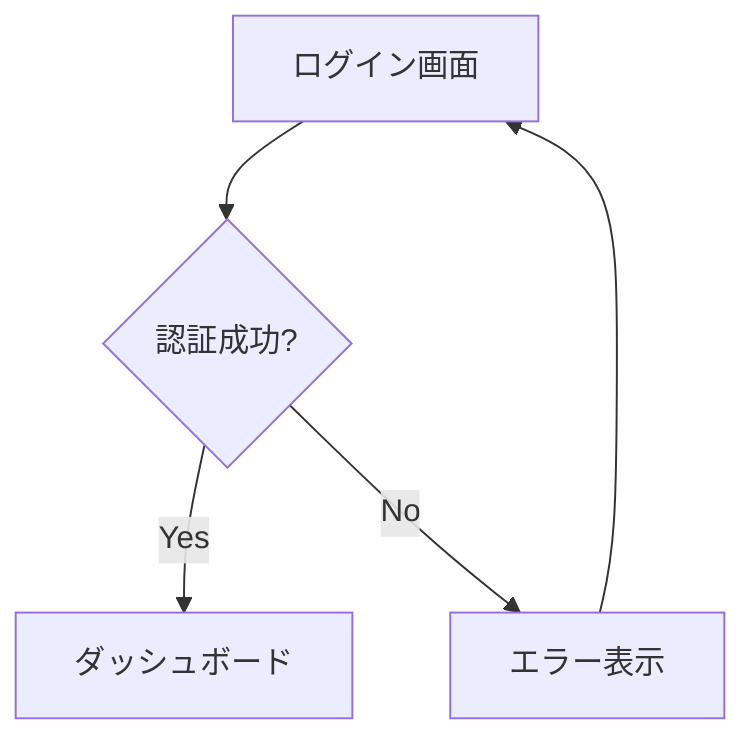
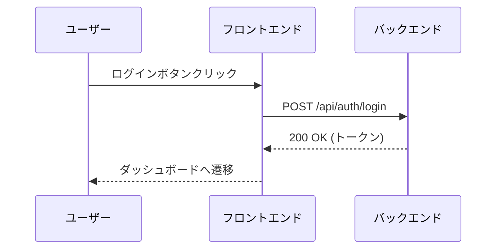

# UI仕様書作成ガイド

## 目次

- [概要](#概要)
- [ディレクトリ構成ルール](#ディレクトリ構成ルール)
  - [命名規則](#命名規則)
  - [ディレクトリ階層](#ディレクトリ階層)
  - [ファイル構成](#ファイル構成)
- [作成手順](#作成手順)
  - [新規機能追加時](#新規機能追加時)
  - [既存機能修正時](#既存機能修正時)
- [ドキュメント作成ルール](#ドキュメント作成ルール)
  - [README.md](#readmemd)
  - [ui-specification.md](#ui-specificationmd)
  - [interaction-specification.md](#interaction-specificationmd)
- [記述のベストプラクティス](#記述のベストプラクティス)
- [レビューチェックリスト](#レビューチェックリスト)
- [よくある質問](#よくある質問)

---

## 概要

このガイドは、UI仕様書を作成する際の標準的な手順とルールを定めたものです。
統一された形式で仕様書を作成することで、チーム全体の生産性とドキュメント品質を向上させます。

**対象者:**
- プロダクトマネージャー
- UIデザイナー
- フロントエンド/バックエンド開発者
- QAエンジニア

**関連ディレクトリ:**
- `docs/03-ui-design/` - UI仕様書（基本設計）
- `docs/05-interactions/` - インタラクション仕様書（詳細設計）

---

## ディレクトリ構成ルール

### 命名規則

#### 機能カテゴリディレクトリ
```
形式: {機能カテゴリ名}/
命名: ハイフン区切りの英小文字（kebab-case）
例: user-management/, authentication/, dashboard/
```

#### 画面ディレクトリ
```
形式: {機能カテゴリ}/{画面名}/
命名: ハイフン区切りの英小文字（kebab-case）
例: user-management/user-list/, user-management/user-detail/
```

#### 命名の原則
- **明確性**: 機能や画面の内容が一目でわかる名前
- **一貫性**: プロジェクト全体で統一された命名パターン
- **簡潔性**: 必要十分な長さ（過度に長い名前は避ける）

### ディレクトリ階層

```
03-ui-design/
├── {機能カテゴリ}/              # レベル1: 機能グループ
│   ├── {画面名}/                # レベル2: 個別画面
│   │   ├── README.md           # 機能概要
│   │   └── ui-specification.md  # UI仕様
│   └── {別の画面}/
│       └── ...
└── {別の機能カテゴリ}/
    └── ...

05-interactions/
├── {機能カテゴリ}/              # 03-ui-design と同じ構造
│   ├── {画面名}/
│   │   └── interaction-specification.md # インタラクション仕様
│   └── ...
└── ...
```

### ファイル構成

各画面ディレクトリには、以下のファイルを配置します：

**03-ui-design/ 配下:**

| ファイル名 | 役割 | 必須/任意 |
|-----------|------|-----------|
| README.md | 機能概要、データモデル、API一覧、実装ステータス | 必須 |
| ui-specification.md | UI設計（レイアウト、コンポーネント、バリデーションルール） | 必須 |

**05-interactions/ 配下:**

| ファイル名 | 役割 | 必須/任意 |
|-----------|------|-----------|
| interaction-specification.md | 処理フロー、API連携、状態管理、エラーハンドリング | 必須 |

---

## 作成手順

### 新規機能追加時

#### ステップ1: 機能カテゴリの決定
```bash
# 既存カテゴリがある場合
既存のカテゴリディレクトリを使用

# 新規カテゴリが必要な場合
mkdir docs/03-ui-design/{機能カテゴリ名}
mkdir docs/05-interactions/{機能カテゴリ名}
```

#### ステップ2: 画面ディレクトリの作成
```bash
# 画面ごとのディレクトリを作成
mkdir docs/03-ui-design/{機能カテゴリ名}/{画面名}
mkdir docs/05-interactions/{機能カテゴリ名}/{画面名}
```

#### ステップ3: テンプレートからファイルをコピー
```bash
# UI仕様書テンプレートをコピー
cp docs/03-ui-design/ui-specification-template.md \
   docs/03-ui-design/{機能カテゴリ}/{画面名}/ui-specification.md

# インタラクション仕様書テンプレートをコピー
cp docs/05-interactions/interaction-specification-template.md \
   docs/05-interactions/{機能カテゴリ}/{画面名}/interaction-specification.md
```

#### ステップ4: README.mdの作成
画面の概要、使用するAPIなどを記載（03-ui-design配下）

#### ステップ5: 各仕様書の記入
テンプレートに従って詳細を記入（UI仕様 → API仕様 → インタラクション仕様の順で作成推奨）

### 既存機能修正時

1. 対象の機能仕様書を特定
2. 変更内容を明確化
3. 影響範囲を確認
4. 仕様書を更新
5. レビューを依頼

---

## ドキュメント作成ルール

### README.md

#### 必須セクション
```markdown
# {画面名}

## 1. 概要
画面の目的と役割を簡潔に記述

## 2. 機能要件
- 対応する要件ID: REQ-XXX
- ユースケース

## 3. データモデル
使用するエンティティとその関係

## 4. 使用API
| エンドポイント | メソッド | 用途 |
|--------------|---------|------|
| /api/users   | GET     | ユーザ一覧取得 |

## 5. 実装ステータス
- [ ] UI実装
- [ ] API連携
- [ ] テスト作成
```

### ui-specification.md

#### 必須セクション
```markdown
# UI仕様書 - {画面名}

## 1. 画面レイアウト
ワイヤーフレームまたはモックアップ

## 2. UIコンポーネント
各UI要素の詳細仕様

## 3. バリデーションルール
入力検証の詳細

## 4. レスポンシブ対応
ブレイクポイントごとの表示
```

### interaction-specification.md

**配置場所:** `docs/05-interactions/{機能カテゴリ}/{画面名}/`

#### 必須セクション
```markdown
# インタラクション仕様書 - {画面名}

## 1. 使用するAPI一覧
画面で使用するAPIの一覧

## 2. 処理フロー
メインの処理の流れ

## 3. API呼び出しマッピング
UI操作とAPI呼び出しの対応

## 4. エラーハンドリング
エラー時の処理

## 5. 状態管理（必要な場合）
複雑な状態管理が必要な場合のみ
```

---

## 記述のベストプラクティス

### 明確性の確保
- **具体的な記述**: 「適切に表示する」ではなく「3秒以内に表示する」
- **数値の明記**: サイズ、文字数制限、タイムアウト値など
- **条件の明確化**: 「場合によって」ではなく具体的な条件を記載

### 視覚的な表現
- **図表の活用**: Mermaidによるフローチャート、シーケンス図
- **テーブル形式**: 一覧性の高い情報はテーブルで整理
- **コード例**: 実装イメージを明確にするためのサンプルコード

### 一貫性の維持
- **用語の統一**: プロジェクト全体で同じ用語を使用
- **形式の統一**: 見出しレベル、箇条書きの形式を統一
- **参照の明確化**: 他のドキュメントへの参照は相対パスで記載

### 例: Mermaidフローチャート


### 例: API呼び出しシーケンス


---

## レビューチェックリスト

### UI仕様書レビュー時の確認項目

#### 必須項目の確認
- [ ] README.mdが存在する（03-ui-design配下）
- [ ] ui-specification.mdが存在する（03-ui-design配下）
- [ ] interaction-specification.mdが存在する（05-interactions配下）
- [ ] 要件IDとの紐付けがある
- [ ] API仕様へのリンクがある

#### 内容の妥当性
- [ ] 要件を満たしている
- [ ] UIガイドラインに準拠している
- [ ] エラーケースが網羅されている
- [ ] パフォーマンス要件が明記されている
- [ ] セキュリティ考慮がされている

#### 記述の品質
- [ ] 曖昧な表現がない
- [ ] 図表が適切に使用されている
- [ ] 実装可能なレベルまで詳細化されている
- [ ] 他の機能との整合性がある

---

## よくある質問

### Q1: 1つの画面に複数の状態がある場合は？
**A:** ui-specification.mdに各状態を別セクションとして記載し、interaction-specification.mdで状態遷移を定義します。

### Q2: 共通コンポーネントの仕様はどこに書く？
**A:** ui-common-specification.mdに記載し、個別の画面仕様からは参照のみとします。

### Q3: モバイルアプリの仕様も同じ構成？
**A:** 基本構成は同じですが、プラットフォーム固有の仕様は別セクションで記載します。

### Q4: 外部システム連携の仕様は？
**A:** integration/カテゴリを作成し、連携システムごとに仕様を管理します。

### Q5: 画面がない機能（バッチ処理など）は？
**A:** background-jobs/などのカテゴリを作成し、処理フローを中心に記載します。

### Q6: 仕様変更時のバージョン管理は？
**A:** Gitでバージョン管理するため、ドキュメント内にバージョン履歴は不要です。コミットメッセージで変更内容を明記してください。

### Q7: 図表の作成ツールは？
**A:**
- 技術的な図表: Mermaid記法でMarkdown内に記述
- 画面デザイン: draw.io（別途PNGエクスポート）

### Q8: レビューは誰が行う？
**A:**
1. 技術リード（技術的妥当性）
2. UIデザイナー（UI仕様）
3. プロダクトオーナー（要件との整合性）

---

## 参考リンク

- [UI共通仕様書](./ui-common-specification.md)
- [UI仕様書テンプレート](./ui-specification-template.md)
- [インタラクション仕様書テンプレート](../05-interactions/interaction-specification-template.md)
- [Mermaid図表記述ルール](../00-rules/mermaid-diagram-rules.md)
- [画面設計ルール](../00-rules/screen-design-rules.md)