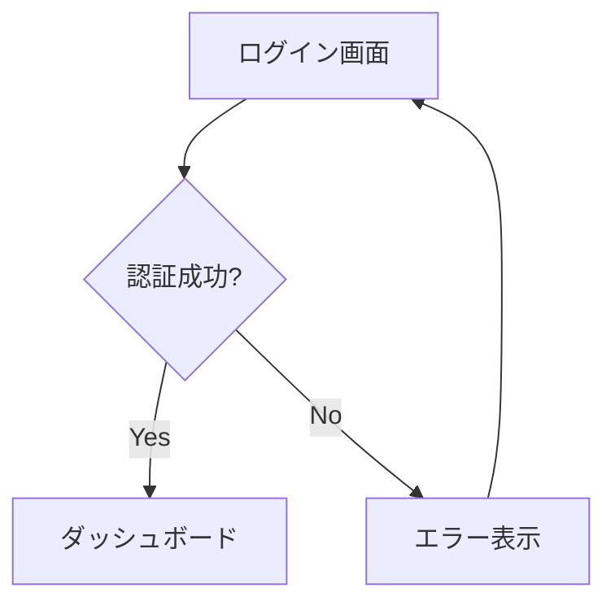
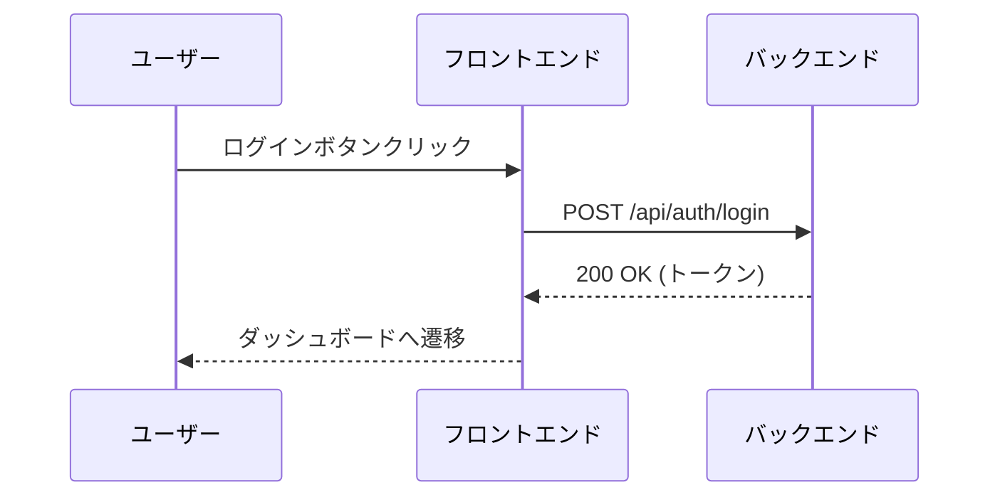

# UI仕様書作成ガイド

## 目次

- [概要](#概要)
- [ディレクトリ構成ルール](#ディレクトリ構成ルール)
  - [命名規則](#命名規則)
  - [ディレクトリ階層](#ディレクトリ階層)
  - [ファイル構成](#ファイル構成)
- [作成手順](#作成手順)
  - [新規機能追加時](#新規機能追加時)
  - [既存機能修正時](#既存機能修正時)
- [ドキュメント作成ルール](#ドキュメント作成ルール)
  - [ui-specification.md](#ui-specificationmd)
- [記述のベストプラクティス](#記述のベストプラクティス)
- [レビューチェックリスト](#レビューチェックリスト)
- [よくある質問](#よくある質問)

---

## 概要

このガイドは、UI仕様書を作成する際の標準的な手順とルールを定めたものです。
統一された形式で仕様書を作成することで、チーム全体の生産性とドキュメント品質を向上させます。

**対象者:**
- プロダクトマネージャー
- UIデザイナー
- フロントエンド/バックエンド開発者
- QAエンジニア

**関連ディレクトリ:**
- `docs/03-ui-design/` - UI仕様書（基本設計）

---

## ディレクトリ構成ルール

### 命名規則

ディレクトリ名は [画面設計書](../02-architecture/screen-design.md) の英語表記に従います。

#### 機能カテゴリディレクトリ
```
形式: {機能名（英語）}/
参照: 画面設計書の「機能名（英語）」列
例: user-management/, asset-management/, lending-management/, inventory/, reports/, admin/, notifications/, common/
```

#### 画面ファイル
```
形式: {機能名（英語）}/{画面名（英語）}-ui-specification.md
参照: 画面設計書の「画面名（英語）」列
例: user-management/login-screen-ui-specification.md, asset-management/asset-search-screen-ui-specification.md
```

#### 命名の原則
- **画面設計書に準拠**: 必ず [画面設計書](../02-architecture/screen-design.md) の英語表記を使用
- **一貫性**: プロジェクト全体で統一された命名パターン
- **トレーサビリティ**: 画面設計書との対応が明確

### ディレクトリ階層

```
03-ui-design/
├── {機能名（英語）}/                              # 機能グループ（例: asset-management）
│   ├── {画面名（英語）}-ui-specification.md       # UI仕様（例: asset-search-screen-ui-specification.md）
│   └── {別の画面名}-ui-specification.md
├── {別の機能}/
│   └── ...
├── screens/                                       # ワイヤーフレーム画像
├── ui-common-specification.md                     # 共通UI仕様
├── ui-design-guide.md                             # 本ガイド
└── ui-specification-template.md                   # テンプレート
```

### ファイル構成

各機能ディレクトリには、画面ごとにUI仕様書ファイルを配置します：

**03-ui-design/{機能名}/ 配下:**

| ファイル名 | 役割 | 必須/任意 |
|-----------|------|-----------|
| {画面名}-ui-specification.md | UI設計（レイアウト、コンポーネント、バリデーションルール） | 必須 |

---

## 作成手順

### 新規機能追加時

#### ステップ0: 画面設計書の確認
[画面設計書](../02-architecture/screen-design.md) を参照し、機能名（英語）と画面名（英語）を確認します。

#### ステップ1: 機能カテゴリの決定
```bash
# 既存カテゴリがある場合
既存のカテゴリディレクトリを使用

# 新規カテゴリが必要な場合（画面設計書の「機能名（英語）」を使用）
mkdir docs/03-ui-design/{機能名（英語）}

# 例: 資産管理機能の場合
mkdir docs/03-ui-design/asset-management
```

#### ステップ2: テンプレートからファイルをコピー
```bash
# UI仕様書テンプレートをコピー（画面設計書の「画面名（英語）」を使用）
cp docs/03-ui-design/ui-specification-template.md \
   docs/03-ui-design/{機能名（英語）}/{画面名（英語）}-ui-specification.md

# 例: 資産検索画面の場合
cp docs/03-ui-design/ui-specification-template.md \
   docs/03-ui-design/asset-management/asset-search-screen-ui-specification.md
```

#### ステップ3: 仕様書の記入
テンプレートに従って詳細を記入

### 既存機能修正時

1. 対象の機能仕様書を特定
2. 変更内容を明確化
3. 影響範囲を確認
4. 仕様書を更新
5. レビューを依頼

---

## ドキュメント作成ルール

### ui-specification.md

#### 必須セクション
```markdown
# UI仕様書 - {画面名}

## 1. 画面レイアウト
ワイヤーフレームまたはモックアップ

## 2. UIコンポーネント
各UI要素の詳細仕様

## 3. バリデーションルール
入力検証の詳細

## 4. レスポンシブ対応
ブレイクポイントごとの表示
```

---

## 記述のベストプラクティス

### 明確性の確保
- **具体的な記述**: 「適切に表示する」ではなく「3秒以内に表示する」
- **数値の明記**: サイズ、文字数制限、タイムアウト値など
- **条件の明確化**: 「場合によって」ではなく具体的な条件を記載

### 視覚的な表現
- **図表の活用**: Mermaidによるフローチャート、シーケンス図
- **テーブル形式**: 一覧性の高い情報はテーブルで整理
- **コード例**: 実装イメージを明確にするためのサンプルコード

### 一貫性の維持
- **用語の統一**: プロジェクト全体で同じ用語を使用
- **形式の統一**: 見出しレベル、箇条書きの形式を統一
- **参照の明確化**: 他のドキュメントへの参照は相対パスで記載

### 例: Mermaidフローチャート


### 例: API呼び出しシーケンス


---

## レビューチェックリスト

### UI仕様書レビュー時の確認項目

#### 必須項目の確認
- [ ] ui-specification.mdが存在する（03-ui-design配下）
- [ ] 要件IDとの紐付けがある

#### 内容の妥当性
- [ ] 要件を満たしている
- [ ] UIガイドラインに準拠している
- [ ] エラーケースが網羅されている
- [ ] パフォーマンス要件が明記されている
- [ ] セキュリティ考慮がされている

#### 記述の品質
- [ ] 曖昧な表現がない
- [ ] 図表が適切に使用されている
- [ ] 実装可能なレベルまで詳細化されている
- [ ] 他の機能との整合性がある

---

## よくある質問

### Q1: 1つの画面に複数の状態がある場合は？
**A:** ui-specification.mdに各状態を別セクションとして記載します。

### Q2: 共通コンポーネントの仕様はどこに書く？
**A:** ui-common-specification.mdに記載し、個別の画面仕様からは参照のみとします。

### Q3: モバイルアプリの仕様も同じ構成？
**A:** 基本構成は同じですが、プラットフォーム固有の仕様は別セクションで記載します。

### Q4: 外部システム連携の仕様は？
**A:** integration/カテゴリを作成し、連携システムごとに仕様を管理します。

### Q5: 画面がない機能（バッチ処理など）は？
**A:** background-jobs/などのカテゴリを作成し、処理フローを中心に記載します。

### Q6: 仕様変更時のバージョン管理は？
**A:** Gitでバージョン管理するため、ドキュメント内にバージョン履歴は不要です。コミットメッセージで変更内容を明記してください。

### Q7: 図表の作成ツールは？
**A:**
- 技術的な図表: Mermaid記法でMarkdown内に記述
- 画面デザイン: draw.io（別途PNGエクスポート）

### Q8: レビューは誰が行う？
**A:**
1. 技術リード（技術的妥当性）
2. UIデザイナー（UI仕様）
3. プロダクトオーナー（要件との整合性）

---

## 参考リンク

- [画面設計書](../02-architecture/screen-design.md) - 機能名（英語）・画面名（英語）の参照元
- [UI共通仕様書](./ui-common-specification.md)
- [UI仕様書テンプレート](./ui-specification-template.md)
- [Mermaid図表記述ルール](../00-rules/mermaid-diagram-rules.md)
- [画面設計ルール](../00-rules/screen-design-rules.md)