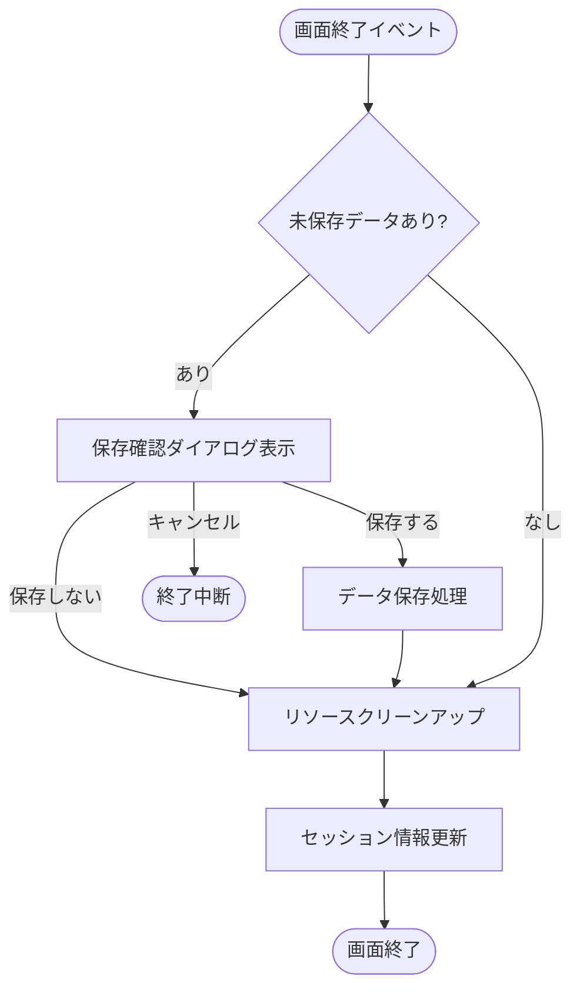
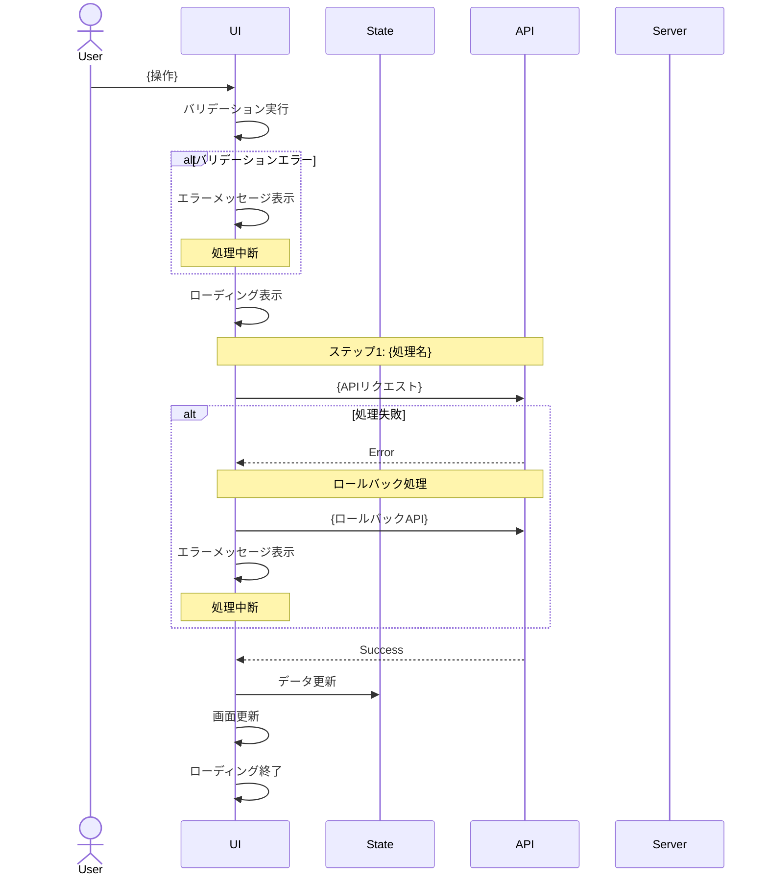
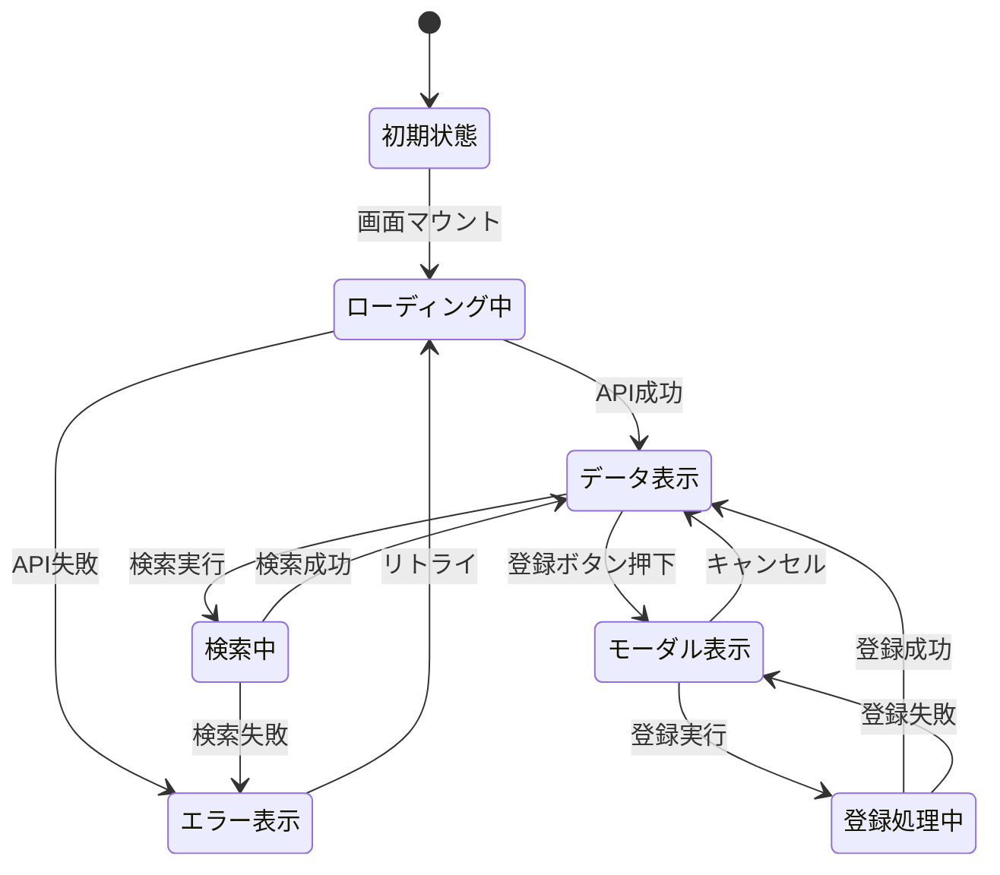

# {画面名} - インタラクション仕様書

> **使用方法**: このテンプレートをコピーして、各画面のインタラクション仕様書を作成してください。
> {中括弧}内の項目は実際の内容に置き換えてください。
> **セクションの統一**: すべての画面でセクション構成を統一するため、該当しないセクションも削除せず「該当なし」と記載してください。

## 目次

- [概要](#概要)
- [使用するAPI一覧](#使用するapi一覧)
- [API呼び出しマッピング](#api呼び出しマッピング)
- [インタラクション一覧](#インタラクション一覧)
  - [初期表示](#初期表示)
  - [検索・絞り込み](#検索絞り込み)
  - [データ登録](#データ登録)
  - [その他の操作](#その他の操作)
  - [画面終了処理](#画面終了処理)
- [共通仕様](#共通仕様)
  - [エラーハンドリング](#エラーハンドリング)
  - [バリデーション実行パターン](#バリデーション実行パターン)
  - [ローディング表示パターン](#ローディング表示パターン)
- [シーケンス図](#シーケンス図)
- [状態管理](#状態管理)
- [パフォーマンス最適化](#パフォーマンス最適化)
- [セキュリティ考慮事項](#セキュリティ考慮事項)
- [関連ドキュメント](#関連ドキュメント)

**注:** すべてのインタラクション仕様書でこの目次構成を統一してください。

---

## 概要

**処理概要:**
{この画面で行われる主な処理の概要を記述}

**前提条件:**
- {処理を開始するための前提条件}
- {必要な権限や状態}

**処理結果:**
- {処理完了後の状態や出力}

### このドキュメントの役割

- ユーザー操作のトリガー条件
- 処理フローの詳細（API呼び出しシーケンス）
- バリデーション実行タイミング（いつチェックするか）
- エラーハンドリングフロー
- UI状態遷移

### UI仕様書との役割分担

| 項目 | UI仕様書 | インタラクション仕様書 |
|------|----------|----------------------|
| バリデーションルール定義（何をチェックするか） | ○ | - |
| バリデーション実行タイミング（いつチェックするか） | - | ○ |
| UI要素の詳細仕様 | ○ | - |
| 処理フロー・API呼び出し順序 | - | ○ |

### セクション記載ガイドライン

**すべてのセクションを記載してください。** 該当しない場合は「該当なし」と記載し、セクション構成を統一してください。

| セクション | 記載内容 | 該当しない場合 |
|-----------|---------|--------------|
| 概要 | 必須 | - |
| 使用するAPI一覧 | 必須 | - |
| API呼び出しマッピング | 使用するAPIが5個以上、または1操作で複数API呼び出し | 「該当なし」と記載 |
| インタラクション一覧 | 必須（各操作の詳細） | - |
| 共通仕様 | 必須 | - |
| シーケンス図 | 複数APIの連鎖処理、ロールバック処理が必要な場合 | 「該当なし」と記載 |
| 状態管理 | React Contextやグローバル状態管理が複雑な場合 | 「該当なし」と記載 |
| パフォーマンス最適化 | 大量データ処理、頻繁なAPI呼び出しがある場合 | 「該当なし」と記載 |
| セキュリティ考慮事項 | 必須 | - |
| 関連ドキュメント | 必須 | - |

---

## 使用するAPI一覧

この画面で使用するすべてのAPIエンドポイントを記載します。

| No | API名 | エンドポイント | メソッド | 用途 | 仕様書 |
|----|-------|---------------|---------|------|--------|
| 1 | {API名} | `{エンドポイント}` | GET/POST/PUT/DELETE | {用途} | [specification.md](../../04-api/{operation}/specification.md) |

**記入例:**

| No | API名 | エンドポイント | メソッド | 用途 | 仕様書 |
|----|-------|---------------|---------|------|--------|
| 1 | ユーザ一覧取得 | `/api/users` | GET | ユーザ検索・一覧表示 | [specification.md](../../04-api/users/list/specification.md) |
| 2 | ユーザ作成 | `/api/users` | POST | ユーザ基本情報の作成 | [specification.md](../../04-api/users/create/specification.md) |
| 3 | グループ一覧取得 | `/api/groups` | GET | 所属グループ選択肢の取得 | [specification.md](../../04-api/groups/list/specification.md) |

---

## API呼び出しマッピング

**注:** 複数のAPIを使用する複雑な画面の場合に記載してください。該当しない場合は「該当なし」と記載してください。

**記載すべき場合:** 使用するAPIが5個以上 / 1操作で複数API呼び出し / 対応関係が複雑

| ユーザー操作 | トリガー | 呼び出すAPI | パラメータ | エラー時の挙動 |
|-------------|---------|-----------|-----------|---------------|
| 画面初期表示 | 画面マウント | GET /api/users | `page=1, per_page=20` | エラーメッセージ表示 |
| 検索ボタン押下 | ボタンクリック | GET /api/users | `keyword, roles, page=1` | エラーメッセージ表示 |
| ユーザ登録実行 | 登録ボタン押下 | 1. POST /api/users<br>2. POST /api/user-groups | 1. `{email, name}`<br>2. `{userId, groupIds}` | ロールバック処理 |

※ 該当しない場合: 該当なし

---

## インタラクション一覧

### 初期表示

**トリガー:** 画面マウント時（ユーザーが画面にアクセスしたとき）

**前提条件:**
- ユーザーがログイン済み
- 適切な権限を持っている（{必要権限}）

#### 処理フロー

```mermaid
flowchart TD
    Start([画面マウント]) --> Auth{認証確認}
    Auth -->|未認証| Redirect[ログイン画面へリダイレクト]
    Auth -->|認証済| Perm{権限確認}
    Perm -->|権限なし| PermError[権限エラー表示]
    Perm -->|権限あり| Loading[ローディング表示開始]
    Loading --> Init[検索条件を初期化]
    Init --> API[API呼び出し<br>GET /api/{resource}]
    API --> Check{APIレスポンス}

    Check -->|成功 200| Success[データ表示]
    Success --> EndSuccess[ローディング終了]

    Check -->|エラー| Error[エラーメッセージ表示]
    Error --> EndError[ローディング終了]

    EndSuccess --> End([処理完了])
    EndError --> End
```

**初期化処理詳細:**

1. **認証確認**
   - セッション/トークンの有効性確認
   - タイムアウト: {秒数}秒

2. **権限確認**
   - 必要権限: {VIEW_RESOURCE, EDIT_RESOURCE}

3. **初期データ取得**
   - {取得するデータの説明}
   - 並列処理: {可/不可}

#### API仕様

| API | エンドポイント | 詳細 |
|-----|---------------|------|
| {API名} | `GET /api/{resource}` | [API仕様書](../../04-api/{resource}/list/specification.md) |

#### バリデーション

**実行タイミング:** なし（初期表示のため）

#### 表示メッセージ

| メッセージID | 表示タイミング | 表示場所 |
|-------------|---------------|---------|
| ERR_001 | API呼び出し失敗時（500） | メッセージ表示エリア |
| INFO_001 | 検索結果が0件 | データテーブル内 |

> **注:** メッセージの詳細は [UI仕様書](./ui-specification.md) を参照してください。

#### エラーハンドリング

→ [共通仕様 - エラーハンドリング](#エラーハンドリング) を参照

#### UI状態

- 検索条件: デフォルト値
- テーブル: データ表示
- ページネーション: 1ページ目を選択状態

---

### 検索・絞り込み

**トリガー:** 検索ボタンクリック

**前提条件:**
- 検索条件が入力されている（空でも可）

#### 処理フロー

```mermaid
flowchart TD
    Start([検索ボタンクリック]) --> Validate[クライアント側バリデーション実行]
    Validate --> ValidCheck{バリデーション結果}

    ValidCheck -->|エラー| ValidError[エラーメッセージを各フィールド下に表示]
    ValidError --> ValidEnd([処理中断])

    ValidCheck -->|OK| Loading[ローディング表示開始]
    Loading --> Convert[検索条件をクエリパラメータに変換]
    Convert --> API[API呼び出し<br>GET /api/{resource}?...]
    API --> Check{APIレスポンス}

    Check -->|成功 200| Success[テーブルを更新]
    Success --> ResetPage[ページネーションを1ページ目にリセット]
    ResetPage --> SaveStorage[検索条件をセッションストレージに保存]
    SaveStorage --> EndSuccess[ローディング終了]

    Check -->|エラー| Error[エラーメッセージ表示]
    Error --> EndError[ローディング終了]

    EndSuccess --> End([処理完了])
    EndError --> End
```

#### API仕様

| API | エンドポイント | 詳細 |
|-----|---------------|------|
| {API名} | `GET /api/{resource}` | [API仕様書](../../04-api/{resource}/list/specification.md) |

#### バリデーション

**実行タイミング:** 検索ボタンクリック直後（API呼び出し前）

**バリデーション対象:** 検索フォーム項目

**バリデーションルール:** [UI仕様書](./ui-specification.md) の検索フォーム > バリデーション を参照

**エラー表示:** 各入力フィールドの下に赤色テキスト表示

#### 表示メッセージ

| メッセージID | 表示タイミング | 表示場所 |
|-------------|---------------|---------|
| ERR_001 | API呼び出し失敗時 | メッセージ表示エリア |
| INFO_001 | 検索結果が0件 | データテーブル内 |

#### エラーハンドリング

→ [共通仕様 - エラーハンドリング](#エラーハンドリング) を参照

#### UI状態

- 検索条件: 入力値を保持
- テーブル: 検索結果データ表示
- ページネーション: 1ページ目にリセット

---

### データ登録

**トリガー:** 登録ボタンクリック

**前提条件:**
- すべての必須項目が入力されている

#### 処理フロー

```mermaid
flowchart TD
    Start([登録ボタンクリック]) --> Validate[クライアント側バリデーション実行]
    Validate --> ValidCheck{バリデーション結果}

    ValidCheck -->|エラー| ValidError[エラーメッセージを各フィールド下に表示]
    ValidError --> ValidEnd([処理中断])

    ValidCheck -->|OK| Confirm[確認ダイアログ表示]
    Confirm -->|キャンセル| CancelEnd([処理中断])
    Confirm -->|OK| Loading[ローディング表示開始<br>登録ボタンをDisable]
    Loading --> API[API呼び出し<br>POST /api/{resource}]
    API --> Check{APIレスポンス}

    Check -->|成功 201| CloseModal[モーダルを閉じる]
    CloseModal --> SuccessMsg[成功メッセージ表示]
    SuccessMsg --> Reload[一覧を再取得]
    Reload --> EndSuccess[ローディング終了]

    Check -->|エラー| ErrorMsg[エラーメッセージ表示<br>モーダルは開いたまま]
    ErrorMsg --> EndError[ローディング終了]

    EndSuccess --> End([処理完了])
    EndError --> End
```

#### API仕様

| API | エンドポイント | 詳細 |
|-----|---------------|------|
| {API名} | `POST /api/{resource}` | [API仕様書](../../04-api/{resource}/create/specification.md) |

#### バリデーション

**実行タイミング:** 登録ボタンクリック直後（API呼び出し前）

**バリデーション対象:** フォーム全項目

**バリデーションルール:** [UI仕様書](./ui-specification.md) のモーダル > バリデーション を参照

**エラー表示:** 各入力フィールドの下に赤色テキスト表示

#### 表示メッセージ

| メッセージID | 表示タイミング | 表示場所 |
|-------------|---------------|---------|
| SUC_001 | 登録成功時 | メッセージ表示エリア（トースト） |
| ERR_002 | 登録失敗時（500） | モーダル内 |
| ERR_003 | 重複エラー | フィールド下 |

#### エラーハンドリング

→ [共通仕様 - エラーハンドリング](#エラーハンドリング) を参照

#### UI状態

- モーダル: 閉じる（成功時）/ 開いたまま（エラー時）
- テーブル: 最新データに更新（成功時）

---

### その他の操作

**注:** 画面固有の操作（ソート、ページング、詳細遷移、削除など）を追加してください。該当する操作がない場合は「該当なし」と記載してください。

#### {操作名}

**トリガー:** {操作のトリガー}

**前提条件:** {前提条件}

##### 処理フロー

```mermaid
flowchart TD
    Start([{トリガー}]) --> Process[{処理内容}]
    Process --> End([処理完了])
```

##### API仕様

| API | エンドポイント | 詳細 |
|-----|---------------|------|
| {API名} | `{メソッド} /api/{endpoint}` | [API仕様書]({パス}) |

##### バリデーション

**実行タイミング:** {タイミング}

##### 表示メッセージ

| メッセージID | 表示タイミング | 表示場所 |
|-------------|---------------|---------|

##### UI状態

- {状態の説明}

※ 該当する操作がない場合: 該当なし

---

### 画面終了処理

**トリガー:** ブラウザバック、他画面への遷移、ブラウザを閉じる

#### 処理フロー



**クリーンアップ処理:**
- タイマーのクリア
- WebSocket接続のクローズ（使用している場合）
- イベントリスナーの削除

---

## 共通仕様

### エラーハンドリング

#### HTTPステータス別対処

| HTTPステータス | エラー種別 | 対処方法 | ユーザー通知 | ロールバック |
|--------------|-----------|---------|-------------|-------------|
| 400 | バリデーションエラー | 該当フィールドにエラー表示 | フィールド下にメッセージ | × |
| 401 | 認証エラー | ログイン画面へリダイレクト | トースト通知 | × |
| 403 | 権限エラー | 権限エラー画面表示 | モーダルダイアログ | × |
| 404 | リソース不在 | 一覧画面へ戻る | アラート表示 | × |
| 409 | 競合エラー | エラーメッセージ表示 | フィールド下にメッセージ | × |
| 500 | サーバーエラー | リトライオプション表示 | エラー画面表示 | ○ |
| 502/503/504 | 外部連携エラー | 自動リトライ後、手動リトライ | プログレスバー | ○ |
| ネットワークエラー | 接続エラー | リトライオプション表示 | エラーメッセージ | ○ |

#### リトライ処理

```javascript
const retryConfig = {
    maxRetries: 3,
    retryDelay: 1000, // ミリ秒
    retryableErrors: [408, 429, 500, 502, 503, 504],
    exponentialBackoff: true
};
```

#### エラーレスポンス形式

```json
{
    "errors": [
        {
            "field": "email",
            "code": "DUPLICATE",
            "message": "このメールアドレスは既に使用されています"
        }
    ]
}
```

#### エラーログ送信

クライアント側でキャッチしたエラーは以下の情報をログAPIへ送信します：

- エラーメッセージ、スタックトレース
- 発生画面ID、ユーザーID
- ブラウザ情報、タイムスタンプ

---

### バリデーション実行パターン

#### 実行タイミング

| タイミング | イベント | 対象 | 処理内容 |
|-----------|--------|------|---------|
| 入力中 | onChange | テキストフィールド | 文字数カウント表示 |
| フォーカスアウト | onBlur | 全フィールド | 形式チェック、必須チェック |
| 送信時 | onSubmit | 全フィールド | 全項目の総合チェック |

#### クライアント側とサーバー側の役割分担

| 検証項目 | クライアント側 | サーバー側 |
|---------|--------------|-----------|
| 必須チェック | ○ | ○ |
| 形式チェック（メール等） | ○ | ○ |
| 文字数チェック | ○ | ○ |
| 重複チェック | △（非同期） | ○ |
| ビジネスルール検証 | × | ○ |
| データ整合性チェック | × | ○ |

---

### ローディング表示パターン

| 処理種別 | 表示方法 | 対象要素 |
|---------|---------|---------|
| 初期データ取得 | スケルトンスクリーン | データテーブル全体 |
| 検索・フィルタ | オーバーレイ + スピナー | データテーブル |
| データ登録・更新 | ボタン内スピナー + Disable | 実行ボタン |
| ページ遷移 | プログレスバー | 画面上部 |

---

## シーケンス図

**注:** 以下の場合に記載してください。該当しない場合は「該当なし」と記載してください。
- 複数のAPIを連鎖的に呼び出す
- 条件分岐が複雑
- エラー時のロールバックロジックが必要

### {処理名}の詳細シーケンス

**トリガー:** {操作}



### ロールバック方針

| 失敗ステップ | ロールバック対象 | 処理内容 |
|------------|----------------|---------|
| ステップ2失敗 | ステップ1で作成したデータ | DELETE APIで削除 |
| ステップ3失敗 | ロールバックしない | 警告メッセージのみ |

### ロールバック実装パターン

```typescript
async function complexOperation(data: InputData) {
  let createdId: string | null = null;

  try {
    // ステップ1
    const result = await createResource(data);
    createdId = result.id;

    // ステップ2
    await linkResource(createdId, data.relatedIds);

    // ステップ3（失敗しても警告のみ）
    try {
      await sendNotification(createdId);
    } catch (error) {
      console.warn('通知送信失敗', error);
      showWarning('処理は完了しましたが、通知の送信に失敗しました');
    }

    return { success: true, id: createdId };

  } catch (error) {
    // ロールバック処理
    if (createdId) {
      try {
        await deleteResource(createdId);
      } catch (rollbackError) {
        console.error('ロールバック失敗', rollbackError);
        notifyAdmin('ロールバック失敗', { id: createdId });
      }
    }
    throw error;
  }
}
```

※ 該当しない場合: 該当なし

---

## 状態管理

**注:** 以下の場合に記載してください。該当しない場合は「該当なし」と記載してください。
- 複数画面間で状態を共有する
- セッションストレージ/ローカルストレージを使用する
- 状態遷移が複雑

### 状態の構造

```typescript
interface ScreenState {
  // データ
  items: Item[];
  selectedItem: Item | null;

  // 検索・ソート・ページング
  searchParams: SearchParams;
  sortParams: SortParams;
  pagination: PaginationState;

  // UI状態
  loading: boolean;
  error: string | null;
  isModalOpen: boolean;

  // フォーム状態
  formData: FormData;
  validationErrors: ValidationErrors;
}
```

### 状態遷移図



### 状態の永続化

| 状態 | 保存先 | 理由 |
|------|-------|------|
| searchParams | SessionStorage | 画面遷移後の復元用 |
| sortParams | SessionStorage | ソート条件維持用 |
| items | なし（メモリのみ） | 常に最新を取得 |
| formData | なし（メモリのみ） | モーダルクローズで破棄 |

**ストレージキー命名規則:**
```
{画面名}:{状態名}
例: user-management:searchParams
```

※ 該当しない場合: 該当なし

---

## パフォーマンス最適化

**注:** 以下の場合に記載してください。該当しない場合は「該当なし」と記載してください。
- データ件数が1,000件以上
- 複数のAPI呼び出しを並列実行できる
- 頻繁なAPI呼び出しがある

### API呼び出しの最適化

#### 並列実行

```typescript
// 依存関係のないAPI呼び出しは並列実行
const [users, groups] = await Promise.all([
  fetchUsers(),
  fetchGroups(),
]);
```

#### デバウンス/スロットリング

| 処理 | 方式 | 待機時間 |
|-----|------|---------|
| 検索入力 | デバウンス | 500ms |
| リサイズイベント | スロットリング | 100ms |
| スクロールイベント | スロットリング | 100ms |

#### キャッシュ戦略

| データ種別 | キャッシュ方式 | 有効期限 | 無効化タイミング |
|-----------|--------------|---------|----------------|
| マスターデータ | セッションストレージ | 30分 | 画面リロード |
| 一覧データ | React Query等 | 5分 | CRUD操作後 |
| 検索結果 | メモリキャッシュ | - | ページ遷移時 |

### レンダリング最適化

- **React.memo**: テーブル行コンポーネントをメモ化
- **仮想スクロール**: 1,000件以上の場合に適用
- **遅延読み込み**: 画像やコンポーネントの遅延読み込み

※ 該当しない場合: 該当なし

---

## セキュリティ考慮事項

### 入力値のサニタイゼーション

- **XSS対策**: ユーザー入力値のエスケープ処理
- **SQLインジェクション対策**: パラメータ化クエリ使用（サーバー側）

### 認証・認可

| 項目 | 設定 |
|-----|-----|
| アクセストークン保存先 | メモリ |
| リフレッシュトークン保存先 | HttpOnly Cookie |
| アクセストークン有効期限 | 15分 |
| リフレッシュトークン有効期限 | 7日 |
| CSRF対策 | CSRFトークン使用 |

### データ保護

| データ種別 | 表示制御 |
|-----------|---------|
| パスワード | 常に非表示 |
| クレジットカード | 下4桁のみ表示 |
| 個人情報 | 権限に応じて表示制御 |

### 監査ログ

以下の操作は監査ログとして記録します：
- データの作成・更新・削除
- 権限変更
- ログイン・ログアウト

---

## 関連ドキュメント

### 画面仕様
- [機能概要 README](../../03-ui-design/{機能カテゴリ}/{画面名}/README.md) - 画面の概要とデータモデル
- [UI仕様書](../../03-ui-design/{機能カテゴリ}/{画面名}/ui-specification.md) - UI要素の詳細、バリデーションルール定義

### API仕様
- [{API名}](../../04-api/{resource}/list/specification.md)
- [{API名}](../../04-api/{resource}/create/specification.md)

### 共通仕様
- [UI共通仕様書](../../03-ui-design/ui-common-specification.md) - すべての画面に共通するUI仕様

---

**このインタラクション仕様書は、実装前に必ずレビューを受けてください。**
